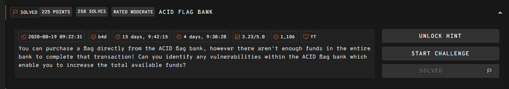
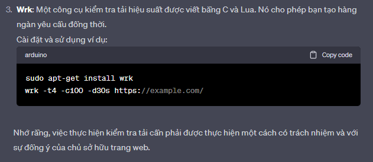
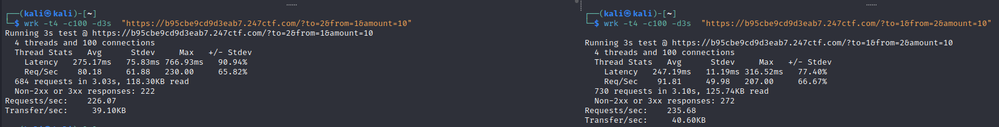
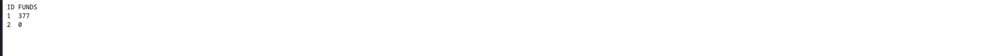
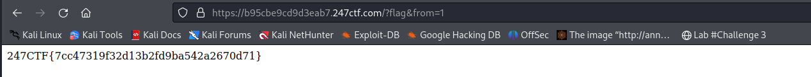

# __Acid flag Bank__

---



## __WriteUp__

Xem source code challenge

```php title="Source code" linenums="1" hl_lines="82"
 <?php
require_once('flag.php');

class ChallDB
{
    public function __construct($flag)
    {
        $this->pdo = new SQLite3('/tmp/users.db');
        $this->flag = $flag;
    }
 
    public function updateFunds($id, $funds)
    {
        $stmt = $this->pdo->prepare('update users set funds = :funds where id = :id');
        $stmt->bindValue(':id', $id, SQLITE3_INTEGER);
        $stmt->bindValue(':funds', $funds, SQLITE3_INTEGER);
        return $stmt->execute();
    }

    public function resetFunds()
    {
        $this->updateFunds(1, 247);
        $this->updateFunds(2, 0);
        return "Funds updated!";
    }

    public function getFunds($id)
    {
        $stmt = $this->pdo->prepare('select funds from users where id = :id');
        $stmt->bindValue(':id', $id, SQLITE3_INTEGER);
        $result = $stmt->execute();
        return $result->fetchArray(SQLITE3_ASSOC)['funds'];
    }

    public function validUser($id)
    {
        $stmt = $this->pdo->prepare('select count(*) as valid from users where id = :id');
        $stmt->bindValue(':id', $id, SQLITE3_INTEGER);
        $result = $stmt->execute();
        $row = $result->fetchArray(SQLITE3_ASSOC);
        return $row['valid'] == true;
    }

    public function dumpUsers()
    {
        $result = $this->pdo->query("select id, funds from users");
        echo "<pre>";
        echo "ID FUNDS\n";
        while ($row = $result->fetchArray(SQLITE3_ASSOC)) {
            echo "{$row['id']}  {$row['funds']}\n";
        }
        echo "</pre>";
    }

    public function buyFlag($id)
    {
        if ($this->validUser($id) && $this->getFunds($id) > 247) {
            return $this->flag;
        } else {
            return "Insufficient funds!";
        }
    }

    public function clean($x)
    {
        return round((int)trim($x));
    }
}

$db = new challDB($flag);
if (isset($_GET['dump'])) {
    $db->dumpUsers();
} elseif (isset($_GET['reset'])) {
    echo $db->resetFunds();
} elseif (isset($_GET['flag'], $_GET['from'])) {
    $from = $db->clean($_GET['from']);
    echo $db->buyFlag($from);
} elseif (isset($_GET['to'],$_GET['from'],$_GET['amount'])) {
    $to = $db->clean($_GET['to']);
    $from = $db->clean($_GET['from']);
    $amount = $db->clean($_GET['amount']);
    if ($to !== $from && $amount > 0 && $amount <= 247 && $db->validUser($to) && $db->validUser($from) && $db->getFunds($from) >= $amount) {
        $db->updateFunds($from, $db->getFunds($from) - $amount);
        $db->updateFunds($to, $db->getFunds($to) + $amount);
        echo "Funds transferred!";
    } else {
        echo "Invalid transfer request!";
    }
} else {
    echo highlight_file(__FILE__, true);
}
```

Đoạn code trên chắc hẵn dễ hiểu mà, cái ta cần chú ý là đoạn logic ở dòng 82

```php
if ($to !== $from && $amount > 0 && $amount <= 247 && $db->validUser($to) && $db->validUser($from) && $db->getFunds($from) >= $amount) {
    $db->updateFunds($from, $db->getFunds($from) - $amount);
    $db->updateFunds($to, $db->getFunds($to) + $amount);
    echo "Funds transferred!";
}
```

Ta thấy, đoạn code trên nhận 3 đối số:

- `to`: Nhận đối số 1 hoặc 2 tương ứng với 2 ID trong cơ sở dữ liệu
- `from`: Nhận đối số 1 hoặc 2 tương ứng với 2 ID trong cơ sở dữ liệu
- `amount`: Nhận đối số có giá trị từ 1 tới 247 mô tả lượng tiền chuyển đổi

Tiếp theo, ta xem xét logic:

- `to !== from`: Kiểm tra 2 giá trị ID khác nhau và __cùng kiểu dữ liệu__
- `$amount > 0 && $amount <= 247`: Kiểm tra amount có nằm ở đoạn [1;247] hay không vì số tiền hiện có của ID 1 là 247
- `db->validUser($to) && $db->validUser($from)`: Kiểm tra xem ID có trong database hay không (tức là to, from chỉ thuộc 1 hoặc 2)
- `getFunds($from) >= $amount`: Kiểm tra xem số tiền của ID có lớn hơn hoặc bằng giá trị của amount hay không

Nếu dữ liệu trên đúng, ta sẽ có bước chuyển tiền:

- Số tiền của ID `from` hiện hành sẽ được tính bằng số tiền của ID `from` trước đó trừ cho amount
- Số tiền của ID `to` hiện hành sẽ được tính bằng số tiền của ID `to` trước đó cộng cho amount

Tóm lại đoạn code này thể hiện việc chuyển 1 lượng (amount) tiền từ ID `to` sang ID `from`.

Nhìn có vẻ đơn giản nhưng logic bài bị tình trạng Transaction ở mức độ cô lập (Isolation Level) và cụ thể là bị lỗi Phantom. Tức là sẽ có một loạt xử lí không đồng bộ bị xung đột dẫn đến việc giá trị `FUNDS` của các ID bị thay đổi. Điều ta cần lúc này là tìm kiếm thứ có thể tạo ra được cái request song song để xảy ra lỗi trên.

Cái gì khó có chatgpt lo ::v



Và đây là thành quả





Nhận flag thôi



!!! Success "Flag: 247CTF{7cc47319f32d13b2fd9ba542a2670d71}"

## __What we learned__

1. Insolation Level