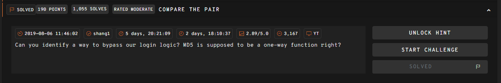

# __Compare the pair__

---



## __WriteUp__

Challenge cung cấp cho ta đoạn mã php bên dưới

```php
<?php
  require_once('flag.php');
  $password_hash = "0e902564435691274142490923013038";
  $salt = "f789bbc328a3d1a3";
  if(isset($_GET['password']) && md5($salt . $_GET['password']) == $password_hash){
    echo $flag;
  }
  echo highlight_file(__FILE__, true);
?>
```

Ta xem xét logic của đoạn mã:

- Đặc tả 2 biến password_hash và salt
- Nhận password từ người dùng 
- Nối salt và password thành 1 biến mới tôi sẽ gọi là `pair`
- Mã hóa biến `pair` theo MD5
- So sánh nếu MD5(pair) = password_hash thì ta có flag.

Oke vậy giờ làm sao? 

Cái ta có thể khai thác ở challenge này chính là họ check logic bằng toán tử `==[^1]` có trong php, vấn đề ở toán tử này là không phải kiểm tra chính xác kiểu như `abc=abc` mà là kiểm tra kiểu "bình đẳng".

Ta thử file test.php

```php title="test.php"
<?php
    var_dump("0e902564435691274142490923013038" == 0);  # bool(true)
?>
```

Output của file này là true tức là nó để `0e902564435691274142490923013038` về 0 (int) rồi mới kiểm tra với 0.

Để làm được điều đó thì bắt đầu hàm băm phải là `0e9`.

Roài password ta cần tìm lúc này là cái để cho khi nó kết hợp với salt thành `f789bbc328a3d1a3<password>` băm ra (theo MD5) sẽ có dạng `0e9<padding>`.

Ta có script khai thác [tại đây](247ctf/compare-the-pair/tools/script.py)

!!! Success "247CTF{76fbce3909b3129536bb396fea3a9879}"

## __What we learned__

1. Lỗ hổng từ toán tử == trong php

 [^1]: Xem thêm tại https://www.php.net/manual/en/language.operators.comparison.php