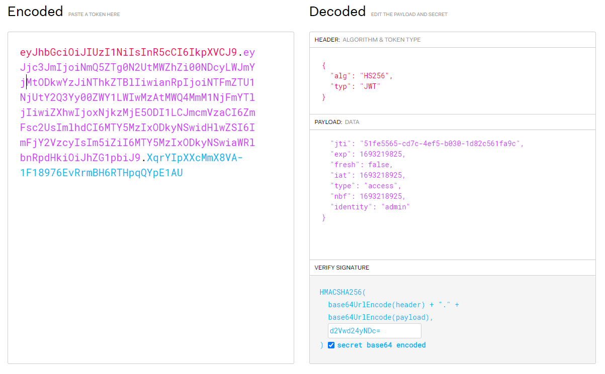

# __Flag Authoriser__

---


## __WriteUp__

Lại một bài với Flask tiếp nè

```python title="Source code"
from flask import Flask, redirect, url_for, make_response, render_template, flash
from flask_jwt_extended import JWTManager, create_access_token, jwt_optional, get_jwt_identity
from secret import secret, admin_flag, jwt_secret

app = Flask(__name__)
cookie = "access_token_cookie"

app.config['SECRET_KEY'] = secret
app.config['JWT_SECRET_KEY'] = jwt_secret
app.config['JWT_TOKEN_LOCATION'] = ['cookies']
app.config['DEBUG'] = False

jwt = JWTManager(app)

def redirect_to_flag(msg):
    flash('%s' % msg, 'danger')
    return redirect(url_for('flag', _external=True))

@jwt.expired_token_loader
def my_expired_token_callback():
    return redirect_to_flag('Token expired')

@jwt.invalid_token_loader
def my_invalid_token_callback(callback):
    return redirect_to_flag(callback)

@jwt_optional
def get_flag():
    if get_jwt_identity() == 'admin':
        return admin_flag

@app.route('/flag')
def flag():
    response = make_response(render_template('main.html', flag=get_flag()))
    response.set_cookie(cookie, create_access_token(identity='anonymous'))
    return response

@app.route('/')
def source():
    return "

%s

" % open(__file__).read()

if __name__ == "__main__":
    app.run()
```

Bài này họ dùng [JWT token](https://jwt.io/), 

Ta xem thông tin token


### __JWT__


### __Tìm flag__

Từ thông tin token trên, ta biết được 

Vì đây là 1 challenge ở mức độ tương đối dễ nên ta có thể dùng `john` để tìm signature của JWT token

> john ywt.txt --wordlist=~/Desktop/allthings/rockyou.txt --format=HMAC-SHA256

Có thể xem một vài cách để bypass JWT Token tại https://tryhackme.com/room/owasptop102021

Thông qua việc dùng john ta có signature là `wepwn247`. Tiến hành làm token mới và nhận flag



!!! Success "Flag: 247CTF{df766362b470d11495214b2f8a4a31b3}"

## __What we learned__

1. JWT Token