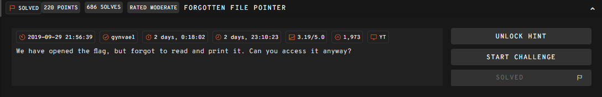

# __Forgotten File Pointer__

---



## __WriteUp__

Ở challenge này, chúng ta nhận được đoạn code php như sau

```php title="Source code"
<?php
  $fp = fopen("/tmp/flag.txt", "r");
  if($_SERVER['REQUEST_METHOD'] === 'GET' && isset($_GET['include']) && strlen($_GET['include']) <= 10) {
    include($_GET['include']);
  }
  fclose($fp);
  echo highlight_file(__FILE__, true);
?>
```

Từ đoạn code trên ta nhận thấy rằng:

- Trình duyệt nhận GET HTTP Request với tham số là include
- Kiểm tra những đối số truyền vào `include` dưới 10 kí tự thì thực thi `include($_GET['include']);`

Tóm lại, ta phải bruteforce đường dẫn file hệ thống dưới 11 kí tự.

> /dev/fd/10


!!! Success "Flag: 247CTF{4be4e08685e2ed433dde9171e887761e}"

## __What we learned__