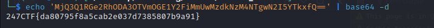

# __Secured Session__

---

## __WriteUp__

Khi vào challenge ta thấy đoạn code như trên và secret_key là thứ ta phải tìm.

Lang thang trên mạng thì ta thấy được đoạn code giải mã session cookie tại https://github.com/noraj/flask-session-cookie-manager.

F12 để tìm session cookie 

Decode và lấy flag thôi

!!! Success "Flag: 247CTF{da80795f8a5cab2e037d7385807b9a91}"

## __What we learned__

1. Flask framework
2. Tools for decode session cookie: [flask_session_cookie_manager3.py](/247ctf/secured-session/tools/script.py)