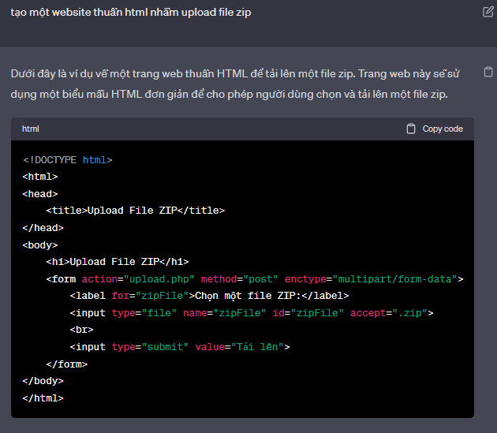
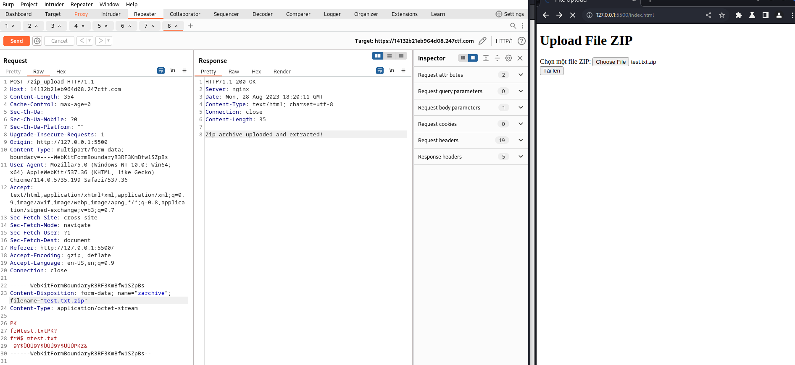

# __Slippery Upload__

---


## __WriteUp__

Xem source code

```py title="Source code" linenums="1" hl_lines="7 23"
from flask import Flask, request
import zipfile, os

app = Flask(__name__)
app.config['SECRET_KEY'] = os.urandom(32)
app.config['MAX_CONTENT_LENGTH'] = 1 * 1024 * 1024
app.config['UPLOAD_FOLDER'] = '/tmp/uploads/'

@app.route('/')
def source():
    return '

%s

' % open('/app/run.py').read()

def zip_extract(zarchive):
    with zipfile.ZipFile(zarchive, 'r') as z:
        for i in z.infolist():
            with open(os.path.join(app.config['UPLOAD_FOLDER'], i.filename), 'wb') as f:
                f.write(z.open(i.filename, 'r').read())

@app.route('/zip_upload', methods=['POST'])
def zip_upload():
    try:
        if request.files and 'zarchive' in request.files:
            zarchive = request.files['zarchive']
            if zarchive and '.' in zarchive.filename and zarchive.filename.rsplit('.', 1)[1].lower() == 'zip' and zarchive.content_type == 'application/octet-stream':
                zpath = os.path.join(app.config['UPLOAD_FOLDER'], '%s.zip' % os.urandom(8).hex())
                zarchive.save(zpath)
                zip_extract(zpath)
                return 'Zip archive uploaded and extracted!'
        return 'Only valid zip archives are acepted!'
    except:
         return 'Error occured during the zip upload process!'

if __name__ == '__main__':
    app.run()
```

Bài này hay. Đúng là bài cuối của Moderate.

Ta thấy được url cần để dùng POST HTTP Request là https:.../zip_upload nhưng lại khum có giao diện cho upload file :)).

Cách nhanh nhất là ta tạo 1 html cơ bản để upload file thông qua url đó (xem url upload như 1 API phía backend)

Hỏi chatgpt về code HTML



Ta cần chỉnh một vài thông số để đúng với logic source code của challenge

```html
<!DOCTYPE html>
<html lang="en">
<head>
    <meta charset="utf-8"/>
    <title>File Upload</title>
</head>
<body>
    <h1>Upload File ZIP</h1>
    <form action="https://14132b21eb964d08.247ctf.com/zip_upload" method="post" enctype="multipart/form-data">
        <label for="zipFile">Chọn một file ZIP:</label>
        <input type="file" name="zarchive">
        <br>
        <input type="submit" value="Tải lên">
    </form>
</body>
</html>
```

Rồi, upload file thôi :V



::) Upload thành công rồi,

!!! Success "Flag: 247CTF{da80795f8a5cab2e037d7385807b9a91}"

## __What we learned__