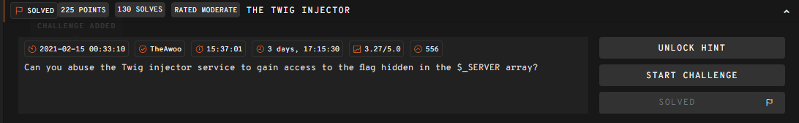
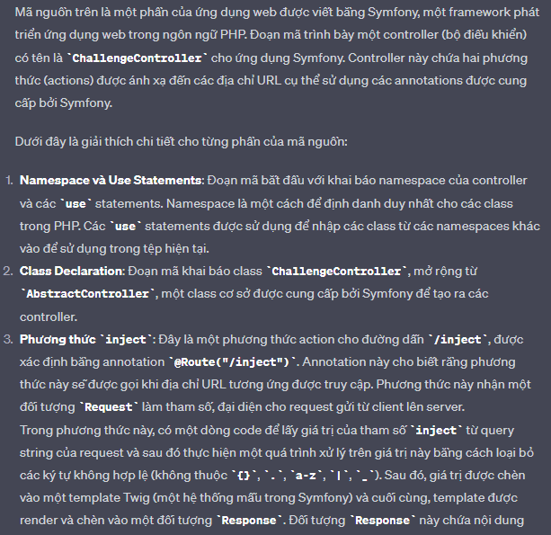
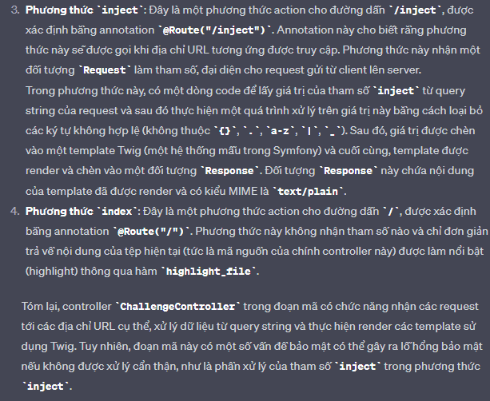

# __The Twjg Injector__

---



## __WriteUp__

Ta xem source code challenge

```php title="Source code"
<?php

namespace App\Controller;

use Symfony\Component\HttpFoundation\Request;
use Symfony\Component\HttpFoundation\Response;
use Symfony\Component\Routing\Annotation\Route;
use Symfony\Bundle\FrameworkBundle\Controller\AbstractController;

class ChallengeController extends AbstractController
{

    /**
     * @Route("/inject")
     */
    public function inject(Request $request)
    {
        $inject = preg_replace('/[^{\.}a-z\|\_]/', '', $request->query->get('inject'));
        $response = new Response($this->get('twig')->createTemplate("Welcome to the twig injector!\n${inject}")->render());
        $response->headers->set('Content-Type', 'text/plain');
        return $response;
    }

    /**
     * @Route("/")
     */
    public function index()
    {
        return new Response(highlight_file(__FILE__, true));
    }
}
```

Bài này source code họ viết bằng Symfony. Nếu các bạn thử hỏi chatgpt về ý nghĩa đoạn code, nó sẽ trả lời cái bạn đấy :3





Roài biết được ý nghĩa mã nguồn là xong bài rồi, 

Lên [PayloadsAllTheThings](https://swisskyrepo.github.io/PayloadsAllTheThings/Server%20Side%20Template%20Injection/#twig) lụm cấu trúc dump là ra flag 

> {{app.request.server.all|join(',')}}

Bài này nó có đoạn `$inject = preg_replace('/[^{\.}a-z\|\_]/', '', $request->query->get('inject'));` dùng để filter đầu vào nên test những cái basic như `{{ 4 * 4 }}, {{ 4 * '4' }}` sẽ không được đâu

!!! Success "Flag: 247CTF{b8d4dce713400424bc2ab7fa673f231c}"

## __What we learned__

1. Symfony