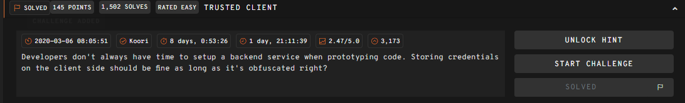
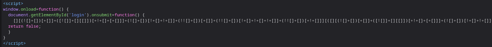
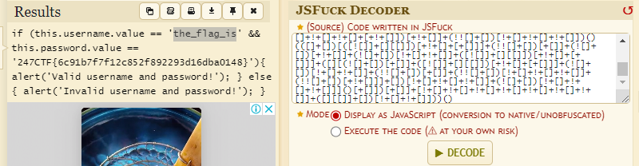

# __Trusted Client__

---

## __WriteUp__

Challenge này cung cấp cho ta một form login gồm có username/password

F12 lên thì thấy đoạn code javescript mang mục đích xử lí logic login

Đây là [JSFuck](https://en.wikipedia.org/wiki/JSFuck) và có nhiều tool để decode nó và tôi dùng https://www.dcode.fr/jsfuck-language

!!! success "Flag: 247CTF{6c91b7f7f12c852f892293d16dba0148}"

## __What we learned__

1. Shouldn't leave information (Eg: username/password,...) on the client side