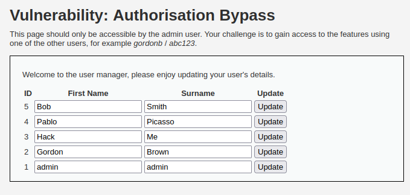
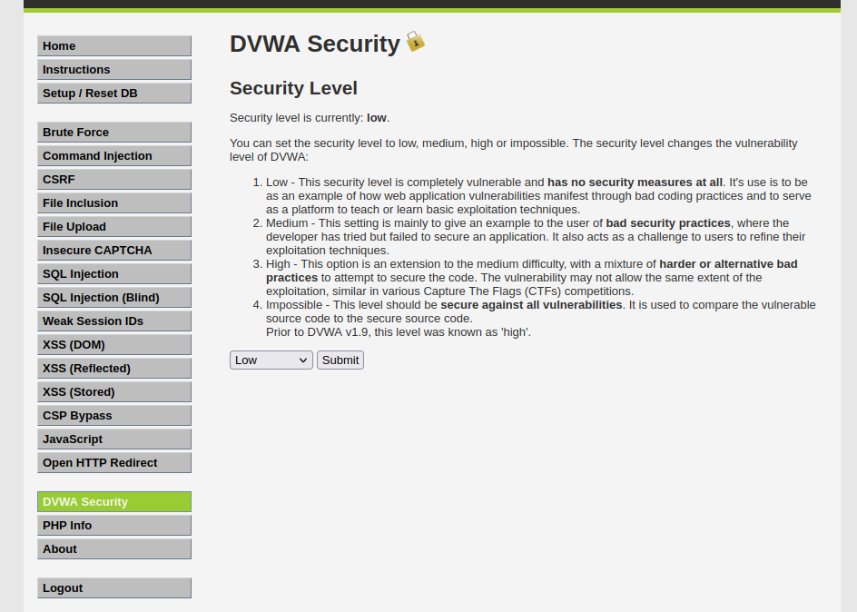
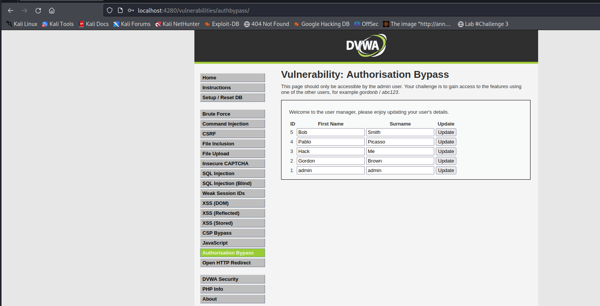
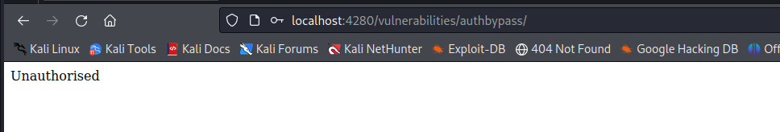
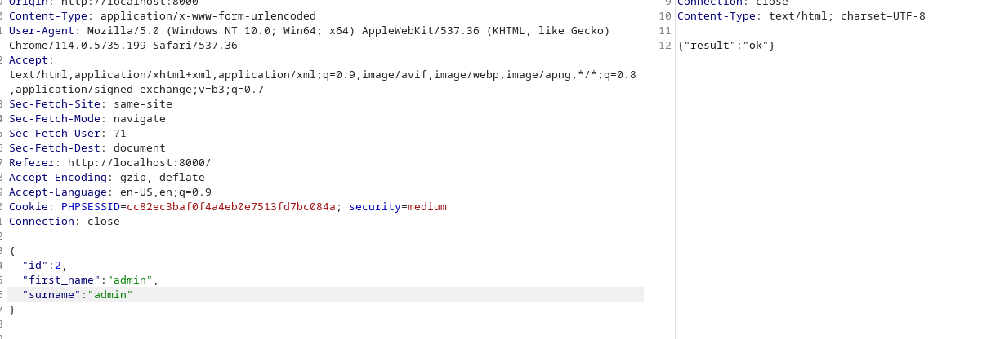
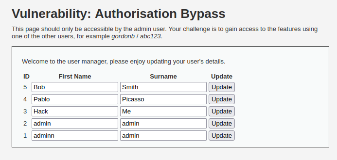
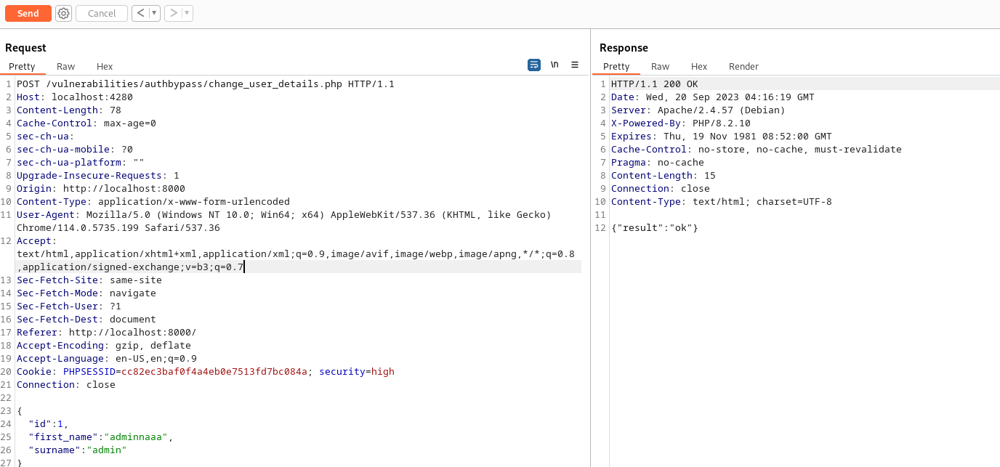
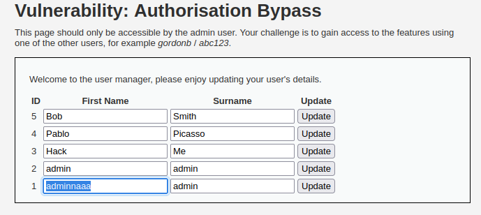

# __Authorisation Bypass__

---

## __About__

When developers have to build authorisation matrices into complex systems it is easy for them to miss adding the right checks in every place, especially those which are not directly accessible through a browser, for example API calls.

As a tester, you need to be looking at every call a system makes and then testing it using every level of user to ensure that the checks are being carried out correctly. This can often be a long and boring task, especially with a large matrix with lots of different user types, but it is critical that the testing is carried out as one missed check could lead to an attacker gaining access to confidential data or functions.


## __Objective__

Your goal is to test this user management system at all four security levels to identify any areas where authorisation checks have been missed.

The system is only designed to be accessed by the admin user, so have a look at all the calls made while logged in as the admin, and then try to reproduce them while logged in as different user.

If you need a second user, you can use gordonb/abc123. 

## __Security Level: Low__

Source code

```php title="vulnerabilities/authbypass/source/low.php"
--8<-- "dvwa/authorisation-bypass/sources/low.php"
```


### __Analysis__

Khi vào challenge này, ta được thông báo như hình dưới



Điều đó có nghĩa là, ta cần phải logout user admin và login 1 user khác:

1. Dùng SQLi và `John The Ripper` để tìm password của các user khác
2. Login bằng user trong thông báo `gordonb/abc123`

Sau khi login bằng user gordonb, ta không hề thấy mục `Authorisation Bypass` nữa



Cùng xem lại danh sách challenge xuất hiện trong vai trò admin trong hình bên dưới



Để ý rằng, url của challenge là `http://localhost:4280/vulnerabilities/authbypass/` và trong cấp độ này, không hề có kiểm tra đầu vào cũng như kiểm tra người dùng, nên ta dễ dàng truy cập được trực tiếp trang `Authorisation Bypass` với user `gordonb`

> Authorisation bypass được hiểu đơn giản là dùng một vài "thủ thuật" để truy cập những tài nguyên mà nội tại user đó không có quyền truy cập tới. "Thủ thuật" này có được là nhờ vào đội triển khai chưa có những chiếc lược phòng vệ kĩ càng.

### __Exploition__


---

## __Security Level: Medium__

Source code

```php title="vulnerabilities/authbypass/source/medium.php"
--8<-- "dvwa/authorisation-bypass/sources/medium.php"
```

### __Analysis__

Challenge này cung cấp cho ta 2 API, 1 cho GET thông tin các user, 1 cho POST mang mục đích đổi thông tin user:

- HTTP GET: localhost:4280/vulnerabilities/authbypass/get_user_data.php
- HTTP POST: http://localhost:4280/vulnerabilities/authbypass/change_user_details.php

Điều ngạc nhiên hơn. Mặc dù với user `gordonb`, ta không truy cập được vào trang challenge nhưng lại có thể truy cập được vào 2 API



```json
[{"user_id":"1","first_name":"admin","surname":"admin"},{"user_id":"2","first_name":"Gordon","surname":"Brown"},{"user_id":"3","first_name":"Hack","surname":"Me"},{"user_id":"4","first_name":"Pablo","surname":"Picasso"},{"user_id":"5","first_name":"Bob","surname":"Smith"}]
```

Điều này có nghĩa là, ta có thể sử dụng 2 API đó và có thể khai thác được gì đó từ cái API dùng HTTP POST. Việc này chứng tỏ ta đã authorisation bypass thành công.

### __Exploition__

Oke, triển khai thôi nào. Đầu tiên là tạo 1 form HTTP POST cơ bản nhằm gửi request lên API `http://localhost:4280/vulnerabilities/authbypass/change_user_details.php`

```html
<!DOCTYPE html>
<html>
<head>
    <title>POST Data to Web Page</title>
</head>
<body>
    <h1>Enter User Information</h1>
    <form action="http://localhost:4280/vulnerabilities/authbypass/change_user_details.php" method="post">
     

        <label for="user_id">ID:</label>
        <input type="text" id="user_id" name="user_id" value="2"><br><br>

        <label for="first_name">First Name:</label>
        <input type="text" id="first_name" name="first_name" value="admin"><br><br>

        <label for="surname">Surname:</label>
        <input type="text" id="surname" name="surname" value="admin"><br><br>

        <input type="submit" value="Submit">
    </form>
</body>
</html>
```

Ta thấy rằng user có user_id=1 chính là admin. Ta thử chỉnh sửa tại nơi có user_id=2 thành "first_name":"admin","surname":"admin"



Và điều ngạc nhiên là ta hoàn toàn có thể chỉnh sửa thông tin các user (xem hình dưới), nhưng hoàn toàn không vào được trang `http://localhost:4280/vulnerabilities/authbypass/`



Hoàn thành thử thách.

---

## __Security Level: High__

Source code

```php title="vulnerabilities/authbypass/source/high.php"
--8<-- "dvwa/authorisation-bypass/sources/high.php"
```

### __Analysis__

Ở cấp độ này, họ chặn không cho người dùng bình thường truy cập vào API dùng HTTP GET nhưng lại quên chặn cái POST, dẫn đến việc ta vẫn có thể dễ dàng thay đổi thông tin các user từ user `gordonb`





---

## __Security Level: Impossible__

Source code

```php title="vulnerabilities/authbypass/source/impossible.php"
--8<-- "dvwa/authorisation-bypass/sources/impossible.php"
```

### __Analysis__


Hopefully on this level all the functions correctly check authorisation before allowing access to the data.

There may however be some non-authorisation related issues on the page, so do not write it off as fully secure. 

---

## __More Information__

- Reference: https://owasp.org/www-project-web-security-testing-guide/v42/4-Web_Application_Security_Testing/05-Authorization_Testing/02-Testing_for_Bypassing_Authorization_Schema
- Reference: https://owasp.org/www-project-web-security-testing-guide/latest/4-Web_Application_Security_Testing/04-Authentication_Testing/04-Testing_for_Bypassing_Authentication_Schema
- Reference: https://owasp.org/www-project-top-ten/2017/A2_2017-Broken_Authentication