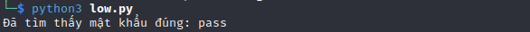
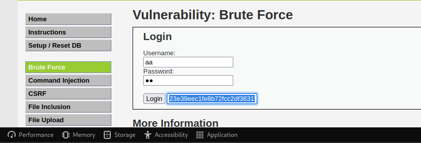
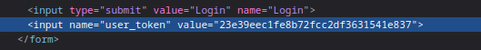

# __Brute Force__

_A brute force attack can manifest itself in many different ways, but primarily consists in an attacker configuring predetermined values, making requests to a server using those values, and then analyzing the response. For the sake of efficiency, an attacker may use a dictionary attack (with or without mutations) or a traditional brute-force attack (with given classes of characters e.g.: alphanumeric, special, case (in)sensitive). Considering a given method, number of tries, efficiency of the system which conducts the attack, and estimated efficiency of the system which is attacked the attacker is able to calculate approximately how long it will take to submit all chosen predetermined values._

---

## __Objective__

Your goal is to get the administrator’s password by brute forcing. Bonus points for getting the other four user passwords!

## __Security Level: Low__

Source code

```php title="vulnerabilities/brute/source/low.php"
<?php

if( isset( $_GET[ 'Login' ] ) ) {
    // Get username
    $user = $_GET[ 'username' ];

    // Get password
    $pass = $_GET[ 'password' ];
    $pass = md5( $pass );

    // Check the database
    $query  = "SELECT * FROM `users` WHERE user = '$user' AND password = '$pass';";
    $result = mysqli_query($GLOBALS["___mysqli_ston"],  $query ) or die( '<pre>' . ((is_object($GLOBALS["___mysqli_ston"])) ? mysqli_error($GLOBALS["___mysqli_ston"]) : (($___mysqli_res = mysqli_connect_error()) ? $___mysqli_res : false)) . '</pre>' );

    if( $result && mysqli_num_rows( $result ) == 1 ) {
        // Get users details
        $row    = mysqli_fetch_assoc( $result );
        $avatar = $row["avatar"];

        // Login successful
        echo "<p>Welcome to the password protected area {$user}</p>";
        echo "";
    }
    else {
        // Login failed
        echo "<pre><br />Username and/or password incorrect.</pre>";
    }

    ((is_null($___mysqli_res = mysqli_close($GLOBALS["___mysqli_ston"]))) ? false : $___mysqli_res);
}

?> 
```

### __Analysis__

Ở challenge này ta thấy rằng, họ không dùng các cơ chế bảo mật. Do đó ta hoàn toàn có thể dùng tool như BurpSuite, hydra,... để Brute Force password của các user.

Bên cạnh việc tìm ra được password của user `admin`, ta cần tìm username của 3 user còn lại:

1. Tìm thông qua việc Bruteforce username
2. Tìm thông qua việc tấn công [SQLi](../sql-injection/index.md)

Quan trọng nữa. Với challenge này ta thấy rằng việc login sai username hoặc password sẽ xuất hiện thông tin `Username and/or password incorrect.`. Do đó ta không thể dùng một vài thủ thuật nhỏ để tìm được username một cách nhanh chống được. Ta cần Brute Force đúng cả về username lẫn password.

Tiếp theo, vì đây là challenge cho việc kiểm thử, nên chắc chắn rằng username và password sẽ đơn giản và sẽ tồn tại trong wordlist.

### __Exploition__

Ở challenge này tôi sẽ gợi ý cho các bạn sử dụng python để Brute Force password.

Với mục tiêu là tìm password của tài khoản admin. 

Với các user khác, ta sẽ dùng 2 vòng for để Brute Force

```python title="Source code brute force"
--8<-- "dvwa/brute-force/sources/low.py"
```

Và kết quả như hình dưới



---

## __Security Level: Medium__

Source code

```php title="vulnerabilities/brute/source/medium.php"
<?php

if( isset( $_GET[ 'Login' ] ) ) {
    // Sanitise username input
    $user = $_GET[ 'username' ];
    $user = ((isset($GLOBALS["___mysqli_ston"]) && is_object($GLOBALS["___mysqli_ston"])) ? mysqli_real_escape_string($GLOBALS["___mysqli_ston"],  $user ) : ((trigger_error("[MySQLConverterToo] Fix the mysql_escape_string() call! This code does not work.", E_USER_ERROR)) ? "" : ""));

    // Sanitise password input
    $pass = $_GET[ 'password' ];
    $pass = ((isset($GLOBALS["___mysqli_ston"]) && is_object($GLOBALS["___mysqli_ston"])) ? mysqli_real_escape_string($GLOBALS["___mysqli_ston"],  $pass ) : ((trigger_error("[MySQLConverterToo] Fix the mysql_escape_string() call! This code does not work.", E_USER_ERROR)) ? "" : ""));
    $pass = md5( $pass );

    // Check the database
    $query  = "SELECT * FROM `users` WHERE user = '$user' AND password = '$pass';";
    $result = mysqli_query($GLOBALS["___mysqli_ston"],  $query ) or die( '<pre>' . ((is_object($GLOBALS["___mysqli_ston"])) ? mysqli_error($GLOBALS["___mysqli_ston"]) : (($___mysqli_res = mysqli_connect_error()) ? $___mysqli_res : false)) . '</pre>' );

    if( $result && mysqli_num_rows( $result ) == 1 ) {
        // Get users details
        $row    = mysqli_fetch_assoc( $result );
        $avatar = $row["avatar"];

        // Login successful
        echo "<p>Welcome to the password protected area {$user}</p>";
        echo "";
    }
    else {
        // Login failed
        sleep( 2 );
        echo "<pre><br />Username and/or password incorrect.</pre>";
    }

    ((is_null($___mysqli_res = mysqli_close($GLOBALS["___mysqli_ston"]))) ? false : $___mysqli_res);
}

?> 
```

### __Analysis__

Ở phần cấp độ này, bạn cũng dễ dàng có thể thực hiện Brute Force như ở cấp độ Low. Nhưng phải chờ 2 giây sau khi login fail (dòng sleep(2) trong mã nguồn).

### __Exploition__

Ta sẽ dùng chính source code ở cấp độ Low để bypass cấp độ này.

---

## __Security Level: High__

Source code

```php title="vulnerabilities/brute/source/high.php"
<?php

if( isset( $_GET[ 'Login' ] ) ) {
    // Check Anti-CSRF token
    checkToken( $_REQUEST[ 'user_token' ], $_SESSION[ 'session_token' ], 'index.php' );

    // Sanitise username input
    $user = $_GET[ 'username' ];
    $user = stripslashes( $user );
    $user = ((isset($GLOBALS["___mysqli_ston"]) && is_object($GLOBALS["___mysqli_ston"])) ? mysqli_real_escape_string($GLOBALS["___mysqli_ston"],  $user ) : ((trigger_error("[MySQLConverterToo] Fix the mysql_escape_string() call! This code does not work.", E_USER_ERROR)) ? "" : ""));

    // Sanitise password input
    $pass = $_GET[ 'password' ];
    $pass = stripslashes( $pass );
    $pass = ((isset($GLOBALS["___mysqli_ston"]) && is_object($GLOBALS["___mysqli_ston"])) ? mysqli_real_escape_string($GLOBALS["___mysqli_ston"],  $pass ) : ((trigger_error("[MySQLConverterToo] Fix the mysql_escape_string() call! This code does not work.", E_USER_ERROR)) ? "" : ""));
    $pass = md5( $pass );

    // Check database
    $query  = "SELECT * FROM `users` WHERE user = '$user' AND password = '$pass';";
    $result = mysqli_query($GLOBALS["___mysqli_ston"],  $query ) or die( '<pre>' . ((is_object($GLOBALS["___mysqli_ston"])) ? mysqli_error($GLOBALS["___mysqli_ston"]) : (($___mysqli_res = mysqli_connect_error()) ? $___mysqli_res : false)) . '</pre>' );

    if( $result && mysqli_num_rows( $result ) == 1 ) {
        // Get users details
        $row    = mysqli_fetch_assoc( $result );
        $avatar = $row["avatar"];

        // Login successful
        echo "<p>Welcome to the password protected area {$user}</p>";
        echo "";
    }
    else {
        // Login failed
        sleep( rand( 0, 3 ) );
        echo "<pre><br />Username and/or password incorrect.</pre>";
    }

    ((is_null($___mysqli_res = mysqli_close($GLOBALS["___mysqli_ston"]))) ? false : $___mysqli_res);
}

// Generate Anti-CSRF token
generateSessionToken();

?> 
```

### __Analysis__

Ở cấp độ này, họ nâng tầm hơn bằng việc thêm [CSRF token](https://owasp.org/www-community/attacks/csrf) dưới tên user_token. Tức nếu request mà sai thì ngay lập tức trang web sẽ tạo một user_token mới. 




Vì user_token nó gắn ở trang web và chỉ `hidden` thôi, nên ta có thể khai thác ở điểm này.

Điều chúng ta cần hiện giờ là bắt được user_token của trang web trước khi thực thi công đoạn login. Tức là phải duyệt web lấy user_token trước, sau đó gắn nó vào gói request gửi login.

Khúc này, ta hỏi ChatGPT thôi :3

### __Exploition__

Roài, triển khai thôi.

```python title="find.py"
--8<-- "dvwa/brute-force/sources/find.py"
```

Kết hợp đoạn code trên và đoạn code ở challenge Low. Ta được code hoàn chỉnh (lưu ý ở challenge này có thời gian login fail được random từ 0 tới 3s).

```python title="high.py"
--8<-- "dvwa/brute-force/sources/high.py"
```

Bên cạnh việc dùng thư viện `re` để tìm phần tử trong website, ta có thể dùng `BeautifulSoup` thay thế.

Về cơ bản, bước đầu của việc test pass là đặt 1 csrf_token `giả` để gửi request tới website. Sau đó chắc chắn rằng csrf_token lúc này sẽ bị thay đổi sau lần request đầu tiên. Lúc này ta sẽ dò website để lấy csrf_token và đưa nó vào biến user_token. Từ request thứ 2 trở đi, mọi chuyện sẽ đơn giản hơn nhiều.

---

## __Security Level: Impossible__

Source code

```php title="vulnerabilities/brute/source/impossible.php"
--8<-- "dvwa/brute-force/sources/impossible.php"
```

### __Analysis__

Brute force (and user enumeration) should not be possible in the impossible level. The developer has added a "lock out" feature, where if there are five bad logins within the last 15 minutes, the locked out user cannot log in.

If the locked out user tries to login, even with a valid password, it will say their username or password is incorrect. This will make it impossible to know if there is a valid account on the system, with that password, and if the account is locked.

This can cause a "Denial of Service" (DoS), by having someone continually trying to login to someone's account. This level would need to be extended by blacklisting the attacker (e.g. IP address, country, user-agent).

---

## __What we learned__

1. CSRF token
2. Write script

## __More Information__


- https://owasp.org/www-community/attacks/Brute_force_attack
- http://www.symantec.com/connect/articles/password-crackers-ensuring-security-your-password
- https://www.golinuxcloud.com/brute-force-attack-web-forms

