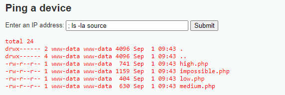
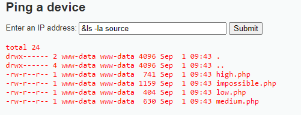
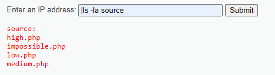

# __Command Injection__


_Command injection is an attack in which the goal is execution of arbitrary commands on the host operating system via a vulnerable application. Command injection attacks are possible when an application passes unsafe user supplied data (forms, cookies, HTTP headers etc.) to a system shell. In this attack, the attacker-supplied operating system commands are usually executed with the privileges of the vulnerable application. Command injection attacks are possible largely due to insufficient input validation._

_This attack differs from [Code Injection](https://owasp.org/www-community/attacks/Code_Injection), in that code injection allows the attacker to add their own code that is then executed by the application. In Command Injection, the attacker extends the default functionality of the application, which execute system commands, without the necessity of injecting code._

---

## __Security Level: Low__

Source code

```php title="vulnerabilities/exec/source/low.php"
<?php

if( isset( $_POST[ 'Submit' ]  ) ) {
    // Get input
    $target = $_REQUEST[ 'ip' ];

    // Determine OS and execute the ping command.
    if( stristr( php_uname( 's' ), 'Windows NT' ) ) {
        // Windows
        $cmd = shell_exec( 'ping  ' . $target );
    }
    else {
        // *nix
        $cmd = shell_exec( 'ping  -c 4 ' . $target );
    }

    // Feedback for the end user
    echo "<pre>{$cmd}</pre>";
}

?>
```

### __Analysis__

Nhìn source code trên, dễ dàng thấy được target của ta là thực thi thứ gì đó tại shell không chỉ mỗi việc `ping IP` (có thể mở reverse shell, ...)

Ta thấy rằng ở đoạn code trên không hề có việc filter đầu vào có phải là IP hay không, vì điều này, ta có thể dễ dàng bypass bằng việc nhập một dãy lệnh (ngăn cách với nhau bằng dấu chấm phẩy để thể hiện từng lệnh) như `10.10.10.10;ls,... hay cơ bản hơn là ;ls` là có thể bypass được challenge

### __Exploition__

Như đã phân tích ở trên, ta sẽ bypass challenge bằng việc tiêm lệnh `ls`



Nâng cao hơn, ta có thể sử dụng trình nghe netcat để kết nối với máy khác.

### __What we learned__
1. Read code

---

## __Security Level: Medium__

Source code

```php title="vulnerabilities/exec/source/medium.php"
<?php

if( isset( $_POST[ 'Submit' ]  ) ) {
    // Get input
    $target = $_REQUEST[ 'ip' ];

    // Set blacklist
    $substitutions = array(
        '&&' => '',
        ';'  => '',
    );

    // Remove any of the characters in the array (blacklist).
    $target = str_replace( array_keys( $substitutions ), $substitutions, $target );

    // Determine OS and execute the ping command.
    if( stristr( php_uname( 's' ), 'Windows NT' ) ) {
        // Windows
        $cmd = shell_exec( 'ping  ' . $target );
    }
    else {
        // *nix
        $cmd = shell_exec( 'ping  -c 4 ' . $target );
    }

    // Feedback for the end user
    echo "<pre>{$cmd}</pre>";
}

?>
```

### __Analysis__

Challenge này thử thách hơn một chút vì hị dùng blacklist để filter toán tử `&&` và `;`. Nhưng blacklist này chắc chắn là chưa đủ, còn nhiều loại toán tử trong linux giúp ích cho việc thực thi lệnh nữa cơ.

Xem thêm các toán tử trong linux tại https://www.makeuseof.com/linux-command-line-chaining-operators/

Hoặc xem bảng tổng hợp bên dưới

| Name | Description |
| : --- | : --- |
| The Ampersand Operator (`&`) | [Run linux command in background](https://www.makeuseof.com/run-linux-commands-in-background/) |
| The Semicolon Operator (`;`) | Execute commands in a defined, sequential order |
| The OR Operator (`||`) | Execute the command that follows only if the preceding command fails |
| The Pipe Operator (`|`) | The pipe operator directs the output of the preceding command as input to the succeeding command |
| The AND Operator (`&&`) | Execute commands only if the preceding command was successfully executed |
| The NOT Operator (`!`) | The NOT operator works in similar ways to an except statement in programming |
| The Precedence Operator (`(...)`) | Visit [here](https://www.makeuseof.com/linux-command-line-chaining-operators/#the-precedence-operator) |
| The Combination Operator (`{...}`) | Group commands | 
| Concatenation or the Escape Operator (`\`) | Visit [here](https://www.makeuseof.com/linux-command-line-chaining-operators/#concatenation-or-the-escape-operator) | 
| The Redirection Operators (`>`, `>>`, `<`) | Visit [here](https://www.makeuseof.com/linux-command-line-chaining-operators/#the-redirection-operators-gt-gt-gt-lt) | 

### __Exploition__

Quay trở lại challenge, ta dễ dàng có thể tạo 1 lệnh cho nó chạy background như hình dưới.



> &ls -la source

### __What we learned__

1. Blacklist

---

## __Security Level: High__

Source code

```php title="vulnerabilities/exec/source/high.php"

<?php

if( isset( $_POST[ 'Submit' ]  ) ) {
    // Get input
    $target = trim($_REQUEST[ 'ip' ]);

    // Set blacklist
    $substitutions = array(
        '&'  => '',
        ';'  => '',
        '| ' => '',
        '-'  => '',
        '$'  => '',
        '('  => '',
        ')'  => '',
        '`'  => '',
        '||' => '',
    );

    // Remove any of the characters in the array (blacklist).
    $target = str_replace( array_keys( $substitutions ), $substitutions, $target );

    // Determine OS and execute the ping command.
    if( stristr( php_uname( 's' ), 'Windows NT' ) ) {
        // Windows
        $cmd = shell_exec( 'ping  ' . $target );
    }
    else {
        // *nix
        $cmd = shell_exec( 'ping  -c 4 ' . $target );
    }

    // Feedback for the end user
    echo "<pre>{$cmd}</pre>";
}

?>
```

### __Analysis__

Lại là blacklist, nhưng lần này ta thấy đấy. Họ filter hết toàn bộ toán tử nằm trong phần [Security Level: Medium](security-level-medium)

:3 Chú ý thiệt kĩ blacklist, bạn sẽ nhận ra điều bất ngờ

??? tip "Hint"
    Bạn có để ý filter toán tử pipe không, nó có khoảng trắng phía sau đấy. Tức là nó filter `| ` chứ không phải filter `|`. 

    Hay nói cách khác, dùng `|ls` sẽ thực thi thành công lệnh.

    Lệnh trim() cũng góp phần nhỏ trong việc filter này, vì lệnh trim() chỉ xóa khoảng trắng ở đầu/cuối chuỗi. Việc nhập khoảng trắng ở đoạn giữa, thì hàm trim() sẽ không filter được.

    Hơn nữa, có một ý nâng cao trong này, vì blacklist nó chỉ đọc và filter `| ` nên ta có thể bypass bằng `| |`. Tức nó xóa đi `|<khoảng trắng>` và còn lại `|`. Đây cũng là một phần phải chú ý. Mở rộng hơn cho việc filter của LFI (`../`)

    

### __Exploition__

Đây là thành quả cho việc bạn tìm ra điều bất ngờ trên


### __What we learned__
1. Trick bypass Blacklist simple

---

## __Security Level: Impossible__

Source code

```php title="vulnerabilities/exec/source/impossible.php"
<?php

if( isset( $_POST[ 'Submit' ]  ) ) {
    // Check Anti-CSRF token
    checkToken( $_REQUEST[ 'user_token' ], $_SESSION[ 'session_token' ], 'index.php' );

    // Get input
    $target = $_REQUEST[ 'ip' ];
    $target = stripslashes( $target );

    // Split the IP into 4 octects
    $octet = explode( ".", $target );

    // Check IF each octet is an integer
    if( ( is_numeric( $octet[0] ) ) && ( is_numeric( $octet[1] ) ) && ( is_numeric( $octet[2] ) ) && ( is_numeric( $octet[3] ) ) && ( sizeof( $octet ) == 4 ) ) {
        // If all 4 octets are int's put the IP back together.
        $target = $octet[0] . '.' . $octet[1] . '.' . $octet[2] . '.' . $octet[3];

        // Determine OS and execute the ping command.
        if( stristr( php_uname( 's' ), 'Windows NT' ) ) {
            // Windows
            $cmd = shell_exec( 'ping  ' . $target );
        }
        else {
            // *nix
            $cmd = shell_exec( 'ping  -c 4 ' . $target );
        }

        // Feedback for the end user
        echo "<pre>{$cmd}</pre>";
    }
    else {
        // Ops. Let the user name theres a mistake
        echo '<pre>ERROR: You have entered an invalid IP.</pre>';
    }
}

// Generate Anti-CSRF token
generateSessionToken();

?>
```

### __Analysis__

Mức độ này thì thua rồi, họ tách ra từng octet một của IP và check quá chặt chẽ. Họ còn lo tới việc check token user nữa mà.

Ở đây tôi muốn nói thêm về blacklist và whitelist:

- Blacklist được hiểu là danh sách đen, tức sẽ chặn những thứ có trong đó. Ví dụ như ta biết 1 danh sách tầm 10 số điện thoại spam, ta cho nó vào danh sách đen. Câu hỏi được đặt ra là nếu ta biết thêm 10, 20, ..., 100, ... số điện thoại spam nữa thì sao? Danh sách đen nào cho đủ?

- Whitelist là danh sách trắng, tức chỉ cho phép những thứ có trong đó. Điều này đơn giản hơn nhiều. Ta không cần biết số lượng số điện thoại spam, ta chỉ cần biết số lượng số điện thoại người quen của ta và bỏ vào whitelist. Điều này đơn giản hơn đúng không?

- Thông thường, họ sẽ dùng whitelist thay cho blacklist vì whitelist phần lớn luôn ít dữ liệu hơn blacklist dẫn đến việc dễ kiểm soát.

---

## __More Information__
- https://www.scribd.com/doc/2530476/Php-Endangers-Remote-Code-Execution
- http://www.ss64.com/bash/
- http://www.ss64.com/nt/
- https://owasp.org/www-community/attacks/Command_Injection