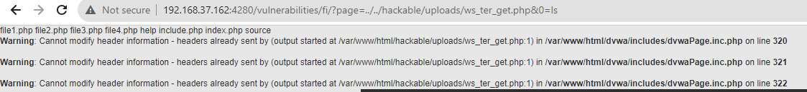
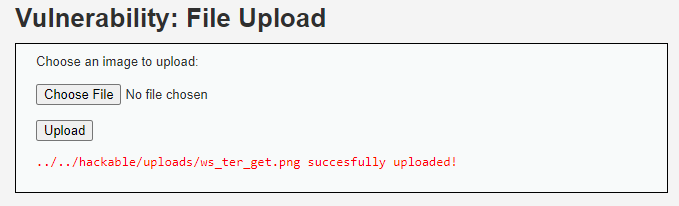
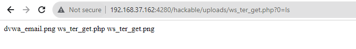
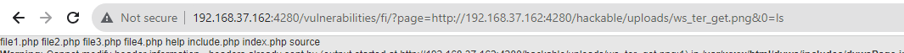
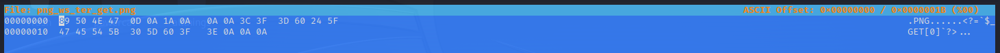
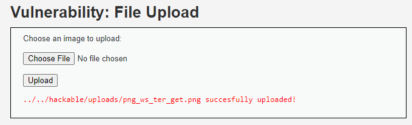
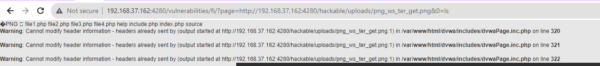

# __File Upload__

_Uploaded files represent a significant risk to applications. The first step in many attacks is to get some code to the system to be attacked. Then the attack only needs to find a way to get the code executed. Using a file upload helps the attacker accomplish the first step._

_The consequences of unrestricted file upload can vary, including complete system takeover, an overloaded file system or database, forwarding attacks to back-end systems, client-side attacks, or simple defacement. It depends on what the application does with the uploaded file and especially where it is stored._

_There are really two classes of problems here. The first is with the file metadata, like the path and file name. These are generally provided by the transport, such as HTTP multi-part encoding. This data may trick the application into overwriting a critical file or storing the file in a bad location. You must validate the metadata extremely carefully before using it._

_The other class of problem is with the file size or content. The range of problems here depends entirely on what the file is used for. See the examples below for some ideas about how files might be misused. To protect against this type of attack, you should analyse everything your application does with files and think carefully about what processing and interpreters are involved._

---

## __Security Level: Low__

Source code

```php title="vulnerabilities/upload/source/low.php"
<?php

if( isset( $_POST[ 'Upload' ] ) ) {
    // Where are we going to be writing to?
    $target_path  = DVWA_WEB_PAGE_TO_ROOT . "hackable/uploads/";
    $target_path .= basename( $_FILES[ 'uploaded' ][ 'name' ] );

    // Can we move the file to the upload folder?
    if( !move_uploaded_file( $_FILES[ 'uploaded' ][ 'tmp_name' ], $target_path ) ) {
        // No
        echo '<pre>Your image was not uploaded.</pre>';
    }
    else {
        // Yes!
        echo "<pre>{$target_path} succesfully uploaded!</pre>";
    }
}

?>
```

### __Analysis__

Challenge này đơn giản thôi, họ cung cấp cho ta một trang upload file (upload lên /hackable/uploads) tùy ý, ta sẽ tận dụng nó để upload file webshell

### __Exploition__

Upload thành công


Để ta kiểm chứng file upload có hoạt động hay không ta có thể truy cập thẳng website http://192.168.37.162:4280/hackable/uploads/ws_ter_get.php?0=ls

Hoặc ta có thể tận dụng challenge [File Inclusion](/dvwa/file-inclusion) để kiểm chứng.



---

## __Security Level: Medium__

Source code

```php title="vulnerabilities/upload/source/medium.php"
<?php

if( isset( $_POST[ 'Upload' ] ) ) {
    // Where are we going to be writing to?
    $target_path  = DVWA_WEB_PAGE_TO_ROOT . "hackable/uploads/";
    $target_path .= basename( $_FILES[ 'uploaded' ][ 'name' ] );

    // File information
    $uploaded_name = $_FILES[ 'uploaded' ][ 'name' ];
    $uploaded_type = $_FILES[ 'uploaded' ][ 'type' ];
    $uploaded_size = $_FILES[ 'uploaded' ][ 'size' ];

    // Is it an image?
    if( ( $uploaded_type == "image/jpeg" || $uploaded_type == "image/png" ) &&
        ( $uploaded_size < 100000 ) ) {

        // Can we move the file to the upload folder?
        if( !move_uploaded_file( $_FILES[ 'uploaded' ][ 'tmp_name' ], $target_path ) ) {
            // No
            echo '<pre>Your image was not uploaded.</pre>';
        }
        else {
            // Yes!
            echo "<pre>{$target_path} succesfully uploaded!</pre>";
        }
    }
    else {
        // Invalid file
        echo '<pre>Your image was not uploaded. We can only accept JPEG or PNG images.</pre>';
    }
}

?>
```

### __Analysis__

Ở challenge này, họ giới hạn lại loại file được upload lên chỉ là file ảnh (cụ thể là JPEG hoặc PNG). Nhưng nhìn kĩ đi, họ check loại file việc lấy định dạng MIME file (giá trị được tải lên trong trường `Content-Type`).

Ta sẽ fake giá trị MIME bằng việc đổi extension file

### __Exploition__

Như đã phân tích ở trên, 



Và file đã upload thành công trên hệ thống





---

## __Security Level: High__

Source code

```php title="vulnerabilities/upload/source/high.php"

<?php

if( isset( $_POST[ 'Upload' ] ) ) {
    // Where are we going to be writing to?
    $target_path  = DVWA_WEB_PAGE_TO_ROOT . "hackable/uploads/";
    $target_path .= basename( $_FILES[ 'uploaded' ][ 'name' ] );

    // File information
    $uploaded_name = $_FILES[ 'uploaded' ][ 'name' ];
    $uploaded_ext  = substr( $uploaded_name, strrpos( $uploaded_name, '.' ) + 1);
    $uploaded_size = $_FILES[ 'uploaded' ][ 'size' ];
    $uploaded_tmp  = $_FILES[ 'uploaded' ][ 'tmp_name' ];

    // Is it an image?
    if( ( strtolower( $uploaded_ext ) == "jpg" || strtolower( $uploaded_ext ) == "jpeg" || strtolower( $uploaded_ext ) == "png" ) &&
        ( $uploaded_size < 100000 ) &&
        getimagesize( $uploaded_tmp ) ) {

        // Can we move the file to the upload folder?
        if( !move_uploaded_file( $uploaded_tmp, $target_path ) ) {
            // No
            echo '<pre>Your image was not uploaded.</pre>';
        }
        else {
            // Yes!
            echo "<pre>{$target_path} succesfully uploaded!</pre>";
        }
    }
    else {
        // Invalid file
        echo '<pre>Your image was not uploaded. We can only accept JPEG or PNG images.</pre>';
    }
}

?>
```

### __Analysis__

Ở challenge này, họ đã tách extension ra riêng và so sánh. Cụ thể

`substr($uploaded_name, strrpos($uploaded_name, '.') + 1)`: Hàm `substr` được sử dụng để trích xuất một phần của chuỗi từ vị trí đã xác định bởi `strrpos($uploaded_name, '.') + 1` đến cuối chuỗi. Trong trường hợp này, nó trích xuất phần mở rộng của tên tệp. Ví dụ, nếu $uploaded_name là "abc.png", thì biến $uploaded_ext sẽ chứa "png".

### __Exploition__

Ta sẽ dùng magic number để bypass challenge này.



Và ta đã thành công upload file webshell



Check lại xem nhé



1. Magic number

---

## __Security Level: Impossible__

Source code

```php title="vulnerabilities/upload/source/impossible.php"
<?php

if( isset( $_POST[ 'Upload' ] ) ) {
    // Check Anti-CSRF token
    checkToken( $_REQUEST[ 'user_token' ], $_SESSION[ 'session_token' ], 'index.php' );


    // File information
    $uploaded_name = $_FILES[ 'uploaded' ][ 'name' ];
    $uploaded_ext  = substr( $uploaded_name, strrpos( $uploaded_name, '.' ) + 1);
    $uploaded_size = $_FILES[ 'uploaded' ][ 'size' ];
    $uploaded_type = $_FILES[ 'uploaded' ][ 'type' ];
    $uploaded_tmp  = $_FILES[ 'uploaded' ][ 'tmp_name' ];

    // Where are we going to be writing to?
    $target_path   = DVWA_WEB_PAGE_TO_ROOT . 'hackable/uploads/';
    //$target_file   = basename( $uploaded_name, '.' . $uploaded_ext ) . '-';
    $target_file   =  md5( uniqid() . $uploaded_name ) . '.' . $uploaded_ext;
    $temp_file     = ( ( ini_get( 'upload_tmp_dir' ) == '' ) ? ( sys_get_temp_dir() ) : ( ini_get( 'upload_tmp_dir' ) ) );
    $temp_file    .= DIRECTORY_SEPARATOR . md5( uniqid() . $uploaded_name ) . '.' . $uploaded_ext;

    // Is it an image?
    if( ( strtolower( $uploaded_ext ) == 'jpg' || strtolower( $uploaded_ext ) == 'jpeg' || strtolower( $uploaded_ext ) == 'png' ) &&
        ( $uploaded_size < 100000 ) &&
        ( $uploaded_type == 'image/jpeg' || $uploaded_type == 'image/png' ) &&
        getimagesize( $uploaded_tmp ) ) {

        // Strip any metadata, by re-encoding image (Note, using php-Imagick is recommended over php-GD)
        if( $uploaded_type == 'image/jpeg' ) {
            $img = imagecreatefromjpeg( $uploaded_tmp );
            imagejpeg( $img, $temp_file, 100);
        }
        else {
            $img = imagecreatefrompng( $uploaded_tmp );
            imagepng( $img, $temp_file, 9);
        }
        imagedestroy( $img );

        // Can we move the file to the web root from the temp folder?
        if( rename( $temp_file, ( getcwd() . DIRECTORY_SEPARATOR . $target_path . $target_file ) ) ) {
            // Yes!
            echo "<pre><a href='{$target_path}{$target_file}'>{$target_file}</a> succesfully uploaded!</pre>";
        }
        else {
            // No
            echo '<pre>Your image was not uploaded.</pre>';
        }

        // Delete any temp files
        if( file_exists( $temp_file ) )
            unlink( $temp_file );
    }
    else {
        // Invalid file
        echo '<pre>Your image was not uploaded. We can only accept JPEG or PNG images.</pre>';
    }
}

// Generate Anti-CSRF token
generateSessionToken();

?>
```

### __Analysis__

### __Exploition__

---

## __What we learned__

1. Bypass file extension (MIME): https://vi.wikipedia.org/wiki/MIME
2. Bypass file extension (Change magic number): https://en.wikipedia.org/wiki/List_of_file_signatures

## __More Information__

- https://owasp.org/www-community/vulnerabilities/Unrestricted_File_Upload
- https://www.acunetix.com/websitesecurity/upload-forms-threat/