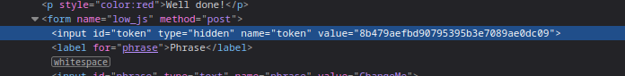
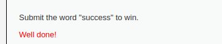
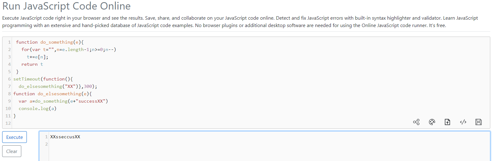
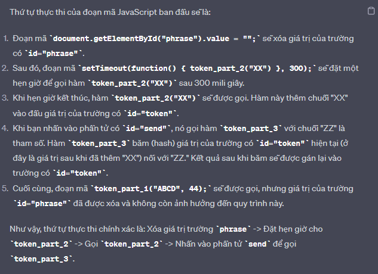

# __JavaScript__

---

## __About__

The attacks in this section are designed to help you learn about how JavaScript is used in the browser and how it can be manipulated. The attacks could be carried out by just analysing network traffic, but that isn't the point and it would also probably be a lot harder.

## __Objective__

Simply submit the phrase "success" to win the level. Obviously, it isn't quite that easy, each level implements different protection mechanisms, the JavaScript included in the pages has to be analysed and then manipulated to bypass the protections.

{==

Công việc của ta cho toàn bộ thử thách ở phần này là dịch ngược đoạn mã JavaScript để tìm được giá trị và truyền nó vào thẻ <input\> có id là `token`. 

==}

## __Security Level: Low__

Source code

```php title="vulnerabilities/javascript/source/low.php"
--8<-- "dvwa/javascript/sources/low.php"
```

### __Analysis__

Để ý hàm `#!js generate_token()` ta thấy hàm này sẽ tạo token từ keyword `success` mà ta nhập vào. Công việc của chúng ta ở thời điểm này là điều chỉnh token hệ thống sinh ra thành token được tạo thông qua hàm `#!js generate_token()`. Chúng ta sẽ hoàn thành thử thách.

### __Exploition__

F12 website ta thấy dòng token bị `hidden`



Ta sẽ tiêm `38581812b435834ebf84ebcc2c6424d6` (MD5(ROT13(success))) vào token và sẽ bypass được challenge này.

Và xong, kết quả sẽ hiển thị như hình bên dưới



---

## __Security Level: Medium__

Source code

```php title="vulnerabilities/javascript/source/medium.php"
--8<-- "dvwa/javascript/sources/medium.php"
```

```js title="vulnerabilities/javascript/source/medium.js"
--8<-- "dvwa/javascript/sources/medium.js"
```

### __Analysis__

Nhờ https://reqbin.com/code/javascript ta sẽ tìm được token mong muốn. 


```js title="medium.js"
--8<-- "dvwa/javascript/sources/token_m.js"
```

### __Exploition__



---

## __Security Level: High__

Source code

```php title="vulnerabilities/javascript/source/high.php"
--8<-- "dvwa/javascript/sources/high.php"
```

```js title="vulnerabilities/javascript/source/high.js"
--8<-- "dvwa/javascript/sources/high.js"
```

### __Analysis__

Với bài này, ta thấy đoạn code javascript khá khó hiểu. Thì thực ra đoạn mã này đã bị [Obfuscation](https://www.cleancss.com/javascript-obfuscate/index.php), và ta sẽ dùng [deobfuscate javascript](http://deobfuscatejavascript.com/#) để xem code.  

```js
function do_something(e) {
    for (var t = "", n = e.length - 1; n >= 0; n--) t += e[n];
    return t
}
function token_part_3(t, y = "ZZ") {
    document.getElementById("token").value = sha256(document.getElementById("token").value + y)
}
function token_part_2(e = "YY") {
    document.getElementById("token").value = sha256(e + document.getElementById("token").value)
}
function token_part_1(a, b) {
    document.getElementById("token").value = do_something(document.getElementById("phrase").value)
}
document.getElementById("phrase").value = "";
setTimeout(function() {
    token_part_2("XX")
}, 300);
document.getElementById("send").addEventListener("click", token_part_3);
token_part_1("ABCD", 44);
```

Ta lượm nhặt được các dòng quan trọng nằm cuối đoạn code. Lúc này ta sẽ phân tích xem trình tự thực thi của các hàm.

Ta thấy tổng cộng có 3 hàm:

- token_part_1 - A
- token_part_2 - B
- token_part_3 - C

Cái vấn đề nan giải ở đây là hàm setTimeout delay token_part_2() 300s, thì cho ta không biết được thứ tự chính xác của 3 hàm A, B, C chạy như thế nào. Hiển nhiên khi test với console.log("A"), console.log("B"), console.log("C") thì ta sẽ thấy được thứ tự gọi là C - A - B. Nhưng đây họ dùng SHA256 thì có thể thời gian nó chênh lệch và dẫn đến thứ tự gọi các hàm không còn đúng nữa.

Well, sau một vài thao tác thử, ta có thể thấy được thứ tự gọi đúng là C - A - B và token cần tìm là `7f1bfaaf829f785ba5801d5bf68c1ecaf95ce04545462c8b8f311dfc9014068a` được lấy từ SHA256(XXsseccus)

### __Exploition__

Khai thác như 2 challenge trước.

Hãy xem một phần chatGPT phân tích cho đoạn mã javascript



Sau khi gọi token_part_3. Ngay lập tức thực thi token_part_1 và có thể gần hết 300s (là thời điểm token_part_2 được gọi). 

Và token cần tìm là SHA256(XX + do_something("success"))

---

## __Security Level: Impossible__

You can never trust anything that comes from the user or prevent them from messing with it and so there is no impossible level.

---

## __Spoiler__

### __Low Level__

All the JavaScript is included in the page. Read the source and work out what function is being used to generate the token required to match with the phrase and then call the function manually.

Spoiler: Change the phrase to success and then use the function generate_token() to update the token.


### __Medium Level__

The JavaScript has been broken out into its own file and then minimized. You need to view the source for the included file and then work out what it is doing. Both Firefox and Chrome have a Pretty Print feature which attempts to reverse the compression and display code in a readable way.

Spoiler: The file uses the setTimeout function to run the do_elsesomething function which generates the token.


### __High Level__

The JavaScript has been obfuscated by at least one engine. You are going to need to step through the code to work out what is useful, what is garbage and what is needed to complete the mission.

Spoiler: <span style="background: #181826; color: #181826">If it helps, two packers have been used, the first is from [Dan's Tools](https://www.danstools.com/javascript-obfuscate/index.php) and the second is the [JavaScript Obfuscator Tool](https://javascriptobfuscator.herokuapp.com/). </span>

Spoiler 2: <span style="background: #181826; color: #181826">This deobfuscation tool seems to work the best on this code [deobfuscate javascript](http://deobfuscatejavascript.com/).</span>

Spoiler 3: <span style="background: #181826; color: #181826">This is one way to do it... run the obfuscated JS through a deobfuscation app, intercept the response for the obfuscated JS and swap in the readable version. Work out the flow and you will see three functions that need to be called in order. Call the functions at the right time with the right parameters.</span>

### __Impossible Level__

You can never trust the user and have to assume that any code sent to the user can be manipulated or bypassed and so there is no impossible level.

---

## __More Information__


- https://www.w3schools.com/js/
- https://www.youtube.com/watch?v=cs7EQdWO5o0&index=17&list=WL
- https://ponyfoo.com/articles/es6-proxies-in-depth
