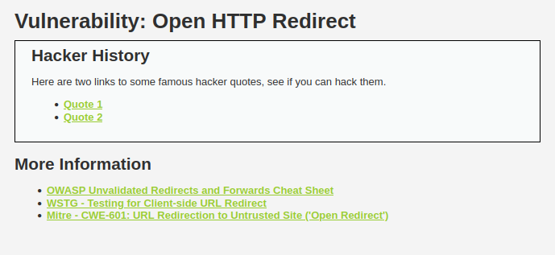
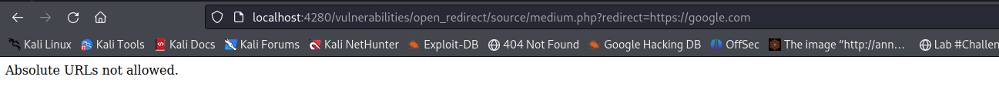

# __Open HTTP Redirect__

---

## __About__

OWASP define this as:

- Unvalidated redirects and forwards are possible when a web application accepts untrusted input that could cause the web application to redirect the request to a URL contained within untrusted input. By modifying untrusted URL input to a malicious site, an attacker may successfully launch a phishing scam and steal user credentials. 

As suggested above, a common use for this is to create a URL which initially goes to the real site but then redirects the victim off to a site controlled by the attacker. This site could be a clone of the target's login page to steal credentials, a request for credit card details to pay for a service on the target site, or simply a spam page full of advertising.


## __Objective__

Abuse the redirect page to move the user off the DVWA site or onto a different page on the site than expected.

> Ta sẽ dùng trang https://google.com để làm target của việc chuyển hướng.

## __Security Level: Low__

Source code

```php title="vulnerabilities/open_redirect/source/low.php"
--8<-- "dvwa/open-http-redirect/sources/low.php"
```


### __Analysis__



Nhận thấy rằng, challenge cung cấp cho ta link của 2 Quote:

- Quote 1: http://localhost:4280/vulnerabilities/open_redirect/source/low.php?redirect=info.php?id=1
- Quote 2: http://localhost:4280/vulnerabilities/open_redirect/source/low.php?redirect=info.php?id=2

Tham số chính của url là `redirect`. Và trong đoạn code của challenge chỉ đề cập đến việc kiểm tra xem nếu tồn tại giá trị của `redirect` thì thực thi. Do đó ta có thể tiêm giá trị https://google.com vào tham số `redirect` để tiến hành chuyển hướng qua trang google.com.

### __Exploition__

Như đã phân tích ở trên, payload đầy đủ của chúng ta là `http://localhost:4280/vulnerabilities/open_redirect/source/low.php?redirect=https://google.com`

---

## __Security Level: Medium__

Source code

```php title="vulnerabilities/open_redirect/source/medium.php"
--8<-- "dvwa/open-http-redirect/sources/medium.php"
```

### __Analysis__

Ở challenge này, họ filter đầu vào bằng việc chặn sự xuất hiện của http:// và https://



### __Exploition__

Bài này ta dùng `protocol-relative URL` (PRURL) để bypass và payload đầy đủ như dưới đây

> Payload: http://localhost:4280/vulnerabilities/open_redirect/source/medium.php?redirect=//google.com

---

## __Security Level: High__

Source code

```php title="vulnerabilities/open_redirect/source/high.php"
--8<-- "dvwa/open-http-redirect/sources/high.php"
```

### __Analysis__

Bài này họ dùng hàm `#!php strpos()` để kiểm tra xem chuỗi info.php có xuất hiện trong chuỗi được truyền vào tham số redirect hay không. Nếu không thì sẽ gửi thông báo `You can only redirect to the info page.` và sẽ không thành công trong việc redirect.

Bạn có thể dễ dàng nhận thấy thông qua URL dẫn đến Quote 1 hoặc URL dẫn đến Quote 2. 

http://localhost:4280/vulnerabilities/open_redirect/source/low.php?redirect=info.php?id=1

Để ý rằng, chuỗi info.php&id=1 được truyền vào tham số redirect đã vô tình biến cho chuỗi `1` làm giá trị cho tham số `id`. Tóm lại ta cần redirect tới 1 website nào đó đủ "mạnh" để nó có thể filter những tham số lỗi. Như payload dưới đây.

> http://localhost:4280/vulnerabilities/open_redirect/source/high.php?redirect=https://google.com?info.php

---

## __Security Level: Impossible__

Source code

```php title="vulnerabilities/open_redirect/source/impossible.php"
--8<-- "dvwa/open-http-redirect/sources/impossible.php"
```

---

## __What we learned__

1. PRURL: https://en.wikipedia.org/wiki/URL#prurl

## __Spoiler__

### __Low Level__

The redirect page has no limitations, you can redirect to anywhere you want.

Spoiler: Try browsing to /vulnerabilities/open_redirect/source/low.php?redirect=https://digi.ninja

## __Medium Level__

The code prevents you from using absolute URLs to take the user off the site, so you can either use relative URLs to take them to other pages on the same site or a Protocol-relative URL.

Spoiler: Try browsing to /vulnerabilities/open_redirect/source/low.php?redirect=//digi.ninja

## __High Level__

The redirect page tries to lock you to only redirect to the info.php page, but does this by checking that the URL contains "info.php".

Spoiler: Try browsing to /vulnerabilities/open_redirect/source/low.php?redirect=https://digi.ninja/?a=info.php

## __Impossible Level__

Rather than accepting a page or URL as the redirect target, the system uses ID values to tell the redirect page where to redirect to. This ties the system down to only redirect to pages it knows about and so there is no way for an attacker to modify things to go to a page of their choosing.

## __More Information__

- [OWASP Unvalidated Redirects and Forwards Cheat Sheet](https://cheatsheetseries.owasp.org/cheatsheets/Unvalidated_Redirects_and_Forwards_Cheat_Sheet.html)
- [WSTG - Testing for Client-side URL Redirect](https://owasp.org/www-project-web-security-testing-guide/stable/4-Web_Application_Security_Testing/11-Client-side_Testing/04-Testing_for_Client-side_URL_Redirect)
- [Mitre - CWE-601: URL Redirection to Untrusted Site ('Open Redirect')](https://cwe.mitre.org/data/definitions/601.html)
- https://en.wikipedia.org/wiki/Password_cracking