# __SQL Injection__

_Notes: Mục tiêu của challenge này là tìm được password của các user._

---

## __Security Level: Low__

Source code

```php title="vulnerabilities/sqli/source/low.php" linenums="1" hl_lines="10"
<?php

if( isset( $_REQUEST[ 'Submit' ] ) ) {
    // Get input
    $id = $_REQUEST[ 'id' ];

    switch ($_DVWA['SQLI_DB']) {
        case MYSQL:
            // Check database
            $query  = "SELECT first_name, last_name FROM users WHERE user_id = '$id';";
            $result = mysqli_query($GLOBALS["___mysqli_ston"],  $query ) or die( '<pre>' . ((is_object($GLOBALS["___mysqli_ston"])) ? mysqli_error($GLOBALS["___mysqli_ston"]) : (($___mysqli_res = mysqli_connect_error()) ? $___mysqli_res : false)) . '</pre>' );

            // Get results
            while( $row = mysqli_fetch_assoc( $result ) ) {
                // Get values
                $first = $row["first_name"];
                $last  = $row["last_name"];

                // Feedback for end user
                echo "<pre>ID: {$id}<br />First name: {$first}<br />Surname: {$last}</pre>";
            }

            mysqli_close($GLOBALS["___mysqli_ston"]);
            break;
        case SQLITE:
            global $sqlite_db_connection;

            #$sqlite_db_connection = new SQLite3($_DVWA['SQLITE_DB']);
            #$sqlite_db_connection->enableExceptions(true);

            $query  = "SELECT first_name, last_name FROM users WHERE user_id = '$id';";
            #print $query;
            try {
                $results = $sqlite_db_connection->query($query);
            } catch (Exception $e) {
                echo 'Caught exception: ' . $e->getMessage();
                exit();
            }

            if ($results) {
                while ($row = $results->fetchArray()) {
                    // Get values
                    $first = $row["first_name"];
                    $last  = $row["last_name"];

                    // Feedback for end user
                    echo "<pre>ID: {$id}<br />First name: {$first}<br />Surname: {$last}</pre>";
                }
            } else {
                echo "Error in fetch ".$sqlite_db->lastErrorMsg();
            }
            break;
    } 
}

?>
```

### __Analysis__

Ta sẽ thăm dò một vài thứ từ cơ sở dữ liệu.

Đầu tiên, ta nhận thấy trong database chỉ có 5 user (thông qua việc check user ID)

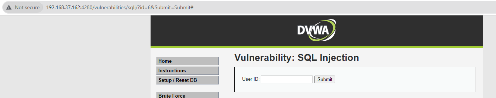

Để ý source code trên ở dòng 10

```sql
SELECT first_name, last_name FROM users WHERE user_id = '$id';
```

Ta thấy câu lệnh truy vấn cơ sở dữ liệu khá đơn giản, lấy thông tin của biến `$id` để check giá trị của `user_id`. Chuyện gì xảy ra nếu giá trị của biến `$id` là `1'or '1'='1`. Ngay lập tức nó đem giá trị này vào `user_id` và kết hợp với dấu `'` trong code, ta được câu lệnh full như sau

```sql
SELECT first_name, last_name FROM users WHERE user_id = '1'or '1'='1';
```

Lúc này, ngay lập tức câu lệnh select của ta sẽ tồn tại logic `or '1'='1'` thể hiện việc điều kiện where luôn đúng. Điều này về cơ bản sẽ đồng nghĩa với câu lệnh sau

```sql
SELECT first_name, last_name FROM users
```

Đã có cái nhìn đầu tiên cho challenge, ta sẽ tiến hành khai thác nó thôi

### __Exploition__

Bằng việc thêm logic cơ bản (or'1'='1) ta dễ dàng lấy được thông tin toàn bộ user trong table `users`

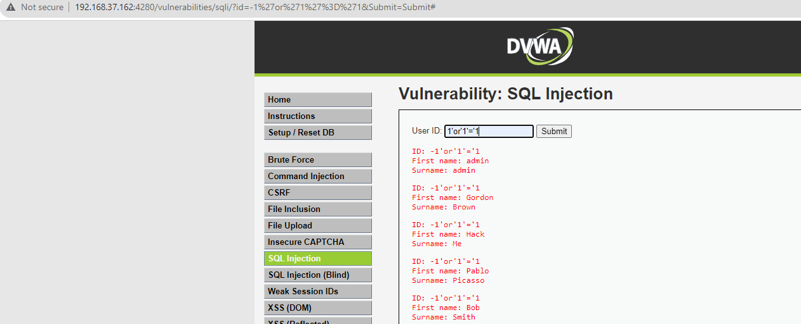

Oke, đã thành công tiêm payload, giờ là bước kết hợp các loại select để tìm ra được các cột có thể khai thác trong tables user

Đầu tiên ta phải xác định hệ quản trị cơ sở dữ liệu của challenge này là loại gì bằng cách tiêm payload lỗi để nhận thông báo lỗi

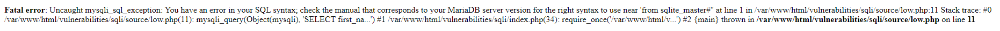

Thấy rằng, họ dùng mysql. Trong mysql ta sẽ có table `information_schema.tables` là bảng chứa tất cả các bảng dữ liệu trong cơ sở dữ liệu.

Ta sẽ lần lượt tìm kiếm thông tin của bảng dữ liệu chứa password

> Trường hợp bảng users chỉ lưu thông tin cơ bản của user như username, first_name, last_name,... và tồn tại 1 table khác lưu thông tin password của user. Hai bảng này kết nối với nhau thông qua username chẳng hạn.

??? tip "Đừng xem"
    'union select 1,table_name from information_schema.tables#

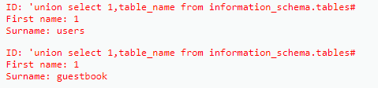

Ta nhận được bảng users và guestbook. Thì ta có thể kết luận password có thể lưu vào bảng users. 

Roài ta sẽ tiếp tục xem table users có tổng cộng bao nhiêu cột

??? tip "Đừng xem"
     'union select 1,column_name from information_schema.columns where table_name="users" #

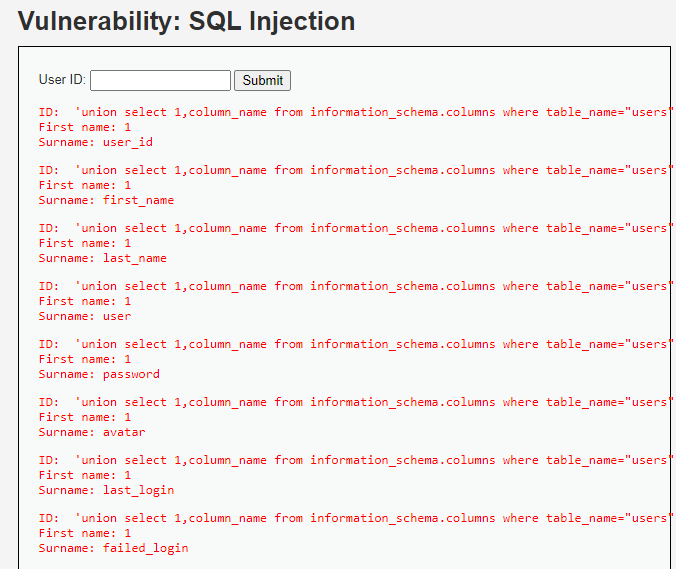

Sau khi có thông tin các cột trong bảng thì dễ rồi, ta sẽ lấy ra password của các user bằng việc lấy ra cột password và cột user_id

??? tip "Đừng xem"
     'union select 1,concat(user_id," ",password) from users #

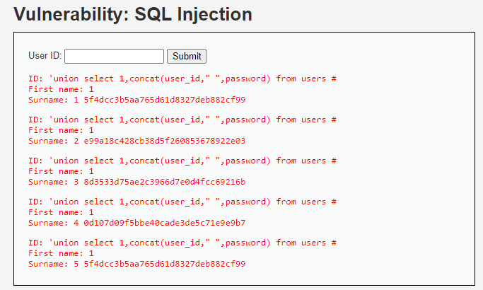

Mục tiêu hoàn thành.

---

## __Security Level: Medium__

Source code

```php title="vulnerabilities/sqli/source/medium.php"

<?php

if( isset( $_POST[ 'Submit' ] ) ) {
    // Get input
    $id = $_POST[ 'id' ];

    $id = mysqli_real_escape_string($GLOBALS["___mysqli_ston"], $id);

    switch ($_DVWA['SQLI_DB']) {
        case MYSQL:
            $query  = "SELECT first_name, last_name FROM users WHERE user_id = $id;";
            $result = mysqli_query($GLOBALS["___mysqli_ston"], $query) or die( '<pre>' . mysqli_error($GLOBALS["___mysqli_ston"]) . '</pre>' );

            // Get results
            while( $row = mysqli_fetch_assoc( $result ) ) {
                // Display values
                $first = $row["first_name"];
                $last  = $row["last_name"];

                // Feedback for end user
                echo "<pre>ID: {$id}<br />First name: {$first}<br />Surname: {$last}</pre>";
            }
            break;
        case SQLITE:
            global $sqlite_db_connection;

            $query  = "SELECT first_name, last_name FROM users WHERE user_id = $id;";
            #print $query;
            try {
                $results = $sqlite_db_connection->query($query);
            } catch (Exception $e) {
                echo 'Caught exception: ' . $e->getMessage();
                exit();
            }

            if ($results) {
                while ($row = $results->fetchArray()) {
                    // Get values
                    $first = $row["first_name"];
                    $last  = $row["last_name"];

                    // Feedback for end user
                    echo "<pre>ID: {$id}<br />First name: {$first}<br />Surname: {$last}</pre>";
                }
            } else {
                echo "Error in fetch ".$sqlite_db->lastErrorMsg();
            }
            break;
    }
}

// This is used later on in the index.php page
// Setting it here so we can close the database connection in here like in the rest of the source scripts
$query  = "SELECT COUNT(*) FROM users;";
$result = mysqli_query($GLOBALS["___mysqli_ston"],  $query ) or die( '<pre>' . ((is_object($GLOBALS["___mysqli_ston"])) ? mysqli_error($GLOBALS["___mysqli_ston"]) : (($___mysqli_res = mysqli_connect_error()) ? $___mysqli_res : false)) . '</pre>' );
$number_of_rows = mysqli_fetch_row( $result )[0];

mysqli_close($GLOBALS["___mysqli_ston"]);
?>
```

### __Analysis__

Thử thách này họ chuyển từ GET HTTP Request thành POST HTTP Request. Ta sẽ dùng Burpsuite để xem trạng thái gói tin

> Challenge ban nãy ta có thể tiêm thẳng trên URL.

Bên cạnh đó, họ còn filter các kí tự đặt biệt bằng việc dùng hàm `mysqli_real_escape_string[^1]` thông qua câu lệnh bên dưới

 [^1]: Xem tại https://www.php.net/manual/en/mysqli.real-escape-string.php

```php
$id = mysqli_real_escape_string($GLOBALS["___mysqli_ston"], $id);
```

Và bộ kí tự được filter là

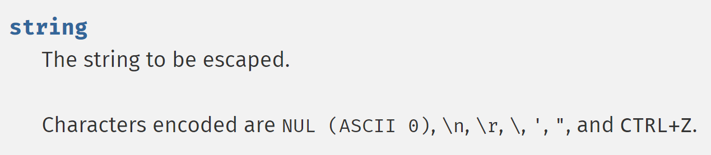

Nhưng đáng tiếc thay, trong truy vấn lại không có dấu ngoặc kép xung quanh dẫn đến việc ta không cần mã hóa dấu ngoặc (gbk,...) mà vẫn có thể bypass được

```php
$query  = "SELECT first_name, last_name FROM users WHERE user_id = $id;";
```

### __Exploition__

Dùng những payload ở mức độ Low để bypass challenge này.

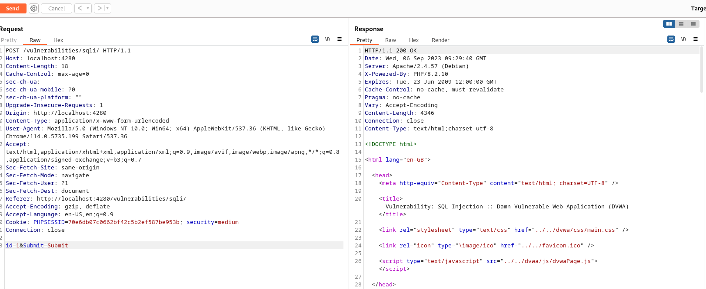

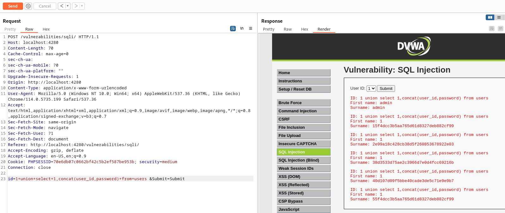

---

## __Security Level: High__

Source code

```php title="vulnerabilities/sqli/source/high.php"
<?php

if( isset( $_SESSION [ 'id' ] ) ) {
    // Get input
    $id = $_SESSION[ 'id' ];

    switch ($_DVWA['SQLI_DB']) {
        case MYSQL:
            // Check database
            $query  = "SELECT first_name, last_name FROM users WHERE user_id = '$id' LIMIT 1;";
            $result = mysqli_query($GLOBALS["___mysqli_ston"], $query ) or die( '<pre>Something went wrong.</pre>' );

            // Get results
            while( $row = mysqli_fetch_assoc( $result ) ) {
                // Get values
                $first = $row["first_name"];
                $last  = $row["last_name"];

                // Feedback for end user
                echo "<pre>ID: {$id}<br />First name: {$first}<br />Surname: {$last}</pre>";
            }

            ((is_null($___mysqli_res = mysqli_close($GLOBALS["___mysqli_ston"]))) ? false : $___mysqli_res);        
            break;
        case SQLITE:
            global $sqlite_db_connection;

            $query  = "SELECT first_name, last_name FROM users WHERE user_id = '$id' LIMIT 1;";
            #print $query;
            try {
                $results = $sqlite_db_connection->query($query);
            } catch (Exception $e) {
                echo 'Caught exception: ' . $e->getMessage();
                exit();
            }

            if ($results) {
                while ($row = $results->fetchArray()) {
                    // Get values
                    $first = $row["first_name"];
                    $last  = $row["last_name"];

                    // Feedback for end user
                    echo "<pre>ID: {$id}<br />First name: {$first}<br />Surname: {$last}</pre>";
                }
            } else {
                echo "Error in fetch ".$sqlite_db->lastErrorMsg();
            }
            break;
    }
}

?> 
```

### __Analysis__

Bài này chắc ở mức Low thôi, thay vì tác động trên URL thì bài này sẽ mở 1 phiên khác để nhập payload vào, nhưng lại không có filter gì cả. Nên ta dễ dàng bypass.

### __Exploition__

Exploit như challenge Low

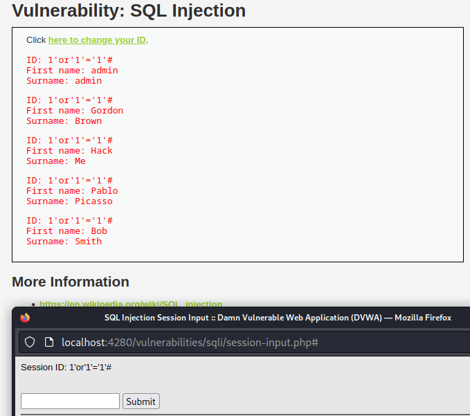

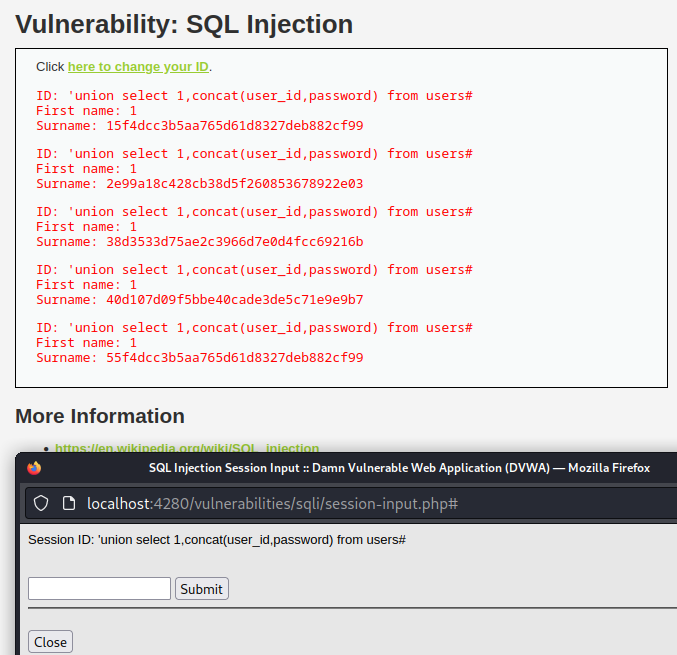

---

## __Security Level: Impossible__

Source code

```php title="vulnerabilities/sqli/source/impossible.php"
<?php

if( isset( $_GET[ 'Submit' ] ) ) {
    // Check Anti-CSRF token
    checkToken( $_REQUEST[ 'user_token' ], $_SESSION[ 'session_token' ], 'index.php' );

    // Get input
    $id = $_GET[ 'id' ];

    // Was a number entered?
    if(is_numeric( $id )) {
        $id = intval ($id);
        switch ($_DVWA['SQLI_DB']) {
            case MYSQL:
                // Check the database
                $data = $db->prepare( 'SELECT first_name, last_name FROM users WHERE user_id = (:id) LIMIT 1;' );
                $data->bindParam( ':id', $id, PDO::PARAM_INT );
                $data->execute();
                $row = $data->fetch();

                // Make sure only 1 result is returned
                if( $data->rowCount() == 1 ) {
                    // Get values
                    $first = $row[ 'first_name' ];
                    $last  = $row[ 'last_name' ];

                    // Feedback for end user
                    echo "<pre>ID: {$id}<br />First name: {$first}<br />Surname: {$last}</pre>";
                }
                break;
            case SQLITE:
                global $sqlite_db_connection;

                $stmt = $sqlite_db_connection->prepare('SELECT first_name, last_name FROM users WHERE user_id = :id LIMIT 1;' );
                $stmt->bindValue(':id',$id,SQLITE3_INTEGER);
                $result = $stmt->execute();
                $result->finalize();
                if ($result !== false) {
                    // There is no way to get the number of rows returned
                    // This checks the number of columns (not rows) just
                    // as a precaution, but it won't stop someone dumping
                    // multiple rows and viewing them one at a time.

                    $num_columns = $result->numColumns();
                    if ($num_columns == 2) {
                        $row = $result->fetchArray();

                        // Get values
                        $first = $row[ 'first_name' ];
                        $last  = $row[ 'last_name' ];

                        // Feedback for end user
                        echo "<pre>ID: {$id}<br />First name: {$first}<br />Surname: {$last}</pre>";
                    }
                }

                break;
        }
    }
}

// Generate Anti-CSRF token
generateSessionToken();

?> 
```

### __Analysis__

---

## __What we learned__


## __More Information__

- https://en.wikipedia.org/wiki/SQL_injection
- https://www.netsparker.com/blog/web-security/sql-injection-cheat-sheet/
- https://owasp.org/www-community/attacks/SQL_Injection
- https://bobby-tables.com/

## __See more__

- https://www.mssqltips.com/sqlservertutorial/196/information-schema-tables/
- https://www.mssqltips.com/sqlservertutorial/183/information-schema-columns/
- https://linuxhint.com/get-table-names-using-select-statement-in-mysql/