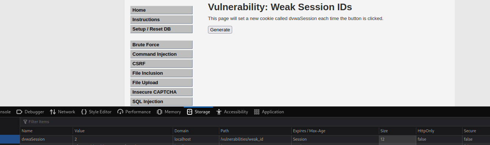

# __Weak Session IDs__

---

## __About__

Knowledge of a session ID is often the only thing required to access a site as a specific user after they have logged in, if that session ID is able to be calculated or easily guessed, then an attacker will have an easy way to gain access to user accounts without having to brute force passwords or find other vulnerabilities such as Cross-Site Scripting.

## __Objective__

This module uses four different ways to set the dvwaSession cookie value, the objective of each level is to work out how the ID is generated and then infer the IDs of other system users.

## __Security Level: Low__

Source code

```php title="vulnerabilities/weak_id/source/low.php"
--8<-- "dvwa/weak-session-ids/sources/low.php"
```


### __Analysis__

Source code challenge này đơn giản rồi, mỗi lần click `Generate` là 1 lần tăng giá trị `dvwaSession` trước lên 1




---

## __Security Level: Medium__

Source code

```php title="vulnerabilities/weak_id/source/medium.php"
--8<-- "dvwa/weak-session-ids/sources/medium.php"
```

### __Analysis__

Ở challenge này, họ tạo `dvwaSession` bằng thời gian thực


---

## __Security Level: High__

Source code

```php title="vulnerabilities/weak_id/source/high.php"
--8<-- "dvwa/weak-session-ids/sources/high.php"
```

Challenge này, họ kết hợp giữa challenge Low và Medium.

---

## __Security Level: Impossible__

Source code

```php title="vulnerabilities/weak_id/source/impossible.php"
--8<-- "dvwa/weak-session-ids/sources/impossible.php"
```

---

## __Spoiler__

### __Low Level__

The cookie value should be very obviously predictable.

### __Medium Level__

The value looks a little more random than on low but if you collect a few you should start to see a pattern.

### __High Level__

First work out what format the value is in and then try to work out what is being used as the input to generate the values.

Extra flags are also being added to the cookie, this does not affect the challenge but highlights extra protections that can be added to protect the cookies.

## __Impossible Level__

The cookie value should not be predictable at this level but feel free to try.

As well as the extra flags, the cookie is being tied to the domain and the path of the challenge.

## __More Information__

- Reference: WSTG - Session Management Schema
- Reference: OWASP Cheat Sheet - Session Management