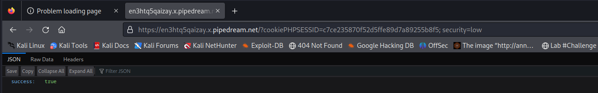

# __XSS (DOM)__

_Cross-Site Scripting (XSS) attacks are a type of injection, in which malicious scripts are injected into otherwise benign and trusted websites. XSS attacks occur when an attacker uses a web application to send malicious code, generally in the form of a browser side script, to a different end user. Flaws that allow these attacks to succeed are quite widespread and occur anywhere a web application uses input from a user within the output it generates without validating or encoding it._

_An attacker can use XSS to send a malicious script to an unsuspecting user. The end user’s browser has no way to know that the script should not be trusted, and will execute the script. Because it thinks the script came from a trusted source, the malicious script can access any cookies, session tokens, or other sensitive information retained by the browser and used with that site. These scripts can even rewrite the content of the HTML page. For more details on the different types of XSS flaws, see: [Types of Cross-Site Scripting](https://owasp.org/www-community/Types_of_Cross-Site_Scripting)._

---

## __Objective__

Run your own JavaScript in another user's browser, use this to steal the cookie of a logged in user.

## __Security Level: Low__

Source code

```php title="vulnerabilities/xss_d/source/low.php"
<?php

# No protections, anything goes

?> 
```

### __Analysis__

Challenge này thì đơn giản rồi, không có ràng buộc về source code. Bạn chỉ cần ghi nhớ muốn lấy cookie thì dùng `document.cookie`. Và tùy thuộc suy nghĩ của bạn về vấn đề mà có hướng attack đúng đắn.

> Thay vì ta xuất thông báo cookie (`alert(document.cookie)`) trên trình duyệt. Thì nên tạo 1 website nào đó lưu yêu cầu lại. Vì ngữ cảnh ta đặt ra là cho 1 victim "click" và ta sẽ ngồi ở nơi nào đó "quan sát"

### __Exploition__

Ta có nhiều cách khai thác




---

## __Security Level: Medium__

Source code

```php title=""
```

### __Analysis__

### __Exploition__

---

## __Security Level: High__

Source code

```php title=""
```

### __Analysis__

### __Exploition__

---

## __Security Level: Impossible__

Source code

```php title=""
```

### __Analysis__

---

## __What we learned__

## __More Information__

- https://owasp.org/www-community/attacks/xss/
- https://owasp.org/www-community/attacks/DOM_Based_XSS
- https://www.acunetix.com/blog/articles/dom-xss-explained/