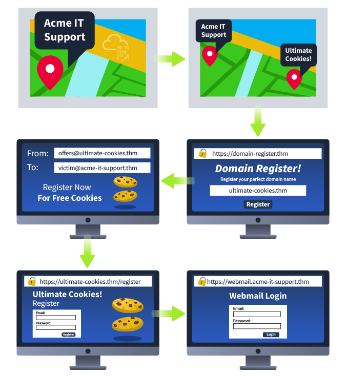

# __Phishing__

---

## __Task 1: Brief__

*[Phishing]: When emails are sent to a target(s) purporting to be from a trusted entity to lure individuals into providing sensitive information.

This room will take you through what phishing is, how it's performed, some valuable tools and why it's an essential part of a Red Team engagement. 

Now it's time to move to the next task and receive your Intro to Phishing!

!!! question "I'm ready to learn!"
    No needed answer 

## __Task 2: Intro To Phishing Attacks__

*[Social engineering]: The manipulation of individuals to divulge sensitive information, through various forms of communication

*[spear-phishing]: This involves sending of targeted emails to specific individuals or groups within an organisation, often with a malicious attachment or link.

Before you learn what phishing is, you'll need to understand the term social engineering. Social engineering is the psychological manipulation of people into performing or divulging information by exploiting weaknesses in human nature. These "weaknesses" can be curiosity, jealously, greed and even kindness and the willingness to help someone. Phishing is a source of social engineering delivered through email to trick someone into either revealing personal information, credentials or even executing malicious code on their computer.

These emails will usually appear to come from a trusted source, whether that's a person or a business. They include content that tries to tempt or trick people into downloading software, opening attachments, or following links to a bogus website.

A term you'll come across and the type of phishing campaign a red team would participate in is spear-phishing, as with throwing a physical spear; you'd have a target to aim at, the same can be said with spear-phishing in that you're targeting an individual, business or organisation rather than just anybody as mass. This is an effective form of phishing for a red team engagement as they are bespoke to the target it makes them hard to detect by technology such as spam filters, antivirus and firewalls.

A red team could be contracted to solely carry out a phishing assessment to see whether a business is vulnerable to this type of attack or can also be part of a broader scale assessment and used to gain access to computer systems or services.

Some other methods of phishing through other mediums are smishing which is phishing through SMS messages, and vishing which is performed through phone calls.

__Example Scenario:__

The below example scenario shows how an employee of a company could be tricked into revealing their credentials.

1) The attacker locates the physical location of the target business.

2) The attacker then looks for nearby food suppliers and discovers a company called Ultimate Cookies!

3) The Attacker registers the domain name ultimate-cookies.thm

4) The attacker then crafts an email to their target, tempting them with an offer of receiving some free cookies if they sign up to the website. Because the victim has heard of this local company, they are more likely to trust it.

5) The victim then follows the link in the email to the fake website created by the attacker and registers online. To keep things simple, the victim reuses the same password for all their online accounts.

6) The attacker now has the victim's email address and password and can log onto the victim's company email account. The attacker could now have access to private company information and also have somewhere to launch another phishing attack against other employees.

Next, you'll learn what goes on in setting up the infrastructure for a red team phishing campaign.

!!! question "What type of psychological manipulation is phishing part of?"
    Social engineering 

!!! question "What type of phishing campaign do red teams get involved in?"
    spear-phishing

## __Task 3: Writing Convincing Phishing Emails__

We have three things to work with regarding phishing emails: the sender's email address, the subject and the content.

__The Senders Address__:

Ideally, the sender's address would be from a domain name that spoofs a significant brand, a known contact, or a coworker. See the Choosing A Phishing Domain task below for more information on this.

To find what brands or people a victim interacts with, you can employ OSINT (Open Source Intelligence) tactics. For example:

- Observe their social media account for any brands or friends they talk to.
- Searching Google for the victim's name and rough location for any reviews the victim may have left about local businesses or brands.
- Looking at the victim's business website to find suppliers.
- Looking at LinkedIn to find coworkers of the victim.

__The Subject__:

You should set the subject to something quite urgent, worrying, or piques the victim's curiosity, so they do not ignore it and act on it quickly.

Examples of this could be:

1. Your account has been compromised.
2. Your package has been dispatched/shipped.
3. Staff payroll information (do not forward!)
4. Your photos have been published.

__The Content__:

If impersonating a brand or supplier, it would be pertinent to research their standard email templates and branding (style, logo's images, signoffs etc.) and make your content look the same as theirs, so the victim doesn't expect anything. If impersonating a contact or coworker, it could be beneficial to contact them; first, they may have some branding in their template, have a particular email signature or even something small such as how they refer to themselves, for example, someone might have the name Dorothy and their email is dorothy@company.thm. Still, in their signature, it might say "Best Regards, Dot". Learning these somewhat small things can sometimes have quite dramatic psychological effects on the victim and convince them more to open and act on the email.

If you've set up a spoof website to harvest data or distribute malware, the links to this should be disguised using the [anchor text](https://en.wikipedia.org/wiki/Anchor_text) and changing it either to some text which says "Click Here" or changing it to a correct looking link that reflects the business you are spoofing, for example:

`<a href="http://spoofsite.thm">Click Here</a>`

`<a href="http://spoofsite.thm">https://onlinebank.thm</a>`

!!! question "What tactic can be used to find brands or people a victim interacts with?"
    OSINT

!!! question "What should be changed on an HTML anchor tag to disguise a link?"
    anchor text

## __Task 4: Phishing Infrastructure__

*[DNS]: Domain Name System (DNS) is the protocol responsible for resolving hostnames, such as tryhackme.com, to their respective IP addresses.

A certain amount of infrastructure will need to be put in place to launch a successful phishing campaign.

__Domain Name__:

You'll need to register either an authentic-looking domain name or one that mimics the identity of another domain. See task 5 for details on how to create the perfect domain name.

__SSL/TLS Certificates__:
Creating SSL/TLS certificates for your chosen domain name will add an extra layer of authenticity to the attack.

__Email Server/Account__:

You'll need to either set up an email server or register with an SMTP email provider. 

__DNS Records__:

Setting up DNS Records such as SPF, DKIM, DMARC will improve the deliverability of your emails and make sure they're getting into the inbox rather than the spam folder.

__Web Server__:

You'll need to set up webservers or purchase web hosting from a company to host your phishing websites. Adding SSL/TLS to the websites will give them an extra layer of authenticity. 

__Analytics__:

When a phishing campaign is part of a red team engagement, keeping analytics information is more important. You'll need something to keep track of the emails that have been sent, opened or clicked. You'll also need to combine it with information from your phishing websites for which users have supplied personal information or downloaded software. 

__Automation And Useful Software__:

Some of the above infrastructures can be quickly automated by using the below tools.

__GoPhish - (Open-Source Phishing Framework) - getgophish.com__

GoPhish is a web-based framework to make setting up phishing campaigns more straightforward. GoPhish allows you to store your SMTP server settings for sending emails, has a web-based tool for creating email templates using a simple WYSIWYG (What You See Is What You Get) editor. You can also schedule when emails are sent and have an analytics dashboard that shows how many emails have been sent, opened or clicked.

The Next task will talk you through how to launch a phishing campaign using this software.

__SET - (Social Engineering Toolkit) - trustedsec.com__

The Social Engineering Toolkit contains a multitude of tools, but some of the important ones for phishing are the ability to create spear-phishing attacks and deploy fake versions of common websites to trick victims into entering their credentials.

Answer the questions below ---

!!! question "What part of a red team infrastructure can make a website look more authentic?"
    SSL/TLS Certificates
