# __The Lay of the Land__

---

## __Task 1: Introduction__

It is essential to be familiar with the environment where you have initial access to a compromised machine during a red team engagement. Therefore, performing reconnaissance and enumeration is a significant part, and the primary goal is to gather as much information as possible to be used in the next stage. 

With an initial foothold established, the post-exploitation process begins! 


This room introduces commonly-used concepts, technologies, and security products that we need to be aware of.

In this room, the assumption is that we have already gained access to the machine, and we are ready to expand our knowledge more about the environment by performing enumerating for the following:

- Network infrastrucutre
- Active Directory Environment
- Users and Groups
- Host-based security solutions
- Network-based security solutions
- Applications and services

### __Answer the question bellow__

!!! question "Let's start learning!"
    No needed answer

## __Task 2: Deploy the VM__

### __Answer the question bellow__

!!! question "Let's discuss the common network infrastructure in the next task!"
    No needed answer

## __Task 3: Network Infrastructure__

### __Nội dung chính__

Từ đây trở đi, tôi sẽ nói tiếng việt và có thể tóm tắt một vài điều mà cần nắm trong những task. Ta có một số thứ cơ bản về network như sau:

__Internal Networks__: Là vùng mạng nội bộ giúp chia sẻ thông tin và liên lạc nhanh hơn trong tổ chức. Những người system admin sẽ config những thứ này

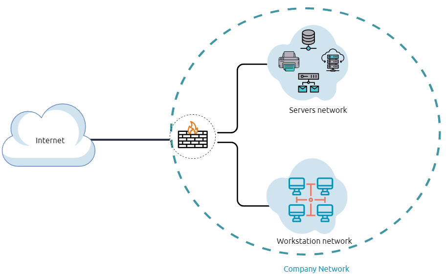

Trên đây là hình ảnh sơ lược

__DMZ Zone__: Vùng DMZ là vùng mạng ngoại biên dùng để bảo vệ cho vùng mạng nội bộ bằng cách đẩy các traffic không đáng tin cậy ra vùng này.

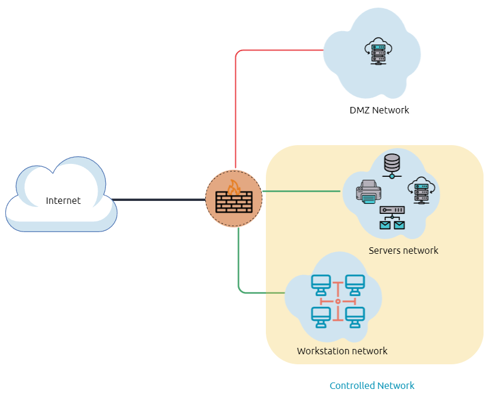

Trong sơ đồ trước, chúng tôi biểu thị lưu lượng mạng đến mạng DMZ bằng màu đỏ, không đáng tin cậy (đến trực tiếp từ internet). Lưu lượng mạng xanh giữa mạng nội bộ là lưu lượng được kiểm soát có thể đi qua một hoặc nhiều thiết bị an ninh mạng.

Việc liệt kê hệ thống và mạng nội bộ là giai đoạn khám phá, cho phép kẻ tấn công tìm hiểu về hệ thống và mạng nội bộ. Dựa trên thông tin thu được, chúng tôi sử dụng thông tin đó để xử lý chuyển động ngang hoặc leo thang đặc quyền nhằm đạt được nhiều đặc quyền hơn trên hệ thống hoặc môi trường AD.

__Network Enumeration__: 

Dùng netstat để kiểm tra các kết nối tcp, udp,...

```ps1 title="Command Prompt"
PS C:\Users\thm> netstat -na

Active Connections

  Proto  Local Address          Foreign Address        State
  TCP    0.0.0.0:80             0.0.0.0:0              LISTENING
  TCP    0.0.0.0:88             0.0.0.0:0              LISTENING
  TCP    0.0.0.0:135            0.0.0.0:0              LISTENING
  TCP    0.0.0.0:389            0.0.0.0:0              LISTENING
```

```ps1 title="Command Prompt"
PS C:\Users\thm> arp -a

Interface: 10.10.141.51 --- 0xa
  Internet Address      Physical Address      Type
  10.10.0.1             02-c8-85-b5-5a-aa     dynamic
  10.10.255.255         ff-ff-ff-ff-ff-ff     static
```

## __Task 4: Active Directory (AD) environment__

A list of Active Directory components that we need to be familiar with:

- Domain Controllers
- Organizational Units
- AD objects
- AD Domains
- Forest
- AD Service Accounts: Built-in local users, Domain users, Managed service accounts
- Domain Administrators

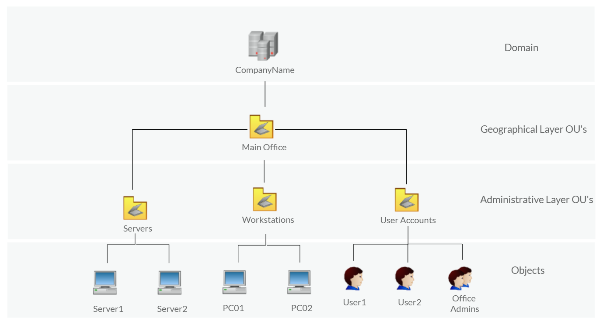

Để kiểm tra xem máy tính có phải một phần trong AD hay không ta dùng lệnh `systeminfo`

```ps1 title="Powershell"
PS C:\Users\thm> systeminfo | findstr Domain
OS Configuration:          Primary Domain Controller
Domain:                    thmdomain.com
```

Với kết quả trên, máy đang là 1 phần của AD với domain `thmdomain.com`

Nếu kết quả bạn cho ra là `WORKGROUP` (thông thường test trên máy tính cá nhân) thì đây là môi trường cục bộ.

### __Answer the questions bellow__

!!! question "Before going any further, ensure the attached machine is deployed and try what we discussed. Is the attached machine part of the AD environment? (Y|N)"
    y

Ta kiểm tra bằng lệnh `systeminfo | findstr Domain`

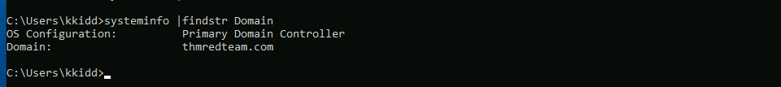

!!! question "If it is part of an AD environment, what is the domain name of the AD?"
    thmredteam.com

__Task 5: Users and Groups Management__

| BUILTIN\Administrator	      | Local admin access on a domain controller                          |
| ----------- | ------------------------------------ |
| Domain Admins	       | Administrative access to all resources in the domain |
| Enterprise Admins	       | Available only in the forest root |
| Schema Admins	    | Capable of modifying domain/forest; useful for red teamers|
| Server Operators		    | Can manage domain servers|
| Account Operators		    | Can manage users that are not in privileged groups|

### __Active Directory (AD) Enum__

Ta dùng lệnh `Get-ADUser  -Filter *` để lấy các tài khoản trong AD

### __Answer the questions bellow__

!!! question "Use the `Get-ADUser -Filter * -SearchBase` command to list the available user accounts within `THM` OU in the `thmredteam.com` domain. How many users are available?"
    6

Dùng lệnh `Get-ADUser -Filter * -SearchBase "OU=THM,DC=thmredteam,DC=com"` nhằm lấy user từ tổ chức THM

!!! question "Once you run the previous command, what is the UserPrincipalName (email) of the admin account?"
    thmadmin@thmredteam.com 
__Task 6: Host Security Solution #1__

### __Host Security Solutions__

1. Antivirus software:
    - __Signature-based detection__ is one of the common and traditional techniques used in antivirus software to identify malicious files. Often, researchers or users submit their infected files into an antivirus engine platform for further analysis by AV vendors, and if it confirms as malicious, then the signature gets registered in their database. The antivirus software compares the scanned file with a database of known signatures for possible attacks and malware on the client-side. If we have a match, then it considers a threat.

    - __Heuristic-based detection__ uses machine learning to decide whether we have the malicious file or not. It scans and statically analyses in real-time in order to find suspicious properties in the application's code or check whether it uses uncommon Windows or system APIs. It does not rely on the signature-based attack in making the decisions, or sometimes it does. This depends on the implementation of the antivirus software.

    - Finally, __Behavior-based detection__ relies on monitoring and examining the execution of applications to find abnormal behaviors and uncommon activities, such as creating/updating values in registry keys, killing/creating processes, etc.

    - As a red teamer, it is essential to be aware of whether antivirus exists or not. It prevents us from doing what we are attempting to do. We can enumerate AV software using Windows built-in tools, such as wmic.

    - Dùng wmic (wmic /namespace:\\root\securitycenter2 path antivirusproduct) để liệt kê phần mềm anti virus

    Lệnh có ý nghĩa tương đương trên poweshell: 
    ```ps1
    Get-CimInstance -Namespace root/SecurityCenter2 -ClassName AntivirusProduct
    ```

2. Microsoft Windows Defender:
    Kiểm tra trạng thái dịch vụ của Windows Defender: 
    ```ps1
    Get-Service WinDefend
    ```

    Kiểm tra trạng thái realtime protection: 
    ```ps1
    Get-MpComputerStatus | select RealTimeProtectionEnabled
    ```

3. Host-based Firewall:

    Kiểm tra tường lửa
    ```ps1
    Get-NetFirewallProfile | Format-Table Name, Enabled
    ```

    Lệnh tắt tường lửa (ở vai trò quản trị viên)
    ```ps1
    Set-NetFirewallProfile -Profile Domain, Public, Private -Enabled False
    ```

    Select property của tường lửa:
    ```ps1 
    Get-NetFirewallRule | select *
    ```

    ```ps1
    Get-NetFirewallRule | select DisplayName, Enabled, Description
    ```

    Kiểm tra kết nối
    ```ps1
    Test-NetConnection -ComputerName 127.0.0.1 -Port 80
    ```

4. Security Event Logging and Monitoring 
5. Host-based Intrusion Detection System (HIDS)/ Host-based Intrusion Prevention System (HIPS)
6. Endpoint Detection and Response (EDR)

### __Answer the questions bellow__

!!! question "Enumerate the attached Windows machine and check whether the host-based firewall is enabled or not! (Y|N)"
    N

Kiểm tra bằng lệnh `Get-NetFirewallProfile | Format-Table Name, Enabled` ta thấy tường lửa chưa được bật.

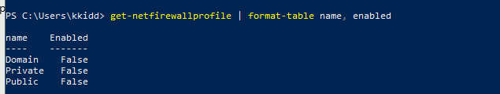

!!! question "Using PowerShell cmdlets such `Get-MpThreat` can provide us with threats details that have been detected using MS Defender. Run it and answer the following: What is the file name that causes this alert to record?"
    powerview.ps1

Xem hình sau
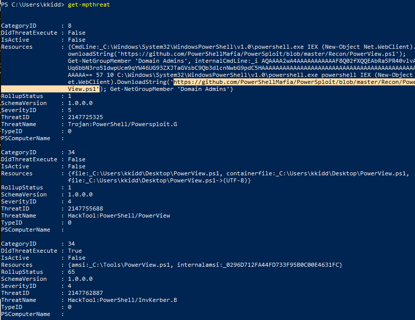

!!! question "UEnumerate the firewall rules of the attached Windows machine. What is the port that is allowed under the THM-Connection rule?"
    17337

Dùng lệnh 
```ps1
get-netfirewallrule | select displayname, enabled, description
```

Xem hình sau
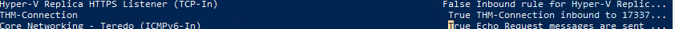


!!! question "In the next task, we will keep discussing the host security solution. I'm ready!"

    No needed answer

## __Task 7: Host Security Solution #2__

Ta sẽ nói về một số giải pháp bảo mật

### __Security Event Logging and Monitoring__

Dùng lệnh `Get-EventLog -List`

### __System Monitor (Sysmon)[^1]__
 [^1]: Xem thêm tại https://docs.microsoft.com/en-us/sysinternals/downloads/sysmon

Một trong những tính năng của sysmon

- Process creation and termination
- Network connections
- Modification on file
- Remote threats
- Process and memory access
- and many others

Kiểm tra sysmon có được cài đặt chưa:
- `Get-Process | Where-Object { $_.ProcessName -eq "Sysmon" }`
- `reg query HKLM\SOFTWARE\Microsoft\Windows\CurrentVersion\WINEVT\Channels\Microsoft-Windows-Sysmon/Operational`

### __Host-based Intrusion Detection/Prevention System (HIDS/HIPS)__


HIDS stands for Host-based Intrusion Detection System. It is software that has the ability to monitor and detect abnormal and malicious activities in a host. The primary purpose of HIDS is to detect suspicious activities and not to prevent them. There are two methods that the host-based or network intrusion detection system works, including:

- Signature-based IDS - it looks at checksums and message authentication.
- Anomaly-based IDS looks for unexpected activities, including abnormal bandwidth usage, protocols, and ports.

Host-based Intrusion Prevention Systems (HIPS) works by securing the operating system activities which where is installed. It is a detecting and prevention solution against well-known attacks and abnormal behaviors. HIPS is capable of auditing log files of the host, monitoring processes, and protecting system resources. HIPS is a mixture of best product features such as antivirus, behavior analysis, network, application firewall, etc.

There is also a network-based IDS/IPS, which we will be covering in the next task. 

### __Endpoint Detection and Response (EDR)__

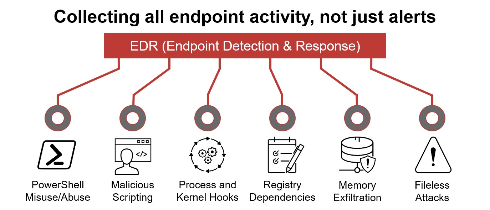

It is also known as Endpoint Detection and Threat Response (EDTR). The EDR is a cybersecurity solution that defends against malware and other threats. EDRs can look for malicious files, monitor endpoint, system, and network events, and record them in a database for further analysis, detection, and investigation. EDRs are the next generation of antivirus and detect malicious activities on the host in real-time.

EDR analyze system data and behavior for making section threats, including

- Malware, including viruses, trojans, adware, keyloggers
- Exploit chains
- Ransomware

Below are some common EDR software for endpoints

- Cylance
- Crowdstrike
- Symantec
- SentinelOne
- Many others

Even though an attacker successfully delivered their payload and bypassed EDR in receiving reverse shell, EDR is still running and monitors the system. It may block us from doing something else if it flags an alert.

We can use scripts for enumerating security products within the machine, such as [Invoke-EDRChecker](https://github.com/PwnDexter/Invoke-EDRChecker) and [SharpEDRChecker](https://github.com/PwnDexter/SharpEDRChecker). They check for commonly used Antivirus, EDR, logging monitor products by checking file metadata, processes, DLL loaded into current processes, Services, and drivers, directories.

## __Task 8: Network Security Solutions__

## __Task 9: Applications and Services__

### __Installed Applications__

Liệt kê các ứng dụng đã cài đặt: `wmic product get name,version`

Tìm kiếm thư mục/tệp tin ẩn bằng Get-ChildItem với cờ Hidden: `Get-ChildItem -Hidden -Path C:\Users\kkidd\Desktop\`

### __Services and Process__

### __Sharing files and Printers__

### __Answer the question bellow__

!!! question "Finally, we can see it is listening on port 8080. Now try to apply what we discussed and find the port number for THM Service. What is the port number?"
    13337

Step 1: Kiểm tra dịch vụ đang chạy: `net start`

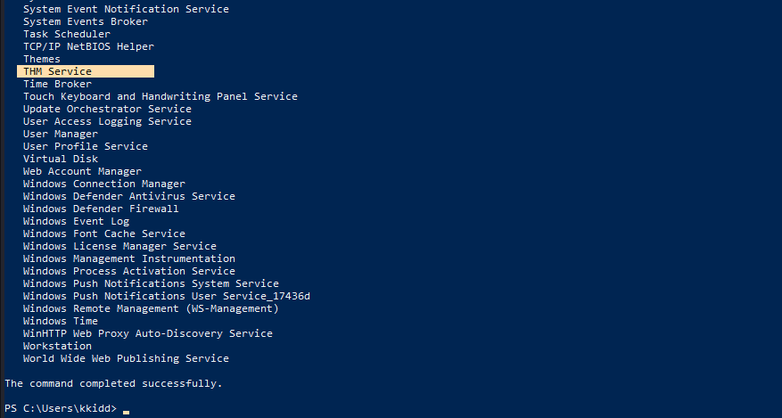

Step 2: Kiểm tra dịch vụ THM Seivice: `wmic service where "name like 'THM Seivice'" get Name,PathName`

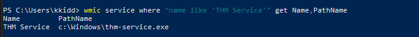

Step 3: Xem tiến trình dịch vụ thông qua Name và Path: `Get-Process -Name thm-service`

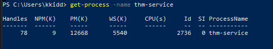

Hình trên cho ta thấy tiến trình có ID 2736.

Ta sẽ liệt kê port internet thông qua ID tiến trình: `netstat -noa | findstr "LISTENING" | findstr "2736" `

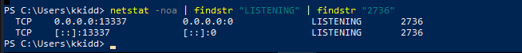

Ta thấy nó listen ở port `13337`, đây cũng là đáp án cho câu hỏi đầu tiên

!!! question "Visit the localhost on the port you found in Question #1. What is the flag?"
     THM{S3rv1cs_1s_3numerat37ed}

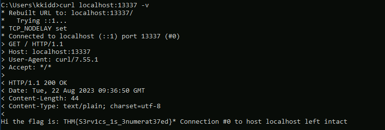

!!! question "Now enumerate the domain name of the domain controller, thmredteam.com, using the nslookup.exe, and perform a DNS zone transfer. What is the flag for one of the records?"
    THM{DNS-15-Enumerated!}

Step 1: Tranfer DNS bằng nslookup

Step 2: Đặt: server MACHINE_IP

Step 3: ls -d thmredteam.com

Xem hình bên dưới
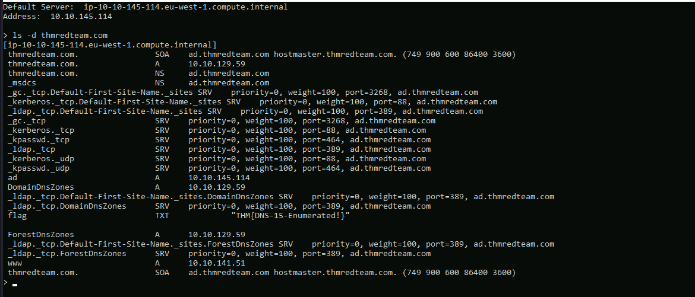


## __Task 10: Conclusion__

This room is an introduction to client systems in corporate environments. The student should have a better understanding of how clients are used in a corporate network including:

- Network Infrastructure
- AD environment
- security measures (HIPS, AV, etc.)
- Internal applications and services