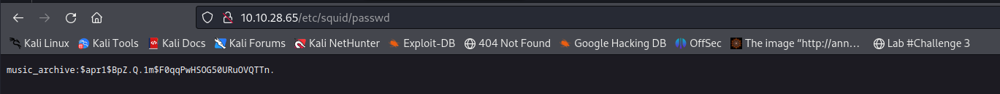
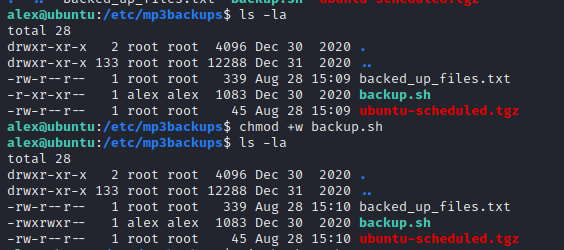
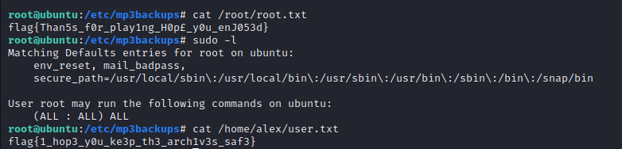

# __Cyborg__

Room at https://tryhackme.com/room/cyborgt8

---

??? question "List of the questions solved"

    Question: Scan the machine, how many ports are open?
    > 2

    Question: What service is running on port 22?
    > ssh

    Question: What service is running on port 80?
    > http

    Question: What is the user.txt flag?
    > flag{1_hop3_y0u_ke3p_th3_arch1v3s_saf3}

    Question: What is the root.txt flag?
    > flag{Than5s_f0r_play1ng_H0p£_y0u_enJ053d}

## __Pentest scenario__

### __Reconnaissance__

Đầu tiên ta quét namp, gobuster như các challenge khác

```ps1 title="Nmap"
PORT   STATE         SERVICE
22/tcp open|filtered ssh
80/tcp open|filtered http
```

```ps1 title="Gobuster"
/admin                (Status: 301) [Size: 310] [--> http://10.10.28.65/admin/]
/etc                  (Status: 301) [Size: 308] [--> http://10.10.28.65/etc/]
```

Sau khi kiểm tra vài bước ban đầu ta thấy có file password từ folder /etc



Để xem password này ta có thể dùng john để giải mã

```ps1 title="Password"
└─$ john --show pass.txt 
music_archive:squidward

1 password hash cracked, 0 left
```

Hơn nữa trong domain `.../admin` ta thấy có thể download tệp archive.tar. Download nó về thôi :3

Cái khó của bài này là đọc blog https://borgbackup.readthedocs.io (thông tin từ file README) và cài đặt `borg`

> borg extract --list final_archive::music_archive

```ps1 title="Terminal"
└─$ borg extract --list final_archive::music_archive 
Enter passphrase for key /home/kali/Desktop/something/tryhackme/practice/cyborgt8/home/field/dev/final_archive: 
home/alex
home/alex/.bashrc
home/alex/.bash_logout
home/alex/.profile
home/alex/Music
home/alex/.bash_history
home/alex/.dbus
home/alex/.dbus/session-bus
home/alex/.dbus/session-bus/c707f46991feb1ed17e415e15fe9cdae-0
home/alex/.config
home/alex/.config/sublime-text-3
home/alex/.config/sublime-text-3/Cache
home/alex/.config/sublime-text-3/Cache/ActionScript
home/alex/.config/sublime-text-3/Cache/ActionScript/ActionScript.sublime-syntax.cache
home/alex/.config/sublime-text-3/Cache/AppleScript
home/alex/.config/sublime-text-3/Cache/AppleScript/AppleScript.sublime-syntax.cache
home/alex/.config/sublime-text-3/Cache/ASP
home/alex/.config/sublime-text-3/Cache/ASP/ASP.sublime-syntax.cache
home/alex/.config/sublime-text-3/Cache/ASP/HTML-ASP.sublime-syntax.cache
home/alex/.config/sublime-text-3/Cache/Batch File
home/alex/.config/sublime-text-3/Cache/Batch File/Batch File.sublime-syntax.cache
home/alex/.config/sublime-text-3/Cache/C#
home/alex/.config/sublime-text-3/Cache/C#/Build.sublime-syntax.cache
home/alex/.config/sublime-text-3/Cache/C#/C#.sublime-syntax.cache
home/alex/.config/sublime-text-3/Cache/C++
home/alex/.config/sublime-text-3/Cache/C++/C.sublime-syntax.cache
home/alex/.config/sublime-text-3/Cache/C++/C++.sublime-syntax.cache
home/alex/.config/sublime-text-3/Cache/Clojure
home/alex/.config/sublime-text-3/Cache/Clojure/Clojure.sublime-syntax.cache
home/alex/.config/sublime-text-3/Cache/CSS
home/alex/.config/sublime-text-3/Cache/CSS/CSS.sublime-syntax.cache
home/alex/.config/sublime-text-3/Cache/D
home/alex/.config/sublime-text-3/Cache/D/D.sublime-syntax.cache
home/alex/.config/sublime-text-3/Cache/D/DMD Output.sublime-syntax.cache
home/alex/.config/sublime-text-3/Cache/Diff
home/alex/.config/sublime-text-3/Cache/Diff/Diff.sublime-syntax.cache
home/alex/.config/sublime-text-3/Cache/Erlang
home/alex/.config/sublime-text-3/Cache/Erlang/Erlang.sublime-syntax.cache
home/alex/.config/sublime-text-3/Cache/Erlang/HTML (Erlang).sublime-syntax.cache
home/alex/.config/sublime-text-3/Cache/Git Formats
home/alex/.config/sublime-text-3/Cache/Git Formats/Git Attributes.sublime-syntax.cache
home/alex/.config/sublime-text-3/Cache/Git Formats/Git Commit.sublime-syntax.cache
home/alex/.config/sublime-text-3/Cache/Git Formats/Git Common.sublime-syntax.cache
home/alex/.config/sublime-text-3/Cache/Git Formats/Git Config.sublime-syntax.cache
home/alex/.config/sublime-text-3/Cache/Git Formats/Git Ignore.sublime-syntax.cache
home/alex/.config/sublime-text-3/Cache/Git Formats/Git Link.sublime-syntax.cache
home/alex/.config/sublime-text-3/Cache/Git Formats/Git Log.sublime-syntax.cache
home/alex/.config/sublime-text-3/Cache/Git Formats/Git Rebase.sublime-syntax.cache
home/alex/.config/sublime-text-3/Cache/Go
home/alex/.config/sublime-text-3/Cache/Go/Go.sublime-syntax.cache
home/alex/.config/sublime-text-3/Cache/Graphviz
home/alex/.config/sublime-text-3/Cache/Graphviz/DOT.sublime-syntax.cache
home/alex/.config/sublime-text-3/Cache/Groovy
home/alex/.config/sublime-text-3/Cache/Groovy/Groovy.sublime-syntax.cache
home/alex/.config/sublime-text-3/Cache/Haskell
home/alex/.config/sublime-text-3/Cache/Haskell/Haskell.sublime-syntax.cache
home/alex/.config/sublime-text-3/Cache/Haskell/Literate Haskell.sublime-syntax.cache
home/alex/.config/sublime-text-3/Cache/HTML
home/alex/.config/sublime-text-3/Cache/HTML/HTML.sublime-syntax.cache
home/alex/.config/sublime-text-3/Cache/Java
home/alex/.config/sublime-text-3/Cache/Java/Java.sublime-syntax.cache
home/alex/.config/sublime-text-3/Cache/Java/Java Server Pages (JSP).sublime-syntax.cache
home/alex/.config/sublime-text-3/Cache/Java/JavaDoc.sublime-syntax.cache
home/alex/.config/sublime-text-3/Cache/Java/JavaProperties.sublime-syntax.cache
home/alex/.config/sublime-text-3/Cache/JavaScript
home/alex/.config/sublime-text-3/Cache/JavaScript/JavaScript.sublime-syntax.cache
home/alex/.config/sublime-text-3/Cache/JavaScript/JSON.sublime-syntax.cache
home/alex/.config/sublime-text-3/Cache/JavaScript/Regular Expressions (JavaScript).sublime-syntax.cache
home/alex/.config/sublime-text-3/Cache/LaTeX
home/alex/.config/sublime-text-3/Cache/LaTeX/Bibtex.sublime-syntax.cache
home/alex/.config/sublime-text-3/Cache/LaTeX/LaTeX.sublime-syntax.cache
home/alex/.config/sublime-text-3/Cache/LaTeX/LaTeX Log.sublime-syntax.cache
home/alex/.config/sublime-text-3/Cache/LaTeX/TeX.sublime-syntax.cache
home/alex/.config/sublime-text-3/Cache/Lisp
home/alex/.config/sublime-text-3/Cache/Lisp/Lisp.sublime-syntax.cache
home/alex/.config/sublime-text-3/Cache/Lua
home/alex/.config/sublime-text-3/Cache/Lua/Lua.sublime-syntax.cache
home/alex/.config/sublime-text-3/Cache/Makefile
home/alex/.config/sublime-text-3/Cache/Makefile/Make Output.sublime-syntax.cache
home/alex/.config/sublime-text-3/Cache/Makefile/Makefile.sublime-syntax.cache
home/alex/.config/sublime-text-3/Cache/Markdown
home/alex/.config/sublime-text-3/Cache/Markdown/Markdown.sublime-syntax.cache
home/alex/.config/sublime-text-3/Cache/Markdown/MultiMarkdown.sublime-syntax.cache
home/alex/.config/sublime-text-3/Cache/Matlab
home/alex/.config/sublime-text-3/Cache/Matlab/Matlab.sublime-syntax.cache
home/alex/.config/sublime-text-3/Cache/Objective-C
home/alex/.config/sublime-text-3/Cache/Objective-C/Objective-C.sublime-syntax.cache
home/alex/.config/sublime-text-3/Cache/Objective-C/Objective-C++.sublime-syntax.cache
home/alex/.config/sublime-text-3/Cache/OCaml
home/alex/.config/sublime-text-3/Cache/OCaml/camlp4.sublime-syntax.cache
home/alex/.config/sublime-text-3/Cache/OCaml/OCaml.sublime-syntax.cache
home/alex/.config/sublime-text-3/Cache/OCaml/OCamllex.sublime-syntax.cache
home/alex/.config/sublime-text-3/Cache/OCaml/OCamlyacc.sublime-syntax.cache
home/alex/.config/sublime-text-3/Cache/Pascal
home/alex/.config/sublime-text-3/Cache/Pascal/Pascal.sublime-syntax.cache
home/alex/.config/sublime-text-3/Cache/Perl
home/alex/.config/sublime-text-3/Cache/Perl/Perl.sublime-syntax.cache
home/alex/.config/sublime-text-3/Cache/PHP
home/alex/.config/sublime-text-3/Cache/PHP/PHP.sublime-syntax.cache
home/alex/.config/sublime-text-3/Cache/PHP/PHP Source.sublime-syntax.cache
home/alex/.config/sublime-text-3/Cache/PHP/Regular Expressions (PHP).sublime-syntax.cache
home/alex/.config/sublime-text-3/Cache/Python
home/alex/.config/sublime-text-3/Cache/Python/Python.sublime-syntax.cache
home/alex/.config/sublime-text-3/Cache/Python/Regular Expressions (Python).sublime-syntax.cache
home/alex/.config/sublime-text-3/Cache/R
home/alex/.config/sublime-text-3/Cache/R/R.sublime-syntax.cache
home/alex/.config/sublime-text-3/Cache/R/R Console.sublime-syntax.cache
home/alex/.config/sublime-text-3/Cache/R/Rd (R Documentation).sublime-syntax.cache
home/alex/.config/sublime-text-3/Cache/Rails
home/alex/.config/sublime-text-3/Cache/Rails/HTML (Rails).sublime-syntax.cache
home/alex/.config/sublime-text-3/Cache/Rails/JavaScript (Rails).sublime-syntax.cache
home/alex/.config/sublime-text-3/Cache/Rails/Ruby Haml.sublime-syntax.cache
home/alex/.config/sublime-text-3/Cache/Rails/Ruby on Rails.sublime-syntax.cache
home/alex/.config/sublime-text-3/Cache/Rails/SQL (Rails).sublime-syntax.cache
home/alex/.config/sublime-text-3/Cache/Regular Expressions
home/alex/.config/sublime-text-3/Cache/Regular Expressions/RegExp.sublime-syntax.cache
home/alex/.config/sublime-text-3/Cache/RestructuredText
home/alex/.config/sublime-text-3/Cache/RestructuredText/reStructuredText.sublime-syntax.cache
home/alex/.config/sublime-text-3/Cache/Ruby
home/alex/.config/sublime-text-3/Cache/Ruby/Ruby.sublime-syntax.cache
home/alex/.config/sublime-text-3/Cache/Rust
home/alex/.config/sublime-text-3/Cache/Rust/Cargo.sublime-syntax.cache
home/alex/.config/sublime-text-3/Cache/Rust/Rust.sublime-syntax.cache
home/alex/.config/sublime-text-3/Cache/Scala
home/alex/.config/sublime-text-3/Cache/Scala/Scala.sublime-syntax.cache
home/alex/.config/sublime-text-3/Cache/ShellScript
home/alex/.config/sublime-text-3/Cache/ShellScript/Bash.sublime-syntax.cache
home/alex/.config/sublime-text-3/Cache/ShellScript/commands-builtin-shell-bash.sublime-syntax.cache
home/alex/.config/sublime-text-3/Cache/ShellScript/Shell-Unix-Generic.sublime-syntax.cache
home/alex/.config/sublime-text-3/Cache/SQL
home/alex/.config/sublime-text-3/Cache/SQL/SQL.sublime-syntax.cache
home/alex/.config/sublime-text-3/Cache/TCL
home/alex/.config/sublime-text-3/Cache/TCL/HTML (Tcl).sublime-syntax.cache
home/alex/.config/sublime-text-3/Cache/TCL/Tcl.sublime-syntax.cache
home/alex/.config/sublime-text-3/Cache/Text
home/alex/.config/sublime-text-3/Cache/Text/Plain text.tmLanguage.cache
home/alex/.config/sublime-text-3/Cache/Text/Plain text.tmLanguage.rcache
home/alex/.config/sublime-text-3/Cache/Textile
home/alex/.config/sublime-text-3/Cache/Textile/Textile.sublime-syntax.cache
home/alex/.config/sublime-text-3/Cache/XML
home/alex/.config/sublime-text-3/Cache/XML/XML.sublime-syntax.cache
home/alex/.config/sublime-text-3/Cache/YAML
home/alex/.config/sublime-text-3/Cache/YAML/YAML.sublime-syntax.cache
home/alex/.config/sublime-text-3/Cache/Default
home/alex/.config/sublime-text-3/Cache/Default/Syntax Summary.cache
home/alex/.config/sublime-text-3/Cache/Default/Meta Info Summary.cache
home/alex/.config/sublime-text-3/Cache/Default/Startup.cache
home/alex/.config/sublime-text-3/Packages
home/alex/.config/sublime-text-3/Packages/User
home/alex/.config/sublime-text-3/Local
home/alex/.config/sublime-text-3/Local/Auto Save Session.sublime_session
home/alex/.config/sublime-text-3/Lib
home/alex/.config/sublime-text-3/Lib/python3.3
home/alex/.config/sublime-text-3/Installed Packages
home/alex/.config/ibus
home/alex/.config/ibus/bus
home/alex/Documents
home/alex/Documents/note.txt
home/alex/Public
home/alex/Videos
home/alex/Desktop
home/alex/Desktop/secret.txt
home/alex/Downloads
home/alex/Templates
home/alex/Pictures
```

Từ dữ liệu trên, ta lấy được username và password login ssh thông qua file note.txt có trong dữ liệu

```ps1 title="Terminal"
└─$ cat home/alex/Documents/note.txt
Wow I'm awful at remembering Passwords so I've taken my Friends advice and noting them down!

alex:S3cretP@s3
```

### __Init Access__

### __Privilege Escalation__

Bài này leo quyền khá đơn giản

```ps1 
alex@ubuntu:/etc/mp3backups$ sudo -l
Matching Defaults entries for alex on ubuntu:
    env_reset, mail_badpass,
    secure_path=/usr/local/sbin\:/usr/local/bin\:/usr/sbin\:/usr/bin\:/sbin\:/bin\:/snap/bin

User alex may run the following commands on ubuntu:
    (ALL : ALL) NOPASSWD: /etc/mp3backups/backup.sh
```

`sudo -l` cho ta thấy user alex có quyền sudo trên file backup, nhưng quan trọng hơn alex lại là người tạo file đó :3



Do vậy ta cấp quyền ghi vào file và thêm `/bin/bash` để chạy quyền root. Ta sẽ leo quyền thành công.



## __What we learned__

1. Borg backup: https://borgbackup.readthedocs.io/en/stable/usage/extract.html?highlight=extract#borg-extract

