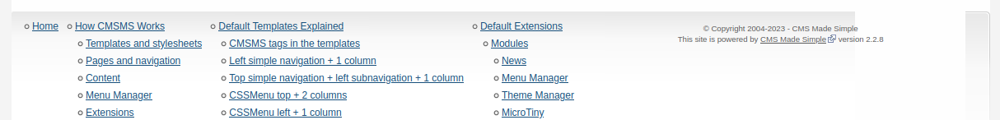
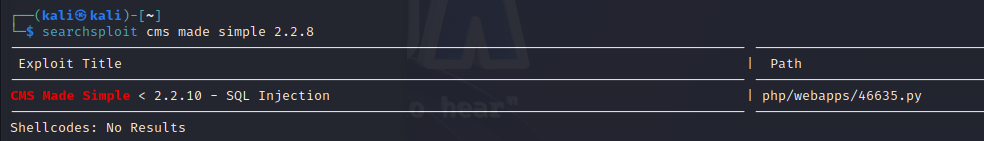

# __Simple CTF__

--- 

## __Task 1: Simple CTF__

Deploy the machine and attempt the questions!

### __Answer the questions bellow__

!!! question "How many services are running under port 1000?"
    Ans: 2
!!! question "What is running on the higher port?"
    Ans: ssh

!!! question "What's the CVE you're using against the application?"
    Ans: CVE-2019-9053

!!! question "To what kind of vulnerability is the application vulnerable?"
    Ans: SQLi
!!! question "What's the password?"
    Ans: secret
!!! question "Where can you login with the details obtained?"
    Ans: ssh
!!! question "What's the user flag?"
    Ans: G00d j0b, keep up!
!!! question "Is there any other user in the home directory? What's its name?"
    Ans: Sunbath
!!! question "What can you leverage to spawn a privileged shell?"
    Ans: Vim
!!! question "What's the root flag?"
    Ans: W3ll d0n3. You made it!

### __Hints__

:3 Dô web thì đầu tiên cứ nmap và gobuster thoai, khi mà có được website cần pentest rồi thì ta sẽ thấy được version của phía server

Tìm lỗ hỏng thông qua searchsploit

::) để ý version python mà chạy tool cho kĩ. 

Sau khi có được user/pass, login với ssh (nhớ cái port lúc nmap, tại không scan nmap thì không tìm được port ssh này đâu - hoặc tìm khó :V).

Rồi, leo thang đặc quyền với vim (sudo -l) [tại đây](/notes/privilege-escalation/linux/#sudo-l)

