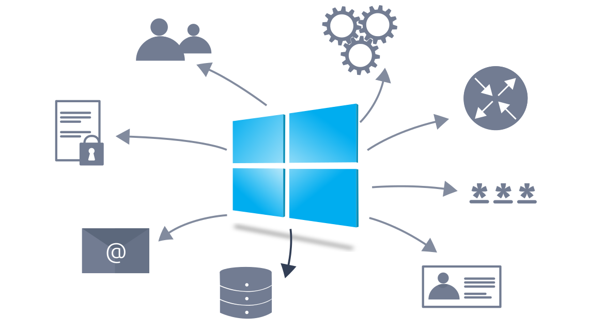
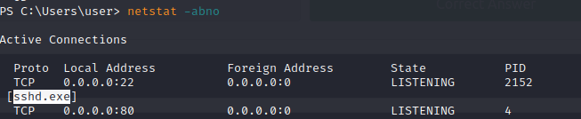

# __Enumeration__

---

## __Task 1: Introduction__

This room is organized as follows:

- Purpose of enumeration
- Linux enumeration with commonly-installed tools: System, users, networking, and running services
- MS Windows enumeration with built-in tools: System, users, networking, and running services
- Examples of additional tools: Seatbelt\


### __Answer the questions bellow__

!!! question "What command would you use to start the PowerShell interactive command line?"
    powershell.exe

## __Task 2: Purpose__

Focus:

1. Users and groups
2. Hostnames
3. Routing tables
4. Network shares
1. Network services
1. Applications and banners
1. Firewall configurations
1. Service settings and audit configurations
1. SNMP and DNS details
1. Hunting for credentials (saved on web browsers or client applications)
1. etc...

### __Answer the questions bellow__

!!! question "In SSH key-based authentication, which key does the client need"
    private key

## __Task 3: Linux Enumeration__

Một vài tiếp cận ban đầu:

### __System__

- `ls /etc/*-release`: Tìm kiếm các tệp tin kết thúc bằng -release và nằm trong folder etc
- `hostname`: Tìm tên hệ thống.
- `/usr/bin/`, `/sbin/` : Nơi chứa các ứng dụng đã cài đặt.
- `dpkg -l`: Lấy danh sách các package đã cài (Linux Debian)
- `rpm -qa`: Lấy danh sách các package đã cài (Linux RPM)

### __Users__

- `who`: Xem thông tin những user đã login
- `w`: Xem thông tin những user đã login và đang làm gì
- `last`: Xem gần đây ai đã sử dụng hệ thống
- `sudo -l`: Liệt kê lệnh được phép cho người dùng gọi trên hệ thống

### __Networking__

- `ip address show` = `ip a s` = `ifconfig -a`: Hiển thị ip
- `cat /etc/resolv.conf`: Xem máy chủ DNS
- `netstat`: Lệnh dùng để tìm hiểu về kết nối mạng

    | Options      | Description                          |
    | ----------- | ------------------------------------ |
    | `-a`       | show both listening and non-listening sockets  |
    | `-l`       | show only listening sockets|
    | `-n`    | show numeric output instead of resolving the IP address and port number |
    | `-t`    | TCP |
    | `-u`    | UDP |
    | `-x`    | UNIX |
    | `-n`    | Show the PID and name of the program to which the socket belongs |

    ```ps1 title="Terminal"
    user@TryHackMe$ sudo netstat -plt
    Active Internet connections (only servers)
    Proto Recv-Q Send-Q Local Address           Foreign Address         State       PID/Program name    
    tcp        0      0 0.0.0.0:ssh             0.0.0.0:*               LISTEN      978/sshd            
    tcp        0      0 localhost:smtp          0.0.0.0:*               LISTEN      1141/master         
    tcp6       0      0 [::]:ssh                [::]:*                  LISTEN      978/sshd            
    tcp6       0      0 localhost:smtp          [::]:*                  LISTEN      1141/master
    ```

- `netstat -atupn`: Hiển thị tất cả kết nối đã thiết lập TCP, UDP (đưa ra định dạng số)

```ps1 title="Terminal"
user@TryHackMe$ sudo netstat -atupn
Active Internet connections (servers and established)
Proto Recv-Q Send-Q Local Address           Foreign Address         State       PID/Program name    
tcp        0      0 0.0.0.0:22              0.0.0.0:*               LISTEN      978/sshd            
tcp        0      0 127.0.0.1:25            0.0.0.0:*               LISTEN      1141/master         
tcp        0      0 10.20.30.129:22         10.20.30.113:38822        ESTABLISHED 5665/sshd: peter [p 
tcp        0      0 10.20.30.129:22         10.20.30.105:38826        ESTABLISHED 5723/sshd: jane [pr 
tcp6       0      0 :::22                   :::*                    LISTEN      978/sshd            
tcp6       0      0 ::1:25                  :::*                    LISTEN      1141/master         
udp        0      0 127.0.0.1:323           0.0.0.0:*                           640/chronyd         
udp        0      0 0.0.0.0:68              0.0.0.0:*                           5638/dhclient       
udp6       0      0 ::1:323                 :::*                                640/chronyd
```

- `lsof`

```ps1 title="Terminal"
user@TryHackMe$ sudo lsof -i
COMMAND   PID      USER   FD   TYPE DEVICE SIZE/OFF NODE NAME
chronyd   640    chrony    5u  IPv4  16945      0t0  UDP localhost:323 
chronyd   640    chrony    6u  IPv6  16946      0t0  UDP localhost:323 
sshd      978      root    3u  IPv4  20035      0t0  TCP *:ssh (LISTEN)
sshd      978      root    4u  IPv6  20058      0t0  TCP *:ssh (LISTEN)
master   1141      root   13u  IPv4  20665      0t0  TCP localhost:smtp (LISTEN)
master   1141      root   14u  IPv6  20666      0t0  TCP localhost:smtp (LISTEN)
dhclient 5638      root    6u  IPv4  47458      0t0  UDP *:bootpc 
sshd     5693     peter    3u  IPv4  47594      0t0  TCP rpm-red-enum.thm:ssh->10.20.30.113:38822 (ESTABLISHED)
[...]
```

- `lsof -i :25`: Giới hạn đầu ra những thứ ở port 25 (như smtp)

### __Running Services__

- `ps`: Xem các tiến trình đang chạy

    | Options      | Description                          |
    | ----------- | ------------------------------------ |
    | `-e`       | all processes |
    | `-f`       | full-format listing |
    | `-j`    | jobs format |
    | `-l`    | long format |
    | `-u`    | user-oriented format |

- `ps aux` = `ps -ef`: Xem đầy đủ tiến trình
- `ps axjf`: Hiển thị cây tiến trình
- `ps -ef | grep ABC`: lấy ra các tiến trình có ABC

### __Answer the questions bellow__

!!! question "What is the name of the Linux distribution used in the VM?"
    Ans: Ubuntu

!!! question "What is its version number?"
    Ans: 20.04.4

!!! question "What is the name of the user who last logged in to the system?"
    Ans: randa

!!! question "What is the highest listening TCP port number?"
    Ans: 6667
    ??? tip "Gợi ý"
        Xem hiển thị tại 

        ```ps1 title="Terminal"  hl_lines="5"
        user@red-linux-enumeration:~$ netstat -atupn | grep "tcp"
        (Not all processes could be identified, non-owned process info
        will not be shown, you would have to be root to see it all.)
        tcp        0      0 0.0.0.0:389             0.0.0.0:*               LISTEN      -                   
        tcp        0      0 127.0.0.1:6667          0.0.0.0:*               LISTEN      -                   
        tcp        0      0 10.10.223.177:53        0.0.0.0:*               LISTEN      -                   
        tcp        0      0 127.0.0.1:53            0.0.0.0:*               LISTEN      -                   
        tcp        0      0 127.0.0.53:53           0.0.0.0:*               LISTEN      -                   
        tcp        0      0 0.0.0.0:22              0.0.0.0:*               LISTEN      -                   
        tcp        0      0 127.0.0.1:953           0.0.0.0:*               LISTEN      -                   
        tcp        0    308 10.10.223.177:22        10.18.80.57:56546       ESTABLISHED -                   
        tcp6       0      0 :::389                  :::*                    LISTEN      -                   
        tcp6       0      0 fe80::5:4ff:fe24:277:53 :::*                    LISTEN      -                   
        tcp6       0      0 ::1:53                  :::*                    LISTEN      -                   
        tcp6       0      0 :::21                   :::*                    LISTEN      -                   
        tcp6       0      0 :::22                   :::*                    LISTEN      -                   
        tcp6       0      0 ::1:953                 :::*                    LISTEN      -      
        ```

!!! question "What is the program name of the service listening on it?"
    Ans: inspircd
    ??? tip "Gợi ý" 
        Có hai cách dùng nhưng đều dùng sudo mới có thể hiển thị được NAME:

        1. Dùng `sudo lsof -i :6667`

        ```ps1 title="Terminal"
        user@red-linux-enumeration:~$ sudo lsof -i :6667
        COMMAND  PID USER   FD   TYPE DEVICE SIZE/OFF NODE NAME
        inspircd 718  irc    4u  IPv4  27760      0t0  TCP localhost:ircd (LISTEN)
        ```

        2. Dùng `sudo netstat -atupn`

!!! question "There is a script running in the background. Its name starts with THM. What is the name of the script?"
    Ans: THM-24765.sh

    ??? tip "Gợi ý" 
        ```ps1 title="Terminal"
        user@red-linux-enumeration:~$ ps aux | grep "THM"
        randa        642  0.0  0.0   2608   592 ?        Ss   13:54   0:00 /bin/sh -c /home/randa/THM-24765.sh
        randa        645  0.0  0.2   6892  2236 ?        S    13:54   0:00 /bin/bash /home/randa/THM-24765.sh
        user        2530  0.0  0.0   6432   720 pts/0    S+   15:08   0:00 grep --color=auto THM
        ```

## __Task 4: Windows Enumeration__



### __System__

- `systeminfo`: Xem thông tin chi tiết của hệ thống

??? Example 
    ```ps1 title="CMD"
    PS C:\Users\user> systeminfo
                                                                                            
    Host Name:                 RED-WIN-ENUM                                                    
    OS Name:                   Microsoft Windows Server 2019 Datacenter                        
    OS Version:                10.0.17763 N/A Build 17763                                      
    OS Manufacturer:           Microsoft Corporation                                           
    OS Configuration:          Standalone Server                                               
    OS Build Type:             Multiprocessor Free                                             
    Registered Owner:          EC2                                                             
    Registered Organization:   Amazon.com                                                      
    Product ID:                00430-00000-00000-AA155                                         
    Original Install Date:     3/17/2021, 2:59:06 PM                                           
    System Boot Time:          8/22/2023, 3:41:32 PM                                           
    System Manufacturer:       Amazon EC2                                                      
    System Model:              t3a.small                                                       
    System Type:               x64-based PC                                                    
    Processor(s):              1 Processor(s) Installed.                                       
                            [01]: AMD64 Family 23 Model 1 Stepping 2 AuthenticAMD ~2200 Mhz 
    BIOS Version:              Amazon EC2 1.0, 10/16/2017                                      
    Windows Directory:         C:\Windows                                                      
    System Directory:          C:\Windows\system32                                             
    Boot Device:               \Device\HarddiskVolume1                                         
    System Locale:             en-us;English (United States)                                   
    Input Locale:              en-us;English (United States)                                   
    Time Zone:                 (UTC) Coordinated Universal Time                                
    Total Physical Memory:     2,016 MB                                                        
    Available Physical Memory: 1,042 MB                                                        
    Virtual Memory: Max Size:  2,400 MB                                                        
    Virtual Memory: Available: 1,458 MB                                                        
    Virtual Memory: In Use:    942 MB                                                          
    Page File Location(s):     C:\pagefile.sys
    Domain:                    WORKGROUP
    Logon Server:              N/A
    Hotfix(s):                 30 Hotfix(s) Installed.
                            [01]: KB5015731
                            [02]: KB4470502
                            [03]: KB4470788
                            [04]: KB4480056
                            [05]: KB4486153
                            [06]: KB4493510
                            [07]: KB4499728
                            [08]: KB4504369
                            [09]: KB4512577
                            [10]: KB4512937
                            [11]: KB4521862
                            [12]: KB4523204
                            [13]: KB4535680
                            [14]: KB4539571
                            [15]: KB4549947
                            [16]: KB4558997
                            [17]: KB4562562
                            [18]: KB4566424
                            [19]: KB4570332
                            [20]: KB4577586
                            [21]: KB4577667
                            [22]: KB4587735
                            [23]: KB4589208
                            [24]: KB4598480
                            [25]: KB4601393
                            [26]: KB5000859
                            [27]: KB5015811
                            [28]: KB5012675
                            [29]: KB5014031
                            [30]: KB5014797
    Network Card(s):           1 NIC(s) Installed.
                            [01]: Amazon Elastic Network Adapter
                                    Connection Name: Ethernet 3
                                    DHCP Enabled:    Yes
                                    DHCP Server:     10.10.0.1
                                    IP address(es)
                                    [01]: 10.10.185.186
                                    [02]: fe80::f552:b4b7:83c3:ccef
    Hyper-V Requirements:      A hypervisor has been detected. Features required for Hyper-V will not be displayed.
    ```         

- `wmic qfe get Caption,Description`: Kiểm tra các bản cập nhập đã cài đặt

??? Example 
    ```ps1 title="CMD"
    C:\>wmic qfe get Caption,Description
    Caption                                     Description      
    http://support.microsoft.com/?kbid=5013630  Update
    https://support.microsoft.com/help/5013944  Security Update
                                                Update
    ```

- `net start`: Xem các tệp window đã được cài đặt và khởi động

??? example
    ```ps1 title="CMD"
    C:\>net start
    These Windows services are started:

    Base Filtering Engine
    Certificate Propagation
    Client License Service (ClipSVC)
    COM+ Event System
    Connected User Experiences and Telemetry
    CoreMessaging
    Cryptographic Services
    DCOM Server Process Launcher
    DHCP Client
    DNS Client
    [...]
    Windows Time
    Windows Update
    WinHTTP Web Proxy Auto-Discovery Service
    Workstation

    The command completed successfully.
    ```
- `wmic product get name,version,vendor`: Xem các ứng dụng đã cài đặt

??? example 
    ```ps1 title="CMD"
    C:\>wmic product get name,version,vendor
    Name                                                            Vendor                                   Version
    Microsoft Visual C++ 2019 X64 Minimum Runtime - 14.28.29910     Microsoft Corporation                    14.28.29910
    [...]
    Microsoft Visual C++ 2019 X64 Additional Runtime - 14.28.29910  Microsoft Corporation                    14.28.29910
    ```

### __Users__

- `whoami`: Xem bạn là ai
- `whoami /priv`: Xem những quyền có thể sử dụng

??? example 
    ```ps1 title="CMD"
    C:\>whoami
    win-server-cli\strategos

    > whoami /priv

    PRIVILEGES INFORMATION
    ----------------------

    Privilege Name                            Description                                                        State
    ========================================= ================================================================== =======
    SeIncreaseQuotaPrivilege                  Adjust memory quotas for a process                                 Enabled
    SeSecurityPrivilege                       Manage auditing and security log                                   Enabled
    SeTakeOwnershipPrivilege                  Take ownership of files or other objects                           Enabled
    [...]
    ```

- `whoami /groups`: Kiểm tra xem bạn thuộc nhóm nào
- `net user`: Xem những người dùng

??? example 
    ```ps1 title="CMD"
    C:\>net user

    User accounts for \\WIN-SERVER-CLI

    -------------------------------------------------------------------------------
    Administrator            DefaultAccount           Guest
    michael                  peter                    strategos
    WDAGUtilityAccount
    The command completed successfully.
    ```

- `net group`, `net localgroup`: Xem các nhóm

??? example 
    ```ps1 title="CMD"
    C:\>net localgroup

    Aliases for \\WIN-SERVER-CLI

    -------------------------------------------------------------------------------
    *Access Control Assistance Operators
    *Administrators
    *Backup Operators
    *Certificate Service DCOM Access
    *Cryptographic Operators
    *Device Owners
    [...]
    ```

- `net localgroup administrators`: Xem người dùng admin cục bộ

??? example 
    ```ps1 title="CND"
    C:\>net localgroup administrators
    Alias name     administrators
    Comment        Administrators have complete and unrestricted access to the computer/domain

    Members

    -------------------------------------------------------------------------------
    Administrator
    michael
    peter
    strategos
    The command completed successfully.
    ```

- `net accounts`, `net accounts /domain`: Xem account/ acount trong AD

Xem thêm tại [Hacking with powershell](/tryhackme/room/hacking-with-powershell/)

### __Networking__

- `ipconfig /all`: Xem địa chỉ ip
- `netstat -abno`: 
    - -a: Hiển thị tất cả thông tin về các port đang listen/connect
    - -b: Tìm tệp nhị phân liên quan đến kết nối
    - -n: output number
    - -o: Hiển thị ID process (PID)

- `arp -a`: Xem bảng ARP

### __Answer the questions bellow__
!!! question "What is the full OS Name?"
    Ans: Microsoft Windows Server 2019 Datacenter
    ??? tip
        Xem example ở phần [System](#system_1)

!!! question "What is the OS Version?"
    Ans: 10.0.17763
    ??? tip
        Xem example ở phần [System](#system_1)

!!! question "How many hotfixes are installed on this MS Windows Server?"
    Ans: 30
    ??? tip
        Xem example ở phần [System](#system_1)

!!! question "What is the lowest TCP port number listening on the system?"
    Ans: 22
    ??? tip
        Dùng netstat 

        ```ps1 title="CMD"
        PS C:\Users\user> netstat                                             

        Active Connections

            Proto  Local Address          Foreign Address        State
            TCP    10.10.185.186:22       ip-10-18-80-57:58676   ESTABLISHED
            TCP    10.10.185.186:49771    20.12.23.50:https      SYN_SENT
        ```

!!! question "What is the name of the program listening on that port?"
    Ans: sshd.exe
    ??? tip
        Dùng netstat -abno

        

## __Task 5: DNS, SMB, and SNMP__

### __DNS__

### __SMB__

- `net share`: Kiểm tra các thư mục được chia sẻ

??? example 
    ```ps1 title="CMD"
    user@TryHackMe$ net share

    Share name   Resource                        Remark

    -------------------------------------------------------------------------------
    C$           C:\                             Default share
    IPC$                                         Remote IPC
    ADMIN$       C:\Windows                      Remote Admin
    Internal     C:\Internal Files               Internal Documents
    Users        C:\Users
    The command completed successfully.
    ```

### __SNMP__

### __Answer the questions bellow__

!!! question "Knowing that the domain name on the MS Windows Server of IP 10.10.138.215 is redteam.thm, use dig to carry out a domain transfer. What is the flag that you get in the records?"
    Ans: THM{DNS_ZONE}
    ??? tip
        Bài này khó 1 cái là ssh vào ngay powershell nhưng powershell thì lại không có `dig` để ta xem record. Ta sẽ lợi dụng nslookup như terminal bên dưới
        ```ps1 title="CMD"
        PS C:\Users\user> nslookup 10.10.138.215
        Server:  ip-10-0-0-2.eu-west-1.compute.internal
        Address:  10.0.0.2

        Name:    ip-10-10-138-215.eu-west-1.compute.internal
        Address:  10.10.138.215

        PS C:\Users\user> nslookup
        Default Server:  ip-10-0-0-2.eu-west-1.compute.internal 
        Address:  10.0.0.2                                      
                                                                
        > server 10.10.138.215                                  
        Default Server:  ip-10-10-138-215.eu-west-1.compute.internal 
        Address:  10.10.138.215                                      
                                                                    
        > ls -d redteam.thm                                          
        [ip-10-10-138-215.eu-west-1.compute.internal]                                          
        redteam.thm.                   SOA    red-win-enum hostmaster. (5 900 600 86400 3600) 
        redteam.thm.                   NS     red-win-enum                                    
        first                          A      10.10.254.1                                     
        flag                           TXT             "THM{DNS_ZONE}"                        
                                                                                            
        second                         A      10.10.254.2                                     
        tryhackme                      CNAME  tryhackme.com                                   
        redteam.thm.                   SOA    red-win-enum hostmaster. (5 900 600 86400 3600) 
        >                                                                                      

        ```


!!! question "What is the name of the share available over SMB protocol and starts with THM?"
    Ans: THM{829738} 
    ??? tip
        ```ps1 title="CMD"
        PS C:\Users\user> net share

        Share name   Resource                        Remark

        -------------------------------------------------------------------------------
        C$           C:\                             Default share
        IPC$                                         Remote IPC
        ADMIN$       C:\Windows                      Remote Admin
        Internal     C:\Internal Files               Internal Documents
        THM{829738}  C:\Users\user\Private           Enjoy SMB shares
        Users        C:\Users
        The command completed successfully.
        ```
!!! question "Knowing that the community string used by the SNMP service is public, use snmpcheck to collect information about the MS Windows Server of IP 10.10.138.215. What is the location specified?"
    Ans: THM{SNMP_SERVICE} 
    ??? tip
        Chạy /opt/snmpcheck/snmpcheck.rb 10.10.138.215 -c public | more trên máy attackbox.
        
## __Task 6: More Tools for Windows__

### __Sysinternals Suite__

Xem tại https://docs.microsoft.com/en-us/sysinternals/downloads/

| Utility Name      | Description                          |
| ----------- | ------------------------------------ |
| Process Explorer	       | Shows the processes along with the open files and registry keys |
| Process Monitor	      | Monitor the file system, processes, and Registry |
| PsList    | Provides information about processes |
| PsLoggedOn	  | Shows the logged-in users|

### __Process Hacker__

Xem tại https://processhacker.sourceforge.io/

### __GhostPack Seatbelt__

Xem tại https://github.com/GhostPack/Seatbelt

### __Answer the questions bellow__

!!! question "What utility from Sysinternals Suite shows the logged-in users?"
    Ans: PsLoggedOn
    
## __Task 7: Conclusion__

The focus of this room was on built-in command-line tools in both Linux and MS Windows systems. Many commands exist in both systems, although the command arguments and resulting output are different. The following tables show the primary Linux and MS Windows commands that we relied on to get more information about the system.

| Linux Command      | Description                          |
| ----------- | ------------------------------------ |
| `hostname`       | shows the system’s hostname |
| `who`       | shows who is logged in|
| `whoami`    | shows the effective username |
| `w`    | shows who is logged in and what they are doing|
| `last`    | shows a listing of the last logged-in users |
| `ip address show`    | shows the network interfaces and addresses |
| `arp`    | shows the ARP cache |
| `netstat`    | prints network connections|
| `ps`    | shows a snapshot of the current processes |

| Windows Command      | Description                          |
| ----------- | ------------------------------------ |
| `systeminfo`       | shows OS configuration information, including service pack levels |
| `whoami`    | shows the user name and group information along with the respective security identifiers |
| `netstat`    | shows protocol statistics and current TCP/IP network connections|
| `net user`    | shows the user accounts on the computer |
| `net localgroup`    | shows the local groups on the computer |
| `arp`    | shows the IP-to-Physical address translation tables|
