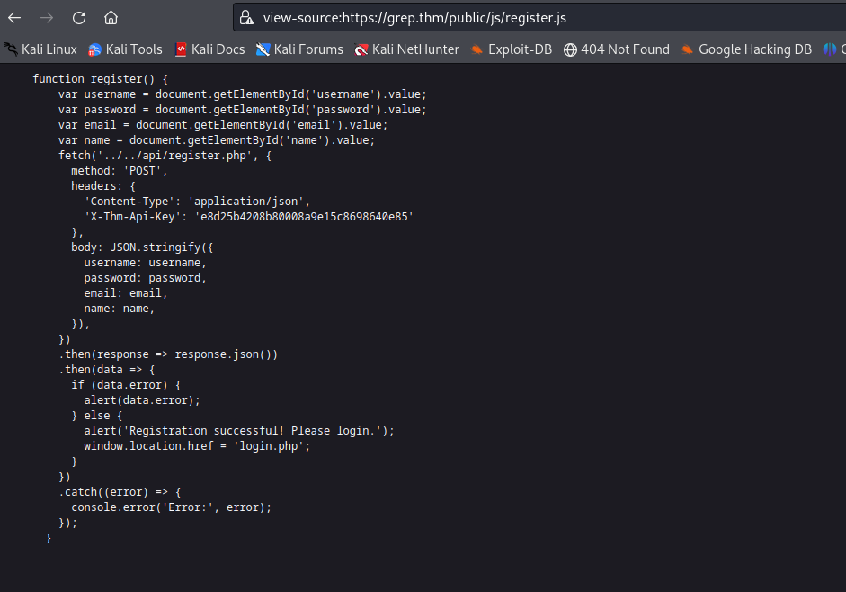
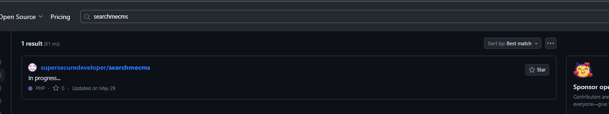
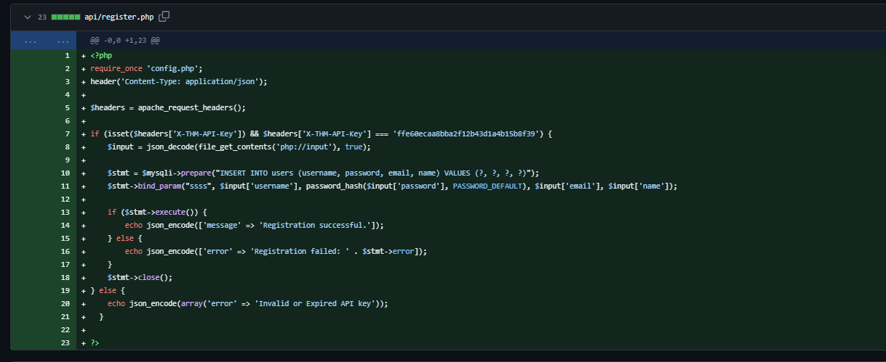
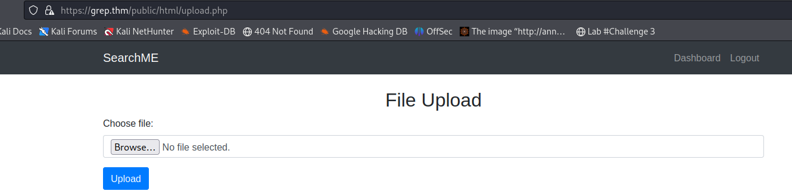
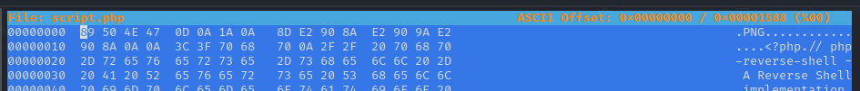
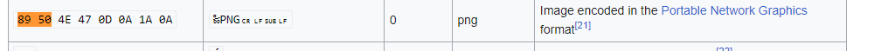
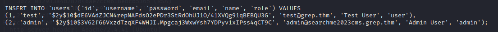
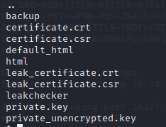
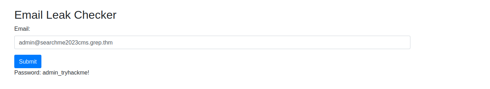

# __Grep__

Room at https://tryhackme.com/room/greprtp

---

??? question "List of the questions solved"

    Question: What is the API key that allows a user to register on the website?
    > Ans: ffe60ecaa8bba2f12b43d1a4b15b8f39

    Question: What is the first flag?
    > Ans: THM{4ec9806d7e1350270dc402ba870ccebb}

    Question: What is the email of the "admin" user?
    > Ans: admin@searchme2023cms.grep.thm

    Question: What is the host name of the web application that allows a user to check an email for a possible password leak?
    > Ans: leakchecker.grep.thm

    Question: What is the password of the "admin" user?
    > Ans: admin_tryhackme!

## __Pentest scenario__

Host: 10.10.216.13

Bài này chủ yếu giúp ta rèn luyện kĩ năng recon và OSINT thôi.

### __Reconnaissance__

Đầu tiên ta cũng sẽ scan nmap và gobuster challenge

```ps1 title="Nmap"
PORT    STATE SERVICE  VERSION
22/tcp  open  ssh      OpenSSH 8.2p1 Ubuntu 4ubuntu0.3 (Ubuntu Linux; protocol 2.0)
| ssh-hostkey: 
|   3072 012933a4d287d46ae7cc0618ebcb5365 (RSA)
|   256 c3a547c2e12301020bb94fbab810cc11 (ECDSA)
|_  256 f59cf1339f9f6749c0b80cf4e36e1424 (ED25519)
80/tcp  open  http     Apache httpd 2.4.41 ((Ubuntu))
|_http-server-header: Apache/2.4.41 (Ubuntu)
|_http-title: Apache2 Ubuntu Default Page: It works
443/tcp open  ssl/http Apache httpd 2.4.41
| ssl-cert: Subject: commonName=grep.thm/organizationName=SearchME/stateOrProvinceName=Some-State/countryName=US
| Not valid before: 2023-06-14T13:03:09
|_Not valid after:  2024-06-13T13:03:09
|_http-server-header: Apache/2.4.41 (Ubuntu)
|_ssl-date: TLS randomness does not represent time
| tls-alpn: 
|_  http/1.1
|_http-title: 400 Bad Request
```

Cái khó chỗ này là trang có port 443 cho service https. Và đã được sign nên ta sẽ không scan dir được. Ta phải config hostname vào file /etc/hosts

```ps1 title="/etc/hosts"
10.10.216.13        grep.thm
```

> Để ý đoạn scan nmap có dòng ...commonName=grep.thm... nên sẽ config theo tên này.

Tiếp theo, scan gobuster, dùng các kĩ thuật thăm dò như F12,... ta sẽ được thứ trong hình bên dưới



Ta nhận được API-KEY nhưng submit lại bị lỗi (register cũng bị lỗi thông báo key hết hạn hoặc sai key). 

Hashid cho ta biết key dùng MD5. Sau khi decrypt ta được `johncena`. Search gg các kiểu chả ra gì

Nhận thấy rằng trang web có SearchMe. Ta tiếp tục tìm kiếm bằng github thì ra được repo bên dưới



Sau một vài thao tác điều tra, ta đã lấy được API-Key



Tiến hành register account và login để nhận first flag.

Tiếp tục tới trang upload



Nhận thấy rằng trang upload họ filter bằng 

```php
$allowedExtensions = ['jpg', 'jpeg', 'png', 'bmp'];
```
Nhưng vấn đề ở đây là filter về mặt mã hex của file (chứ không phải filter theo dạng lấy extension ra so sánh). Ta sẽ tạo reverse shell với tên file là `script.php` nhưng thay đổi thông số magic number



> 89 50 4E 47 0D 0A 1A 0A
> Xem link https://en.wikipedia.org/wiki/List_of_file_signatures hoặc xem hình bên dưới
> 

Và ta thành thông trong việc thâm nhập hệ thống


### __Init Access__

Tiếp tục OSINT, ta được thông tin account admin trong folder `backup`



Dùng john để giải mã password mãi thì không được.

Xem xét tiếp ta thấy trong hệ thống tồn tại một folder `leakchecker` đã sign - thì đây là 1 subdomain của `grep.thm`



Tiếp tục đem nó vào file /etc/hosts

Ta được password của user admin



> Thực ra thì ban đầu bước scan nmap vẫn còn 1 port ẩn là 51337 dành cho subdomain này. Tôi có tình không để ở phần scan trước để nhằm hidden nó, đến lúc này mới đem ra :3
>
> ```ps1
> 51337/tcp open  http     Apache httpd 2.4.41
> |_http-server-header: Apache/2.4.41 (Ubuntu)
> |_http-title: 400 Bad Request
> ```

> Hơn thế nữa, bản chất đây là port cho http có hỗ trợ ssl. Nhưng ta sẽ nhận được thông báo `Your browser sent a request that this server could not understand. Reason: You're speaking plain HTTP to an SSL-enabled server port. Instead use the HTTPS scheme to access this URL, please.` nếu truy cập bằng http vì để truy cập http có hỗ trợ ssl như này, ta phải dùng https thay thế.

## __What we learned__

1. Config DNS Server through hosts file
2. Config DNS Server through hosts file :3
3. Bypass file extensions by using magic numbers