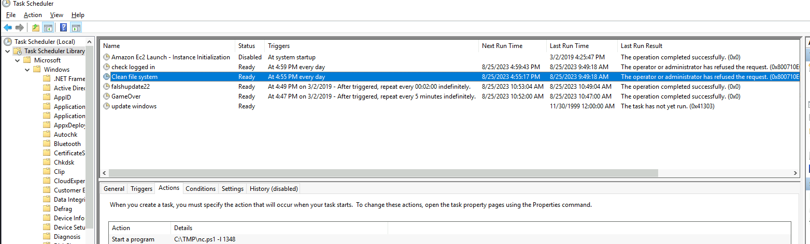

# __Investigating Windows__

Room: https://tryhackme.com/room/investigatingwindows

---

## __Task 1: Investigating Windows__

This is a challenge that is exactly what is says on the tin, there are a few challenges around investigating a windows machine that has been previously compromised.

Connect to the machine using RDP. The credentials the machine are as follows:

Username: Administrator
Password: letmein123!

Please note that this machine does not respond to ping (ICMP) and may take a few minutes to boot up.

### __Answer the questions bellow__

!!! question "Whats the version and year of the windows machine?"
    windows server 2016
    ??? tip "Hint"
        systeminfo

!!! question "Which user logged in last?"
    Administrator
    ??? tip "Hint"

        get-localuser | select *

        get-localuser | select name, lastlogon

!!! question "When did John log onto the system last?"
    03/02/2019 5:48:32 PM
    ??? tip "Hint"
    
        get-localuser | select *

        get-localuser | select name, lastlogon

!!! question "What IP does the system connect to when it first starts?"
    10.34.2.3

!!! question "What two accounts had administrative privileges (other than the Administrator user)?"
    Jenny, Guest
    ??? tip "Hint"

        Dùng tool computer management

        
    
!!! question "Whats the name of the scheduled task that is malicous."
    clean file system

    ??? tip "Hint"

    Dùng task scheduler
    

!!! question "What file was the task trying to run daily?"
    nc.ps1

!!! question "What port did this file listen locally for?"
    1348

!!! question "When did Jenny last logon?"
    never

    ??? tip "Hint"

    net user jenny

!!! question "At what date did the compromise take place?"
    03/02/2019

    ??? tip "Hint"
        File in folder C:\TMP

        

!!! question "During the compromise, at what time did Windows first assign special privileges to a new logon?"
    02/03/2019 4:04:49 PM

    ??? tip "Hint"
        Xem event viewer
        
        
