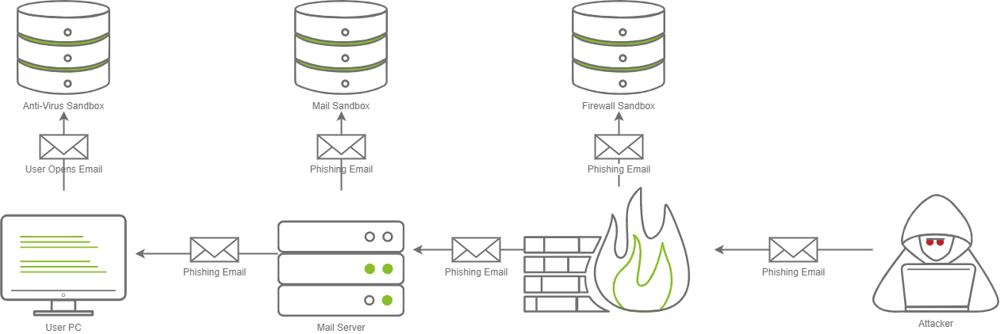

# __Sandbox Evasion__

---

## __Task 1: Introduction__

### __Welcome to Sandbox Evasion__

Lots of companies deploy a “Defense in Depth” strategy, which refers to implementing security in layers, so if one layer fails, there should be another one that an adversary must evade. In this room, we will be focusing on one unique type of active defense; Sandboxes. Sandboxes provide a safe way to analyze a potentially malicious file and observe the effects on the system and return if the executable is malicious or not.

### __Learning Objectives__

In this room, we will learn about Sandboxes in-depth; by the time you finish this room, you will gain a better understanding of the following topics:

- Learn how Malware Sandboxes work
- Learn about Static and Dynamic Malware Analysis
- Common Sandbox Evasion Methods
- Developing and Testing Sandbox Evasion Methods with Any.Run

### __Room Pre-requisites__

For this room, we recommend the prior experience in the following areas:

- [Windows APIs](https://tryhackme.com/room/abusingwindowsinternals)
- [C++ Programming](https://tryhackme.com/room/windowsinternals)
- [Active Directory](https://tryhackme.com/room/activedirectorybasics)

## __Task 2: An Adversary walks into a Sandbox__

### __What is Malware Analysis__

Malware Analysis is the process of analyzing a suspicious file to determine what it does on both a micro level (by looking at Assembly), and a macro level (by looking at what it does on the system). This process lets Blue Teamers gain a better understanding of malicious programs, which can aid them in developing detections.

### __Static vs. Dynamic Analysis__

There are two ways that a Blue Teamer can analyze a suspicious file; one way is by looking at the code on a micro-level (as previously stated) by using Disassemblers such as IDA or Ghidra. This process is more well known as “Static Analysis”.

On the flip side of the coin, we can observe what happens when the suspicious file is executed on the system through a process called “Dynamic Analysis”. On the system, there are often many analysis tools installed, such as EDR Software, Sysmon, ProcMon, Process Hacker, and Debuggers (For example, OllyDebug, WinDbg, x64Dbg), and much more.

### __Introduction to Sandboxes__

One of the most creative and effective ways that Blue Teamers have come up with to analyze suspicious-looking files is in the category of Dynamic Analysis. This method involves running the file in a containerized (or virtualized) environment; This environment is referred to as a Sandbox. Depending on the sandbox of choice, you may be able to customize what version of Windows is running, the software installed on the machine, and much more.

Sandboxes provide a safe and effective way to monitor what a suspicious-looking file does before running it on a production system (or allowing it to be sent to a production system). There are many commercial Sandboxes that may be in place in various parts of a network.

In the diagram above, there are three different sandboxes in place. It is not uncommon for there to be one, two, or even three Sandboxes in a corporate environment. Often you may find them in the following places:

- Firewalls
- Mail Servers
- Workstations

Each sandbox may work differently; for example, a Firewall may execute the attachment in the email and see what kind of network communications occur, whereas a Mail sandbox may open the email and see if an embedded file within the email triggers a download over a protocol like SMB in an attempt to steal a NetNTLM hash, where a host-based Anti-Virus Sandbox may execute the file and monitor for malicious programmatic behavior or changes to the system.

There are various vendors that make various Sandbox products that Blue Teamers may be able to deploy in a corporate network. Here are some popular examples:

- Palo Alto Wildfire ([Firewall](https://www.paloaltonetworks.co.uk/products/secure-the-network/wildfire))
- Proofpoint TAP ([Email Sandbox](https://www.proofpoint.com/uk/products/advanced-threat-protection/targeted-attack-protection))
- Falcon Sandbox ([EDR/Workstation](https://www.crowdstrike.co.uk/products/threat-intelligence/falcon-sandbox-malware-analysis/))
- MimeCast ([Email Sandbox](https://www.mimecast.com/))
- VirusTotal ([Sample Submission Site](https://www.virustotal.com/))
- Any.Run ([Sample Submission Site](https://any.run/))
- Antiscan.me ([Sample Submission Site](https://antiscan.me/))
- Joe Sandbox ([Sample Submission Site](https://www.joesandbox.com/))

In the next section, we will learn about various techniques commonly deployed by Malware authors to gain an understanding of some evasion techniques that exist.

We have provided a Windows development VM where you can develop your own Sandbox evasion techniques. You can access the virtual machine with the following credentials:

__Username:__ Administrator
__Password:__ TryHackMe123!