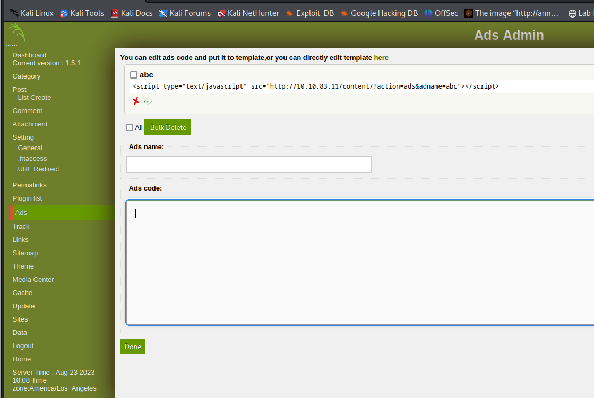

# __LazyAdmin__

---

Room at https://tryhackme.com/room/lazyadmin

## __Task 1: Lazy Admin__

### __Answer the questions bellow__

!!! question "What is the user flag?"
    Ans: THM{63e5bce9271952aad1113b6f1ac28a07}

!!! question "What is the root flag?"
    Ans: THM{6637f41d0177b6f37cb20d775124699f}

### __Hướng dẫn__

Đầu tiên khi vào IP, các bạn sẽ không thấy gì đâu ::). Ta phải thực hiện recon trang web thì thấy được website chuẩn chỉ là http://IP/content. 

Tiếp tục, gobuster tiếp ta được trang inc (chứa thông tin các file code php, txt, db, ...) và trang http://IP/content/as để login account. 

Gồi gồi, sau một hồi xem xét website thì thấy file `mysql_bakup_20191129023059-1.5.1.sql` chứa đoạn dưới đây 

```sql 
  14 => 'INSERT INTO `%--%_options` VALUES(\'1\',\'global_setting\',\'a:17:{s:4:\\"name\\";s:25:\\"Lazy Admin&#039;s Website\\";s:6:\\"author\\";s:10:\\"Lazy Admin\\";s:5:\\"title\\";s:0:\\"\\";s:8:\\"keywords\\";s:8:\\"Keywords\\";s:11:\\"description\\";s:11:\\"Description\\";s:5:\\"admin\\";s:7:\\"manager\\";s:6:\\"passwd\\";s:32:\\"42f749ade7f9e195bf475f37a44cafcb\\";s:5:\\"close\\";i:1;s:9:\\"close_tip\\";s:454:\\"<p>Welcome to SweetRice - Thank your for install SweetRice as your website management system.</p><h1>This site is building now , please come late.</h1><p>If you are the webmaster,please go to Dashboard -> General -> Website setting </p><p>and uncheck the checkbox \\"Site close\\" to open your website.</p><p>More help at <a href=\\"http://www.basic-cms.org/docs/5-things-need-to-be-done-when-SweetRice-installed/\\">Tip for Basic CMS SweetRice installed</a></p>\\";s:5:\\"cache\\";i:0;s:13:\\"cache_expired\\";i:0;s:10:\\"user_track\\";i:0;s:11:\\"url_rewrite\\";i:0;s:4:\\"logo\\";s:0:\\"\\";s:5:\\"theme\\";s:0:\\"\\";s:4:\\"lang\\";s:9:\\"en-us.php\\";s:11:\\"admin_email\\";N;}\',\'1575023409\');',
  15 => 'INSERT INTO `%--%_options` VALUES(\'2\',\'categories\',\'\',\'1575023409\');',
```

Để ý thấy đoạn mã trên chứa thông tin account admin là `manager` và password được hash thành `42f749ade7f9e195bf475f37a44cafcb`. Dùng `hashid` để tìm phỏng đoán password. Và nó là MD5, ta được password là `Password123` :))

login thoai.....

Trong trang giao diện admin, ta có thể tìm được nhiều chỗ để tiêm reverseshell như theme, ads,...



Sau khi có revershell, dễ dàng ta lấy được flag user.txt

Phần leo thang đặc quyền, chú ý kĩ file tại `/home/itguy/backup.pl`.`

