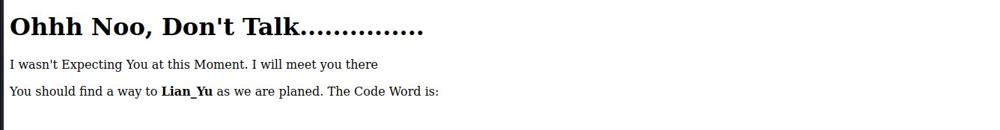

# __Lian_Yu__

See room in https://tryhackme.com/room/lianyu

---

## __Task 1: Find the Flags__

<span> 
    <span class="twemoji mdx-heart ans-wu">
        <svg xmlns="http://www.w3.org/2000/svg" viewBox="0 0 24 24"><path d="M14 20.408c-.492.308-.903.546-1.192.709-.153.086-.308.17-.463.252h-.002a.75.75 0 0 1-.686 0 16.709 16.709 0 0 1-.465-.252 31.147 31.147 0 0 1-4.803-3.34C3.8 15.572 1 12.331 1 8.513 1 5.052 3.829 2.5 6.736 2.5 9.03 2.5 10.881 3.726 12 5.605 13.12 3.726 14.97 2.5 17.264 2.5 20.17 2.5 23 5.052 23 8.514c0 3.818-2.801 7.06-5.389 9.262A31.146 31.146 0 0 1 14 20.408z"></path></svg>
    </span>
        <span class="content-wu ans-wu"> Answer the questions below </span>
</span>
*[VM]: Virtual Machine
*[FTP]: File Transfer Protocol (FTP) is a protocol designed to help the efficient transfer of files between different and even non-compatible systems. It supports two modes for file transfer: binary and ASCII (text).
!!! question "__Deploy the VM and Start the Enumeration__"

    === "Answer"
        ``` powershell
        No needed answer
        ```
!!! question "__What is the Web Directory you found?__"

    === "Answer"
        ``` powershell
        2100
        ```
!!! question "__What is the file name you found?__"

    === "Answer"
        ``` powershell
        green_arrow.ticket 
        ```
!!! question "__What is the FTP Password?__"

    === "Answer"
        ``` powershell
        !#th3h00d
        ```
!!! question "__What is the file name with SSH password?__"

    === "Answer"
        ``` powershell
        shado
        ```
!!! question "__user.txt__"

    === "Answer"
        ``` powershell
        THM{P30P7E_K33P_53CRET5__C0MPUT3R5_D0N'T}
        ```
!!! question "__root.txt__"

    === "Answer"
        ``` powershell
        THM{MY_W0RD_I5_MY_B0ND_IF_I_ACC3PT_YOUR_CONTRACT_THEN_IT_WILL_BE_COMPL3TED_OR_I'LL_BE_D34D}
        ```

## __Explanation and attack scenario__

First, we will test some basic things in this website first such as port test (scan port through nmap), url test (gobuster, wfuzz,...)

With nmap, you should consider it because it's extremely noisy. I will use Vietnamese to present.

Địa chỉ ip của website: 10.10.254.149

Đầu tiên ta tiến hành scan website xem các service trước: -sV -sT -sC -vv 10.10.254.149 

Ta được kết quả scan port như hình bên dưới:


Chú ý đến 
```ps1 title="Terminal"
PORT    STATE SERVICE REASON  VERSION
21/tcp  open  ftp     syn-ack vsftpd 3.0.2
22/tcp  open  ssh     syn-ack OpenSSH 6.7p1 Debian 5+deb8u8 (protocol 2.0)
| ssh-hostkey: 
|   1024 5650bd11efd4ac5632c3ee733ede87f4 (DSA)
| ssh-dss AAAAB3NzaC1kc3MAAACBAOZ67Cx0AtDwHfVa7iZw6O6htGa3GHwfRFSIUYW64PLpGRAdQ734COrod9T+pyjAdKscqLbUAM7xhSFpHFFGM7NuOwV+d35X8CTUM882eJX+t3vhEg9d7ckCzNuPnQSpeUpLuistGpaP0HqWTYjEncvDC0XMYByf7gbqWWU2pe9HAAAAFQDWZIJ944u1Lf3PqYCVsW48Gm9qCQAAAIBfWJeKF4FWRqZzPzquCMl6Zs/y8od6NhVfJyWfi8APYVzR0FR05YCdS2OY4C54/tI5s6i4Tfpah2k+fnkLzX74fONcAEqseZDOffn5bxS+nJtCWpahpMdkDzz692P6ffDjlSDLNAPn0mrJuUxBFw52Rv+hNBPR7SKclKOiZ86HnQAAAIAfWtiPHue0Q0J7pZbLeO8wZ9XNoxgSEPSNeTNixRorlfZBdclDDJcNfYkLXyvQEKq08S1rZ6eTqeWOD4zGLq9i1A+HxIfuxwoYp0zPodj3Hz0WwsIB2UzpyO4O0HiU6rvQbWnKmUaH2HbGtqJhYuPr76XxZtwK4qAeFKwyo87kzg==
|   2048 396f3a9cb62dad0cd86dbe77130725d6 (RSA)
| ssh-rsa AAAAB3NzaC1yc2EAAAADAQABAAABAQDRbgwcqyXJ24ulmT32kAKmPww+oXR6ZxoLeKrtdmyoRfhPTpCXdocoj0SqjsETI8H0pR0OVDQDMP6lnrL8zj2u1yFdp5/bDtgOnzfd+70Rul+G7Ch0uzextmZh7756/VrqKn+rdEVWTqqRkoUmI0T4eWxrOdN2vzERcvobqKP7BDUm/YiietIEK4VmRM84k9ebCyP67d7PSRCGVHS218Z56Z+EfuCAfvMe0hxtrbHlb+VYr1ACjUmGIPHyNeDf2430rgu5KdoeVrykrbn8J64c5wRZST7IHWoygv5j9ini+VzDhXal1H7l/HkQJKw9NSUJXOtLjWKlU4l+/xEkXPxZ
|   256 a66996d76d6127967ebb9f83601b5212 (ECDSA)
| ecdsa-sha2-nistp256 AAAAE2VjZHNhLXNoYTItbmlzdHAyNTYAAAAIbmlzdHAyNTYAAABBBPfrP3xY5XGfIk2+e/xpHMTfLRyEjlDPMbA5FLuasDzVbI91sFHWxwY6fRD53n1eRITPYS1J6cBf+QRtxvjnqRg=
|   256 3f437675a85aa6cd33b066420491fea0 (ED25519)
|_ssh-ed25519 AAAAC3NzaC1lZDI1NTE5AAAAIDexCVa97Otgeg9fCD4RSvrNyB8JhRKfzBrzUMe3E/Fn
80/tcp  open  http    syn-ack Apache httpd
```

Ta thấy được 3 port, 1 cho ssh, 1 ftp và 1 http. Đây có vẻ là thông tin ta cần.

Tiếp theo, ta bắt đầu tìm kiếm url bằng gobuster. Ta nhận được đường dẫn đến file 2100


Ta tìm được url http://10.10.254.149/island có nội dung trông như thế này đây:



Để ý chút xíu thì trang này chứa thông tin bổ ích cho chúng ta đêí. Họ bảo hãy dùng word gì đó để đến được LianYu thì chắc là username cho ftp hay ssh gì đó roài. Ta xem source code thì nhận được mã `vigilante` được đánh color white từ đầu. Bảo sao ::). Tiếp tục gobuster để quét url...


Xem source code của website mới ta thấy có 1 dòng command về file có extension là .ticket. Tiếp tục dùng gobuster và ta tìm được file `green_arrow.ticket`. 


Nội dung file mô tả là token của Queen's Gambit(Ship) 

Đây là 1 password được mã hóa theo base58. Sau khi giải mã, ta được flag: !#th3h00d. 

Bây giờ đã đủ:

- username = vigilante
- password = !#th3h00d

Ta thử thì đây chính là thông tin để login ftp.
Roài, login thôi


Và xem, ta có gì nào, 3 file ảnh. Ta sẽ get nó về máy và xem thì phát hiện file ảnh Leave_me_alone.png mặc dù đúng extension nhưng mã hex bị sai làm cho việc xem ảnh trở nên không thể. Ta sẽ chỉnh lại hex bằng thông tin trên [wiki](https://en.wikipedia.org/wiki/PNG)


Và ta đã thấy thông tin trên ảnh


Chả có gì ở trỏng :). Osint tiếp các file ảnh khác thôi

Nhận thấy file aa.jpg như file rác gì đó, chắc hẵn là fiel chứa dữ liệu ẩn giấu, ta dùng các công cụ để xem file ẩn. Ở đây tôi dùng `stegseek -sf aa.jpg` và tìm được file shado chứa password, đây là flag cần tìm.

Login ssh với user slade, ta sẽ xem được file user.txt.

Tiếp theo, kiểm tra quyền của slade bằng `sudo -l` và đây bị lỗi leo thang đặc quyền [pkexec](https://gtfobins.github.io/gtfobins/pkexec/#sudo) được phép sử dụng sudo.

Ta sẽ tiến hành leo thang đặc quyền bằng `sudo pkexec /bin/sh` và lấy được quyền root. 