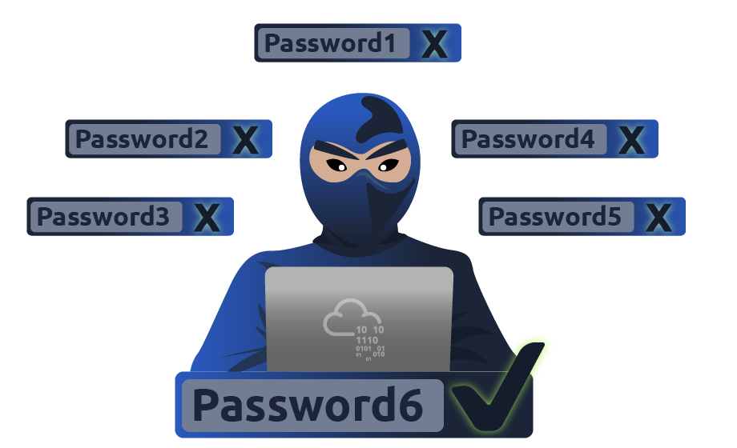

# __Password Attacks__

---
## __Task 1: Introduction__

This room is an introduction to the types and techniques used in password attacks. We will discuss the ways to get and generate custom password lists. The following are some of the topics we will discuss:

- Password profiling
- Password attacks techniques
- Online password attacks

### __What is a password?__

Passwords are used as an authentication method for individuals to access computer systems or applications. Using passwords ensures the owner of the account is the only one who has access. However, if the password is shared or falls into the wrong hands, unauthorized changes to a given system could occur. Unauthorized access could potentially lead to changes in the system's overall status and health or damage the file system. Passwords are typically comprised of a combination of characters such as letters, numbers, and symbols. Thus, it is up to the user how they generate passwords!
A collection of passwords is often referred to as a dictionary or wordlist. Passwords with low complexity that are easy to guess are commonly found in various publicly disclosed password data breaches. For example, an easy-to-guess password could be `password`, `123456`, `111111`, and much more. Here are the [top 100 and most common and seen passwords](https://techlabuzz.com/top-100-most-common-passwords/) for your reference. Thus, it won't take long and be too difficult for the attacker to run password attacks against the target or service to guess the password. Choosing a strong password is a good practice, making it hard to guess or crack. Strong passwords should not be common words or found in dictionaries as well as the password should be an eight characters length at least. It also should contain uppercase and lower case letters, numbers, and symbol strings (ex: `*&^%$#@`).

Sometimes, companies have their own password policies and enforce users to follow guidelines when creating passwords. This helps ensure users aren't using common or weak passwords within their organization and could limit attack vectors such as brute-forcing. For example, a password length has to be eight characters and more, including characters, a couple of numbers, and at least one symbol. However, if the attacker figures out the password policy, he could generate a password list that satisfies the account password policy.

### __How secure are passwords?__
Passwords are a protection method for accessing online accounts or computer systems. Passwords authentication methods are used to access personal and private systems, and its main goal of using the password is to keep it safe and not share it with others.

To answer the question: `How secure are passwords?` depends on various factors. Passwords are usually stored within the file system or database, and keeping them safe is essential. We've seen cases where companies store passwords into plaintext documents, such as the [Sony breach](https://www.techdirt.com/articles/20141204/12032329332/shocking-sony-learned-no-password-lessons-after-2011-psn-hack.shtml) in 2014. Therefore, once an attacker accesses the file system, he can easily obtain and reuse these passwords. On the other hand, others store passwords within the system using various techniques such as hashing functions or encryption algorithms to make them more secure. Even if the attacker has to access the system, it will be harder to crack. We will cover cracking hashes in the upcoming tasks.

<span> 
    <span class="twemoji mdx-heart ans-wu">
        <svg xmlns="http://www.w3.org/2000/svg" viewBox="0 0 24 24"><path d="M14 20.408c-.492.308-.903.546-1.192.709-.153.086-.308.17-.463.252h-.002a.75.75 0 0 1-.686 0 16.709 16.709 0 0 1-.465-.252 31.147 31.147 0 0 1-4.803-3.34C3.8 15.572 1 12.331 1 8.513 1 5.052 3.829 2.5 6.736 2.5 9.03 2.5 10.881 3.726 12 5.605 13.12 3.726 14.97 2.5 17.264 2.5 20.17 2.5 23 5.052 23 8.514c0 3.818-2.801 7.06-5.389 9.262A31.146 31.146 0 0 1 14 20.408z"></path></svg>
    </span>
        <span class="content-wu ans-wu"> Answer the questions below </span>
</span>

!!! question "__Learn about password attacking techniques in the next task!__"

    === "Answer"
        ``` powershell
        No needed answer
        ```

## __Task 2: Password Attacking Techniques__


### __Password Attack Techniques__

In this room, we will discuss the techniques that could be used to perform password attacks. We will cover various techniques such as a dictionary, brute-force, rule-base, and guessing attacks. All the above techniques are considered active 'online' attacks where the attacker needs to communicate with the target machine to obtain the password in order to gain unauthorized access to the machine.

### __Password Cracking vs. Password Guessing__
This section discusses password cracking terminology from a cybersecurity perspective. Also, we will discuss significant differences between password cracking and password guessing. Finally, we'll demonstrate various tools used for password cracking, including `Hashcat` and `John the Ripper`.

Password cracking is a technique used for discovering passwords from encrypted or hashed data to plaintext data. Attackers may obtain the encrypted or hashed passwords from a compromised computer or capture them from transmitting data over the network. Once passwords are obtained, the attacker can utilize password attacking techniques to crack these hashed passwords using various tools.

Password cracking is considered one of the traditional techniques in pen-testing. The primary goal is to let the attacker escalate to higher privileges and access to a computer system or network. Password guessing and password cracking are often commonly used by information security professionals. Both have different meanings and implications. Password guessing is a method of guessing passwords for online protocols and services based on dictionaries. The following are major differences between password cracking and password guessing:

- Password guessing is a technique used to target online protocols and services. Therefore, it's considered time-consuming and opens up the opportunity to generate logs for the failed login attempts. A password guessing attack conducted on a web-based system often requires a new request to be sent for each attempt, which can be easily detected. It may cause an account to be locked out if the system is designed and configured securely.
- Password cracking is a technique performed locally or on systems controlled by the attacker.

<span> 
    <span class="twemoji mdx-heart ans-wu">
        <svg xmlns="http://www.w3.org/2000/svg" viewBox="0 0 24 24"><path d="M14 20.408c-.492.308-.903.546-1.192.709-.153.086-.308.17-.463.252h-.002a.75.75 0 0 1-.686 0 16.709 16.709 0 0 1-.465-.252 31.147 31.147 0 0 1-4.803-3.34C3.8 15.572 1 12.331 1 8.513 1 5.052 3.829 2.5 6.736 2.5 9.03 2.5 10.881 3.726 12 5.605 13.12 3.726 14.97 2.5 17.264 2.5 20.17 2.5 23 5.052 23 8.514c0 3.818-2.801 7.06-5.389 9.262A31.146 31.146 0 0 1 14 20.408z"></path></svg>
    </span>
        <span class="content-wu ans-wu"> Answer the questions below </span>
</span>

!!! question "__Which type of password attack is performed locally?__"

    === "Answer"
        Password cracking
    === "Explain"
        Password cracking is a technique performed locally or on systems controlled by the attacker.

## __Task 3: Password Profiling #1 - Default, Weak, Leaked, Combined , and Username Wordlists__

Having a good wordlist is critical to carrying out a successful password attack. It is important to know how you can generate username lists and password lists. In this section, we will discuss creating targeted username and password lists. We will also cover various topics, including default, weak, leaked passwords, and creating targeted wordlists.

### __Default Passwords__

Before performing password attacks, it is worth trying a couple of default passwords against the targeted service. Manufacturers set default passwords with products and equipment such as switches, firewalls, routers. There are scenarios where customers don't change the default password, which makes the system vulnerable. Thus, it is a good practice to try out `admin:admin`, `admin:123456`, etc. If we know the target device, we can look up the default passwords and try them out. For example, suppose the target server is a Tomcat, a lightweight, open-source Java application server. In that case, there are a couple of possible default passwords we can try: `admin:admin` or `tomcat:admin`.

Here are some website lists that provide default passwords for various products.

- https://cirt.net/passwords
- https://default-password.info/
- https://datarecovery.com/rd/default-passwords/
### __Weak Passwords__
Professionals collect and generate weak password lists over time and often combine them into one large wordlist. Lists are generated based on their experience and what they see in pentesting engagements. These lists may also contain leaked passwords that have been published publically. Here are some of the common weak passwords lists :

- https://wiki.skullsecurity.org/index.php?title=Passwords - This includes the most well-known collections of passwords.
- [SecLists](https://github.com/danielmiessler/SecLists/tree/master/Passwords) - A huge collection of all kinds of lists, not only for password cracking.

### __Leaked Passwords__
Sensitive data such as passwords or hashes may be publicly disclosed or sold as a result of a breach. These public or privately available leaks are often referred to as 'dumps'. Depending on the contents of the dump, an attacker may need to extract the passwords out of the data. In some cases, the dump may only contain hashes of the passwords and require cracking in order to gain the plain-text passwords. The following are some of the common password lists that have weak and leaked passwords, including `webhost`, `elitehacker`,`hak5`, `Hotmail`, `PhpBB` companies' leaks:

- [SecLists/Passwords/Leaked-Databases](https://github.com/danielmiessler/SecLists/tree/master/Passwords/Leaked-Databases)
### __Combined wordlists__
Let's say that we have more than one wordlist. Then, we can combine these wordlists into one large file. This can be done as follows using `cat`:

```ps1 title="cewl"
cat file1.txt file2.txt file3.txt > combined_list.txt
```

To clean up the generated combined list to remove duplicated words, we can use `sort` and `uniq` as follows:

```ps1 title="cewl"
sort combined_list.txt | uniq -u > cleaned_combined_list.txt
```

### __Customized Wordlists__
Customizing password lists is one of the best ways to increase the chances of finding valid credentials. We can create custom password lists from the target website. Often, a company's website contains valuable information about the company and its employees, including emails and employee names. In addition, the website may contain keywords specific to what the company offers, including product and service names, which may be used in an employee's password! 

Tools such as `Cewl` can be used to effectively crawl a website and extract strings or keywords. `Cewl` is a powerful tool to generate a wordlist specific to a given company or target. Consider the following example below

```ps1 title="cewl"
user@thm$ cewl -w list.txt -d 5 -m 5 http://thm.labs
```

`-w` will write the contents to a file. In this case, list.txt.

`-m 5` gathers strings (words) that are 5 characters or more

`-d 5` is the depth level of web crawling/spidering (default 2)

`http://thm.labs` is the URL that will be used

As a result, we should now have a decently sized wordlist based on relevant words for the specific enterprise, like names, locations, and a lot of their business lingo. Similarly, the wordlist that was created could be used to fuzz for usernames. 

Apply what we discuss using `cewl` against `https://clinic.thmredteam.com/` to parse all words and generate a wordlist with a minimum length of 8. Note that we will be using this wordlist later on with another task!

### __Username Wordlists__

Gathering employees' names in the enumeration stage is essential. We can generate username lists from the target's website. For the following example, we'll assume we have a {first name} {last name} (ex: John Smith) and a method of generating usernames.

- __{first name}__: john
- __{last name}__: smith
- __{first name}{last name}__:  `johnsmith` 
- __{last name}{first name}__:  `smithjohn`  
- first letter of the __{first name}{last name}__: `jsmith` 
- first letter of the __{last name}{first name}__: `sjohn`  
- first letter of the __{first name}.{last name}__: `j.smith` 
- first letter of the __{first name}-{last name}__: `j-smith` 
- and so on
Thankfully, there is a tool `username_generator` that could help create a list with most of the possible combinations if we have a first name and last name.

```ps1 title="Usernames"
user@thm$ git clone https://github.com/therodri2/username_generator.git
Cloning into 'username_generator'...
remote: Enumerating objects: 9, done.
remote: Counting objects: 100% (9/9), done.
remote: Compressing objects: 100% (7/7), done.
remote: Total 9 (delta 0), reused 0 (delta 0), pack-reused 0
Receiving objects: 100% (9/9), done.

user@thm$ cd username_generator
```
Using `python3 username_generator.py -h` shows the tool's help message and optional arguments.

```ps1 title="Usernames"
user@thm$ python3 username_generator.py -h
usage: username_generator.py [-h] -w wordlist [-u]

Python script to generate user lists for bruteforcing!

optional arguments:
  -h, --help            show this help message and exit
  -w wordlist, --wordlist wordlist
                        Specify path to the wordlist
  -u, --uppercase       Also produce uppercase permutations. Disabled by default
  ```

Now let's create a wordlist that contains the full name John Smith to a text file. Then, we'll run the tool to generate the possible combinations of the given full name.

```ps1 title="Usernames"
user@thm$ echo "John Smith" > users.lst
user@thm$ python3 username_generator.py -w users.lst
usage: username_generator.py [-h] -w wordlist [-u]
john
smith
j.smith
j-smith
j_smith
j+smith
jsmith
smithjohn
```

This is just one example of a custom username generator. Please feel free to explore more options or even create your own in the programming language of your choice!

<span> 
    <span class="twemoji mdx-heart ans-wu">
        <svg xmlns="http://www.w3.org/2000/svg" viewBox="0 0 24 24"><path d="M14 20.408c-.492.308-.903.546-1.192.709-.153.086-.308.17-.463.252h-.002a.75.75 0 0 1-.686 0 16.709 16.709 0 0 1-.465-.252 31.147 31.147 0 0 1-4.803-3.34C3.8 15.572 1 12.331 1 8.513 1 5.052 3.829 2.5 6.736 2.5 9.03 2.5 10.881 3.726 12 5.605 13.12 3.726 14.97 2.5 17.264 2.5 20.17 2.5 23 5.052 23 8.514c0 3.818-2.801 7.06-5.389 9.262A31.146 31.146 0 0 1 14 20.408z"></path></svg>
    </span>
        <span class="content-wu ans-wu"> Answer the questions below </span>
</span>

!!! question "__What are the default login credentials (in the format of `username:password`) for a Juniper Networks ISG 2000 device?__"

    === "Answer"
        ``` powershell
        netscreen:netscreen
        ```

## __Task 4: Password Profiling #2 - Keyspace Technique and CUPP__

### __Keyspace Technique__

Another way of preparing a wordlist is by using the key-space technique. In this technique, we specify a range of characters, numbers, and symbols in our wordlist. `crunch` is one of many powerful tools for creating an offline wordlist. With `crunch`, we can specify numerous options, including min, max, and options as follows:

```ps1 title="crunch"
user@thm$ crunch -h
crunch version 3.6

Crunch can create a wordlist based on the criteria you specify.  
The output from crunch can be sent to the screen, file, or to another program.

Usage: crunch   [options]
where min and max are numbers

Please refer to the man page for instructions and examples on how to use crunch.
```

The following example creates a wordlist containing all possible combinations of 2 characters, including 0-4 and a-d. We can use the `-o` argument and specify a file to save the output to. 

```ps1 title="crunch"
user@thm$ crunch 2 2 01234abcd -o crunch.txt
Crunch will now generate the following amount of data: 243 bytes
0 MB
0 GB
0 TB
0 PB
Crunch will now generate the following number of lines: xx
crunch: 100% completed generating output
```

Here is a snippet of the output:

```ps1 title="crunch"
user@thm$ cat crunch.txt
00
01
02
03
04
0a
0b
0c
0d
10
.
.
.
cb
cc
cd
d0
d1
d2
d3
d4
da
db
dc
dd
```

It's worth noting that crunch can generate a very large text file depending on the word length and combination options you specify. The following command creates a list with an 8 character minimum and maximum length containing numbers 0-9, a-f lowercase letters, and A-F uppercase letters:

`crunch 8 8 0123456789abcdefABCDEF -o crunch.txt` the file generated is `459 GB` and contains `54875873536` words.

crunch also lets us specify a character set using the -t option to combine words of our choice. Here are some of the other options that could be used to help create different combinations of your choice:

`@` - lower case alpha characters

`,` - upper case alpha characters

`%` - numeric characters

`^` - special characters including space

For example, if part of the password is known to us, and we know it starts with `pass` and follows two numbers, we can use the % symbol from above to match the numbers. Here we generate a wordlist that contains `pass` followed by 2 numbers:

```ps1 title="crunch"
user@thm$  crunch 6 6 -t pass%%
Crunch will now generate the following amount of data: 700 bytes
0 MB
0 GB
0 TB
0 PB
Crunch will now generate the following number of lines: 100
pass00
pass01
pass02
pass03
```

### __CUPP - Common User Passwords Profiler__
CUPP is an automatic and interactive tool written in Python for creating custom wordlists. For instance, if you know some details about a specific target, such as their birthdate, pet name, company name, etc., this could be a helpful tool to generate passwords based on this known information. CUPP will take the information supplied and generate a custom wordlist based on what's provided. There's also support for a `1337/leet mode`, which substitutes the letters a, i,e, t, o, s, g, z  with numbers. For example, replace a  with 4  or i with 1. For more information about the tool, please visit the GitHub repo [here](https://github.com/Mebus/cupp).

To run CUPP, we need python 3 installed. Then clone the GitHub repo to your local machine using git as follows:

```ps1 title="CUPP"
user@thm$  git clone https://github.com/Mebus/cupp.git
Cloning into 'cupp'...
remote: Enumerating objects: 237, done.
remote: Total 237 (delta 0), reused 0 (delta 0), pack-reused 237
Receiving objects: 100% (237/237), 2.14 MiB | 1.32 MiB/s, done.
Resolving deltas: 100% (125/125), done.
```

Now change the current directory to CUPP and run `python3 cupp.py` or with `-h` to see the available options.


```ps1 title="CUPP"
user@thm$  python3 cupp.py
 ___________
   cupp.py!                 # Common
      \                     # User
       \   ,__,             # Passwords
        \  (oo)____         # Profiler
           (__)    )\
              ||--|| *      [ Muris Kurgas | j0rgan@remote-exploit.org ]
                            [ Mebus | https://github.com/Mebus/]

usage: cupp.py [-h] [-i | -w FILENAME | -l | -a | -v] [-q]

Common User Passwords Profiler

optional arguments:
  -h, --help         show this help message and exit
  -i, --interactive  Interactive questions for user password profiling
  -w FILENAME        Use this option to improve existing dictionary, or WyD.pl output to make some pwnsauce
  -l                 Download huge wordlists from repository
  -a                 Parse default usernames and passwords directly from Alecto DB. Project Alecto uses purified
                     databases of Phenoelit and CIRT which were merged and enhanced
  -v, --version      Show the version of this program.
  -q, --quiet        Quiet mode (don't print banner)
```

CUPP supports an interactive mode where it asks questions about the target and based on the provided answers, it creates a custom wordlist. If you don't have an answer for the given field, then skip it by pressing the `Enter` key.

```ps1 title="CUPP"
user@thm$  python3 cupp.py -i
 ___________
   cupp.py!                 # Common
      \                     # User
       \   ,__,             # Passwords
        \  (oo)____         # Profiler
           (__)    )\
              ||--|| *      [ Muris Kurgas | j0rgan@remote-exploit.org ]
                            [ Mebus | https://github.com/Mebus/]


[+] Insert the information about the victim to make a dictionary
[+] If you don't know all the info, just hit enter when asked! ;)

> First Name: 
> Surname: 
> Nickname: 
> Birthdate (DDMMYYYY): 


> Partners) name:
> Partners) nickname:
> Partners) birthdate (DDMMYYYY):


> Child's name:
> Child's nickname:
> Child's birthdate (DDMMYYYY):


> Pet's name:
> Company name:


> Do you want to add some key words about the victim? Y/[N]:
> Do you want to add special chars at the end of words? Y/[N]:
> Do you want to add some random numbers at the end of words? Y/[N]:
> Leet mode? (i.e. leet = 1337) Y/[N]:

[+] Now making a dictionary...
[+] Sorting list and removing duplicates...
[+] Saving dictionary to .....txt, counting ..... words.
> Hyperspeed Print? (Y/n)
```

ِAs a result, a custom wordlist that contains various numbers of words based on your entries is generated. Pre-created wordlists can be downloaded to your machine as follows:

```ps1 title="CUPP"
user@thm$  python3 cupp.py -l
 ___________
   cupp.py!                 # Common
      \                     # User
       \   ,__,             # Passwords
        \  (oo)____         # Profiler
           (__)    )\
              ||--|| *      [ Muris Kurgas | j0rgan@remote-exploit.org ]
                            [ Mebus | https://github.com/Mebus/]


        Choose the section you want to download:

     1   Moby            14      french          27      places
     2   afrikaans       15      german          28      polish
     3   american        16      hindi           29      random
     4   aussie          17      hungarian       30      religion
     5   chinese         18      italian         31      russian
     6   computer        19      japanese        32      science
     7   croatian        20      latin           33      spanish
     8   czech           21      literature      34      swahili
     9   danish          22      movieTV         35      swedish
    10   databases       23      music           36      turkish
    11   dictionaries    24      names           37      yiddish
    12   dutch           25      net             38      exit program
    13   finnish         26      norwegian


        Files will be downloaded from http://ftp.funet.fi/pub/unix/security/passwd/crack/dictionaries/ repository

        Tip: After downloading wordlist, you can improve it with -w option

> Enter number:
```

Based on your interest, you can choose the wordlist from the list above to aid in generating wordlists for brute-forcing!

Finally, CUPP could also provide default usernames and passwords from the Alecto database by using the `-a` option. 

```ps1 title="CUPP"
user@thm$  python3 cupp.py -a
 ___________
   cupp.py!                 # Common
      \                     # User
       \   ,__,             # Passwords
        \  (oo)____         # Profiler
           (__)    )\
              ||--|| *      [ Muris Kurgas | j0rgan@remote-exploit.org ]
                            [ Mebus | https://github.com/Mebus/]


[+] Checking if alectodb is not present...
[+] Downloading alectodb.csv.gz from https://github.com/yangbh/Hammer/raw/b0446396e8d67a7d4e53d6666026e078262e5bab/lib/cupp/alectodb.csv.gz ...

[+] Exporting to alectodb-usernames.txt and alectodb-passwords.txt
[+] Done.
```

<span> 
    <span class="twemoji mdx-heart ans-wu">
        <svg xmlns="http://www.w3.org/2000/svg" viewBox="0 0 24 24"><path d="M14 20.408c-.492.308-.903.546-1.192.709-.153.086-.308.17-.463.252h-.002a.75.75 0 0 1-.686 0 16.709 16.709 0 0 1-.465-.252 31.147 31.147 0 0 1-4.803-3.34C3.8 15.572 1 12.331 1 8.513 1 5.052 3.829 2.5 6.736 2.5 9.03 2.5 10.881 3.726 12 5.605 13.12 3.726 14.97 2.5 17.264 2.5 20.17 2.5 23 5.052 23 8.514c0 3.818-2.801 7.06-5.389 9.262A31.146 31.146 0 0 1 14 20.408z"></path></svg>
    </span>
        <span class="content-wu ans-wu"> Answer the questions below </span>
</span>

!!! question "__Run the following crunch command:crunch 2 2 01234abcd -o crunch.txt. How many words did crunch generate?__"

    === "Answer"
        ``` powershell
        81
        ```

## __Task 5: Offline Attacks - Dictionary and Brute-Force__

This section discusses offline attacks, including dictionary, brute-force, and rule-based attacks.

### __Dictionary attack__
A dictionary attack is a technique used to guess passwords by using well-known words or phrases. The dictionary attack relies entirely on pre-gathered wordlists that were previously generated or found. It is important to choose or create the best candidate wordlist for your target in order to succeed in this attack. Let's explore performing a dictionary attack using what you've learned in the previous tasks about generating wordlists. We will showcase an offline dictionary attack using `hashcat`, which is a popular tool to crack hashes.

Let's say that we obtain the following hash `f806fc5a2a0d5ba2471600758452799c`, and want to perform a dictionary attack to crack it. First, we need to know the following at a minimum:

1- What type of hash is this?
2- What wordlist will we be using? Or what type of attack mode could we use?

To identify the type of hash, we could a tool such as `hashid` or `hash-identifier`. For this example, `hash-identifier` believed the possible hashing method is MD5. Please note the time to crack a hash will depend on the hardware you're using (CPU and/or GPU).

```ps1 title="Dictionary attack"
user@machine$ hashcat -a 0 -m 0 f806fc5a2a0d5ba2471600758452799c /usr/share/wordlists/rockyou.txt
hashcat (v6.1.1) starting...
f806fc5a2a0d5ba2471600758452799c:rockyou

Session..........: hashcat
Status...........: Cracked
Hash.Name........: MD5
Hash.Target......: f806fc5a2a0d5ba2471600758452799c
Time.Started.....: Mon Oct 11 08:20:50 2021 (0 secs)
Time.Estimated...: Mon Oct 11 08:20:50 2021 (0 secs)
Guess.Base.......: File (/usr/share/wordlists/rockyou.txt)
Guess.Queue......: 1/1 (100.00%)
Speed.#1.........:   114.1 kH/s (0.02ms) @ Accel:1024 Loops:1 Thr:1 Vec:8
Recovered........: 1/1 (100.00%) Digests
Progress.........: 40/40 (100.00%)
Rejected.........: 0/40 (0.00%)
Restore.Point....: 0/40 (0.00%)
Restore.Sub.#1...: Salt:0 Amplifier:0-1 Iteration:0-1
Candidates.#1....: 123456 -> 123123

Started: Mon Oct 11 08:20:49 2021
Stopped: Mon Oct 11 08:20:52 2021
```

`-a 0`  sets the attack mode to a dictionary attack

`-m 0`  sets the hash mode for cracking MD5 hashes; for other types, run hashcat -h for a list of supported hashes.

`f806fc5a2a0d5ba2471600758452799c` this option could be a single hash like our example or a file that contains a hash or multiple hashes.

`/usr/share/wordlists/rockyou.txt` the wordlist/dictionary file for our attack

We run `hashcat` with `--show` option to show the cracked value if the hash has been cracked:

```ps1 title="Dictionary attack"
user@machine$ hashcat -a 0 -m 0 F806FC5A2A0D5BA2471600758452799C /usr/share/wordlists/rockyou.txt --show
f806fc5a2a0d5ba2471600758452799c:rockyou
```

As a result, the cracked value is `rockyou`.

### __Brute-Force attack__

Brute-forcing is a common attack used by the attacker to gain unauthorized access to a personal account. This method is used to guess the victim's password by sending standard password combinations. The main difference between a dictionary and a brute-force attack is that a dictionary attack uses a wordlist that contains all possible passwords.

In contrast, a brute-force attack aims to try all combinations of a character or characters. For example, let's assume that we have a bank account to which we need unauthorized access. We know that the PIN contains 4 digits as a password. We can perform a brute-force attack that starts from `0000` to `9999` to guess the valid PIN based on this knowledge. In other cases, a sequence of numbers or letters can be added to existing words in a list, such as `admin0`, `admin1`, .. `admin9999`.

For instance, `hashcat` has charset options that could be used to generate your own combinations. The charsets can be found in `hashcat` help options.

```ps1 title="Brute-Force attack"
user@machine$ hashcat --help
 ? | Charset
 ===+=========
  l | abcdefghijklmnopqrstuvwxyz
  u | ABCDEFGHIJKLMNOPQRSTUVWXYZ
  d | 0123456789
  h | 0123456789abcdef
  H | 0123456789ABCDEF
  s |  !"#$%&'()*+,-./:;<=>?@[\]^_`{|}~
  a | ?l?u?d?s
  b | 0x00 - 0xff
```

The following example shows how we can use `hashcat` with the brute-force attack mode with a combination of our choice. 

```ps1 title="Brute-Force attack" hl_lines="1"
user@machine$ hashcat -a 3 ?d?d?d?d --stdout
1234
0234
2234
3234
9234
4234
5234
8234
7234
6234
..
..
```

`-a 3`  sets the attacking mode as a brute-force attack

`?d?d?d?d` the ?d tells hashcat to use a digit. In our case, ?d?d?d?d for four digits starting with 0000 and ending at 9999

`--stdout` print the result to the terminal

Now let's apply the same concept to crack the following MD5 hash: `05A5CF06982BA7892ED2A6D38FE832D6` a four-digit PIN number.

```ps1 title="Brute-Force attack"
user@machine$ hashcat -a 3 -m 0 05A5CF06982BA7892ED2A6D38FE832D6 ?d?d?d?d
05a5cf06982ba7892ed2a6d38fe832d6:2021

Session..........: hashcat
Status...........: Cracked
Hash.Name........: MD5
Hash.Target......: 05a5cf06982ba7892ed2a6d38fe832d6
Time.Started.....: Mon Oct 11 10:54:06 2021 (0 secs)
Time.Estimated...: Mon Oct 11 10:54:06 2021 (0 secs)
Guess.Mask.......: ?d?d?d?d [4]
Guess.Queue......: 1/1 (100.00%)
Speed.#1.........: 16253.6 kH/s (0.10ms) @ Accel:1024 Loops:10 Thr:1 Vec:8
Recovered........: 1/1 (100.00%) Digests
Progress.........: 10000/10000 (100.00%)
Rejected.........: 0/10000 (0.00%)
Restore.Point....: 0/1000 (0.00%)
Restore.Sub.#1...: Salt:0 Amplifier:0-10 Iteration:0-10
Candidates.#1....: 1234 -> 6764

Started: Mon Oct 11 10:54:05 2021
Stopped: Mon Oct 11 10:54:08 2021
```

<span> 
    <span class="twemoji mdx-heart ans-wu">
        <svg xmlns="http://www.w3.org/2000/svg" viewBox="0 0 24 24"><path d="M14 20.408c-.492.308-.903.546-1.192.709-.153.086-.308.17-.463.252h-.002a.75.75 0 0 1-.686 0 16.709 16.709 0 0 1-.465-.252 31.147 31.147 0 0 1-4.803-3.34C3.8 15.572 1 12.331 1 8.513 1 5.052 3.829 2.5 6.736 2.5 9.03 2.5 10.881 3.726 12 5.605 13.12 3.726 14.97 2.5 17.264 2.5 20.17 2.5 23 5.052 23 8.514c0 3.818-2.801 7.06-5.389 9.262A31.146 31.146 0 0 1 14 20.408z"></path></svg>
    </span>
        <span class="content-wu ans-wu"> Answer the questions below </span>
</span>

!!! question "__Considering the following hash: `8d6e34f987851aa599257d3831a1af040886842f`. What is the hash type?__"

    === "Answer"
        ``` powershell
        sha-1
        ```
!!! question "__Perform a dictionary attack against the following hash: 8d6e34f987851aa599257d3831a1af040886842f. What is the cracked value? Use rockyou.txt wordlist.__"

    === "Answer"
        ``` powershell
        sunshine
        ```
!!! question "__Perform a brute-force attack against the following MD5 hash: e48e13207341b6bffb7fb1622282247b. What is the cracked value? Note the password is a 4 digit number: [0-9][0-9][0-9][0-9]__"

    === "Answer"
        ``` powershell
        1337
        ```
    
## __Task 6: Offline Attacks - Rule-Based__

### __Rule-Based attacks__

Rule-Based attacks are also known as hybrid attacks. Rule-Based attacks assume the attacker knows something about the password policy. Rules are applied to create passwords within the guidelines of the given password policy and should, in theory, only generate valid passwords. Using pre-existing wordlists may be useful when generating passwords that fit a policy — for example, manipulating or 'mangling' a password such as 'password': p@ssword, Pa$$word, Passw0rd, and so on.

For this attack, we can expand our wordlist using either hashcat or John the ripper. However, for this attack, let's see how John the ripper works. Usually, John the ripper has a config file that contains rule sets, which is located at /etc/john/john.conf or /opt/john/john.conf depending on your distro or how john was installed. You can read /etc/john/john.conf and look for List.Rules to see all the available rules:

```ps1 title="Rule-based attack"
user@machine$ cat /etc/john/john.conf|grep "List.Rules:" | cut -d"." -f3 | cut -d":" -f2 | cut -d"]" -f1 | awk NF
JumboSingle
o1
o2
i1
i2
o1
i1
o2
i2
best64
d3ad0ne
dive
InsidePro
T0XlC
rockyou-30000
specific
ShiftToggle
Split
Single
Extra
OldOffice
Single-Extra
Wordlist
ShiftToggle
Multiword
best64
Jumbo
KoreLogic
T9
```

We can see that we have many rules that are available for us to use. We will create a wordlist with only one password containing the string `tryhackme`, to see how we can expand the wordlist. Let's choose one of the rules, the `best64` rule, which contains the best 64 built-in John rules, and see what it can do!

```ps1 title="Rule-based attack"
user@machine$ john --wordlist=/tmp/single-password-list.txt --rules=best64 --stdout | wc -l
Using default input encoding: UTF-8
Press 'q' or Ctrl-C to abort, almost any other key for status
76p 0:00:00:00 100.00% (2021-10-11 13:42) 1266p/s pordpo
76
```

`--wordlist=` to specify the wordlist or dictionary file. 

`--rules` to specify which rule or rules to use.

`--stdout` to print the output to the terminal.

`|wc -l`  to count how many lines John produced.

By running the previous command, we expand our password list from 1 to 76 passwords. Now let's check another rule, one of the best rules in John, `KoreLogic`. `KoreLogic` uses various built-in and custom rules to generate complex password lists. For more information, please visit this website [here](https://contest-2010.korelogic.com/rules.html). Now let's use this rule and check whether the `Tryh@ckm3` is available in our list!

<span> 
    <span class="twemoji mdx-heart ans-wu">
        <svg xmlns="http://www.w3.org/2000/svg" viewBox="0 0 24 24"><path d="M14 20.408c-.492.308-.903.546-1.192.709-.153.086-.308.17-.463.252h-.002a.75.75 0 0 1-.686 0 16.709 16.709 0 0 1-.465-.252 31.147 31.147 0 0 1-4.803-3.34C3.8 15.572 1 12.331 1 8.513 1 5.052 3.829 2.5 6.736 2.5 9.03 2.5 10.881 3.726 12 5.605 13.12 3.726 14.97 2.5 17.264 2.5 20.17 2.5 23 5.052 23 8.514c0 3.818-2.801 7.06-5.389 9.262A31.146 31.146 0 0 1 14 20.408z"></path></svg>
    </span>
        <span class="content-wu ans-wu"> Answer the questions below </span>
</span>

!!! question "__What syntax would you use to create a rule to produce the following: "S[Word]NN  where N is Number and S is a symbol of !@?__"

    === "Answer"
        ``` powershell
        Az"[0-9][0-9]" ^[!@]
        ```

## __Task 8: Online password attacks__

Some online password attacks tools: hydra, [Medusa](https://www.kali.org/tools/medusa/), [Ncrack](https://www.kali.org/tools/ncrack/), others!

### __Hydra__

Brute force:

- hydra -l ftp -P passlist.txt ftp://xxx.xxx.xxx.xxx 
- hydra -l email@company.xyz -P /path/to/wordlist.txt smtp://10.10.x.x -v 
- hydra -L users.lst -P /path/to/wordlist.txt ssh://10.10.x.x -v

### __HTTP login pages__

In this scenario, we will brute-force `HTTP login pages`. To do that, first, you need to understand what you are brute-forcing. Using hydra, it is important to specify the type of HTTP request, whether `GET` or `POST`. Checking hydra options: `hydra http-get-form -U`, we can see that hydra has the following syntax for the `http-get-form` option:

`<url>:<form parameters>:<condition string>[:<optional>[:<optional>]`

As we mentioned earlier, we need to analyze the HTTP request that we need to send, and that could be done either by using your browser dev tools or using a web proxy such as Burp Suite.

```ps1 title="hydra"
user@machine$ hydra -l admin -P 500-worst-passwords.txt 10.10.x.x http-get-form "/login-get/index.php:username=^USER^&password=^PASS^:S=logout.php" -f 
Hydra v8.6 (c) 2017 by van Hauser/THC - Please do not use in military or secret service organizations, or for illegal purposes. 

Hydra (http://www.thc.org/thc-hydra) starting at 2021-10-13 08:06:22 
[DATA] max 16 tasks per 1 server, overall 16 tasks, 500 login tries (l:1/p:500), ~32 tries per task 
[DATA] attacking http-get-form://10.10.x.x:80//login-get/index.php:username=^USER^&password=^PASS^:S=logout.php 
[80][http-get-form] host: 10.10.x.x   login: admin password: xxxxxx 
1 of 1 target successfully completed, 1 valid password found 
Hydra (http://www.thc.org/thc-hydra) 
finished at 2021-10-13 08:06:45
```

Option:

- `-f` to stop the brute-forcing attacks after finding a valid username and password

??? info "__Online password attacks__"

    <span> 
        <span class="twemoji mdx-heart ans-wu">
            <svg xmlns="http://www.w3.org/2000/svg" viewBox="0 0 24 24"><path d="M14 20.408c-.492.308-.903.546-1.192.709-.153.086-.308.17-.463.252h-.002a.75.75 0 0 1-.686 0 16.709 16.709 0 0 1-.465-.252 31.147 31.147 0 0 1-4.803-3.34C3.8 15.572 1 12.331 1 8.513 1 5.052 3.829 2.5 6.736 2.5 9.03 2.5 10.881 3.726 12 5.605 13.12 3.726 14.97 2.5 17.264 2.5 20.17 2.5 23 5.052 23 8.514c0 3.818-2.801 7.06-5.389 9.262A31.146 31.146 0 0 1 14 20.408z"></path></svg>
        </span>
            <span class="content-wu ans-wu"> Answer the questions below </span>
    </span>

    > Question 1: Can you guess the FTP credentials without brute-forcing? What is the flag?

    >> THM{d0abe799f25738ad739c20301aed357b}
    >>
    >> Hint: Can login anonymous

!!! question "Perform a brute-forcing attack against the phillips account for the login page at http://MACHINE_IP/login-get using hydra? __What is the flag?__"
    THM{33c5d4954da881814420f3ba39772644}

!!! question "Perform a rule-based password attack to gain access to the burgess account. Find the flag at the following website: http://MACHINE_IP/login-post/. What is the flag?"
    THM{f8e3750cc0ccbb863f2706a3b2933227}
    > Note: use the clinic.lst dictionary in generating and expanding the wordlist!

## __Task 9: Password spray attack__

### __RDP__

See tool: https://github.com/xFreed0m/RDPassSpray

Syntax:

- python3 RDPassSpray.py -u user -p pass -t HOST:PORT

### __Outlook web access (OWA) portal__

Tools:

- [SprayingToolkit](https://github.com/byt3bl33d3r/SprayingToolkit) (atomizer.py)
- [MailSniper](https://github.com/dafthack/MailSniper)

### __SMB__
Tool: Metasploit (auxiliary/scanner/smb/smb_login)

<span> 
    <span class="twemoji mdx-heart ans-wu">
        <svg xmlns="http://www.w3.org/2000/svg" viewBox="0 0 24 24"><path d="M14 20.408c-.492.308-.903.546-1.192.709-.153.086-.308.17-.463.252h-.002a.75.75 0 0 1-.686 0 16.709 16.709 0 0 1-.465-.252 31.147 31.147 0 0 1-4.803-3.34C3.8 15.572 1 12.331 1 8.513 1 5.052 3.829 2.5 6.736 2.5 9.03 2.5 10.881 3.726 12 5.605 13.12 3.726 14.97 2.5 17.264 2.5 20.17 2.5 23 5.052 23 8.514c0 3.818-2.801 7.06-5.389 9.262A31.146 31.146 0 0 1 14 20.408z"></path></svg>
    </span>
        <span class="content-wu ans-wu"> Answer the questions below </span>
</span>

Use the following username list:

```ps1 title="Password spraying attack!"
user@THM:~# cat usernames-list.txt 
admin
phillips
burgess
pittman
guess
```

Perform a `password spraying attack` to get access to the `SSH://MACHINE_IP` server to read `/etc/flag`. What is the flag?

> Flag: THM{a97a26e86d09388bbea148f4b870277d}


## __Task 10: Summary__

This room introduced the basic concepts of different password attacks and how to create custom and targeted password lists. We covered and discussed various topics, including:

- Default, weak, leaked combined wordlists
- Password profiling
- Offline password attacks
- Online password attacks