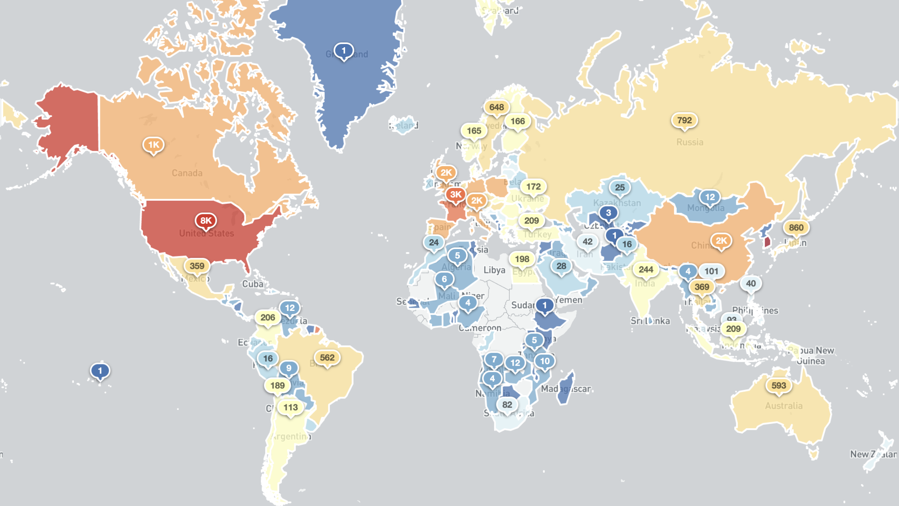

# __Printer Hacking 101__

---

## __Task 1: Unit 1 - Introduction__

In this room, we will look at the most common printer hacking techniques and will look at why they're made vulnerable. 

Mass printer hacking has been taking advantage of over the past few years. One example would be when one attacker hacked around 50,000 printers, printing out messages asking people to subscribe to PewDiePie. In the next task we'll take a look at the reasons behind the success of this attack.

## __Task 2  Unit 2: IPP Port__

The reason behind the printers' vulnerability which effected those 50,000 printers, was simply an open IPP port. 

"__The Internet Printing Protocol (IPP)__ - is a specialized Internet protocol for communication between client devices and printers. It allows clients to submit one or more print jobs to the printer or print server, and perform tasks such as querying the status of a printer, obtaining the status of print jobs, or canceling individual print jobs."

When an IPP port is open to the internet, it is possible for anyone to print to the printer or even transfer malicious data through it (using it as a middleman for attacks). 

A recent study by [VARIoT](https://www.variot.eu/) (Vulnerability and Attack Repository for IoT) showed that there are still around 80 thousand vulnerable printers opened to the world. Most of them appear to run the CUPS server (which is a simple UNIX printing system). 

An open IPP port can expose a lot of sensitive information such as printer name, location, model, firmware version, or even printer wifi SSID.

### __Answer the questions bellow__

!!! question "What port does IPP run on?"
    631

## __Task 3: Unit 3: Targeting & Exploitation__