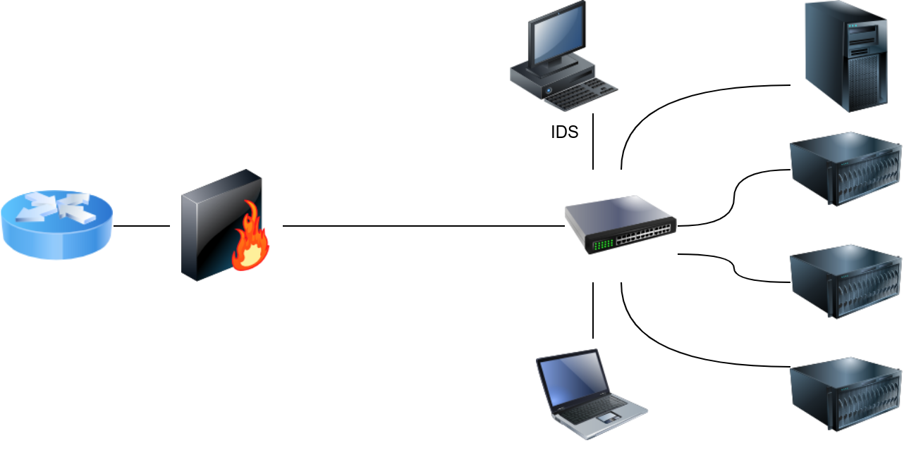
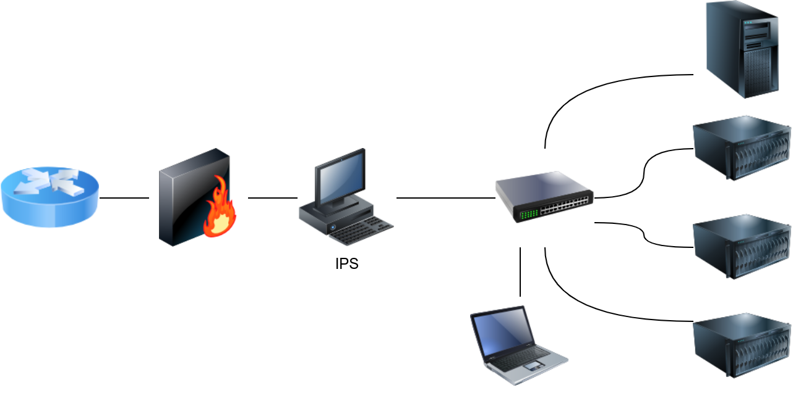
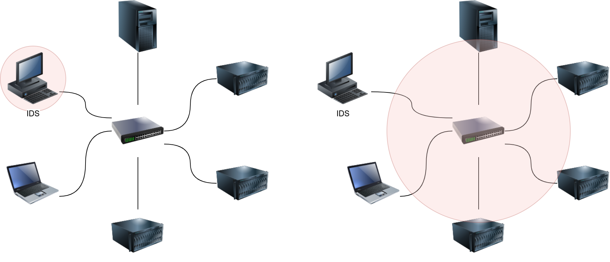

# __Network Security Solutions__

---

## __Task 1: Introduction__

An Intrusion Detection System (IDS) is a system that detects network or system intrusions. One analogy that comes to mind is a guard watching live feeds from different security cameras. He can spot a theft, but he cannot stop it by himself. However, if this guard can contact another guard and ask them to stop the robber, detection turns into prevention. An Intrusion Detection and Prevention System (IDPS) or simply Intrusion Prevention System (IPS) is a system that can detect and prevent intrusions.

Understanding the difference between detection and prevention is essential. Snort is a network intrusion detection and intrusion prevention system. Consequently, Snort can be set up as an IDS or an IPS. For Snort to function as an IPS, it needs some mechanism to block (`drop`) offending connections. This capability requires Snort to be set up as `inline` and to bridge two or more network cards.

As a signature-based network IDS, Snort is shown in the figure below.

The following figure shows how Snort can be configured as an IPS if set up inline.

IDS setups can be divided based on their location in the network into:

1. Host-based IDS (HIDS)
2. Network-based IDS (NIDS)

The host-based IDS (HIDS) is installed on an OS along with the other running applications. This setup will give the HIDS the ability to monitor the traffic going in and out of the host; moreover, it can monitor the processes running on the host.

The network-based IDS (NIDS) is a dedicated appliance or server to monitor the network traffic. The NIDS should be connected so that it can monitor all the network traffic of the network or VLANs we want to protect. This can be achieved by connecting the NIDS to a monitor port on the switch. The NIDS will process the network traffic to detect malicious traffic.

In the figure below, we use two red circles to show the difference in the coverage of a HIDS versus a NIDS.

