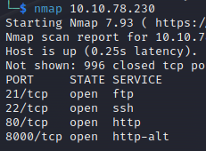

# __Startup__

---

## __Task 1: Welcome to Spice Hut!__

We are Spice Hut, a new startup company that just made it big! We offer a variety of spices and club sandwiches (in case you get hungry), but that is not why you are here. To be truthful, we aren't sure if our developers know what they are doing and our security concerns are rising. We ask that you perform a thorough penetration test and try to own root. Good luck!

### __Answer the questions bellow__

!!! question "What is the secret spicy soup recipe?"
    love

!!! question "What are the contents of user.txt?"
    THM{03ce3d619b80ccbfb3b7fc81e46c0e79}

!!! question "What are the contents of root.txt?"
    THM{f963aaa6a430f210222158ae15c3d76d}

### __Hints__

Như thường lệ, ta sẽ scan port website trước

Ta thấy có 4 port mở và ta focus vào ftp -> thấy có thể đăng nhập ẩn danh -> folder ftp có thể upload -> upload reverse shell (webshell).

Focus vào folder `incidents` và file recipe.txt (flag 1).

Với việc đọc file pcapng:

- Ta có thể gửi file đó lên folder ftp và dùng ftp để get nó về máy chúng ta để xem
- Mở 1 web local với python và máy attack dùng wget để lấy file về
- `cat` trực tiếp file để xem log.

Khi có được password lennie, login ssh

Tìm folder scripts và đọc. Tới đây thì challenge này leo thang đặc quyền như challenge [LazyAdmin](tryhackme/room/lazyadmin/)

## __Task 2: Credits__

Spice Hut was very happy with your results and it is guaranteed they will spread word about your excellence with their partners. Astounding work!

Find my official writeup here: https://www.youtube.com/watch?v=3qNxI1OggGc

I'd like to thank [ku5e](https://tryhackme.com/p/ku5e) for being a good sensei and [GeneralClaw](https://tryhackme.com/p/GeneralClaw), my grammar cop.

I'd like to thank my testers [Amit25095](https://tryhackme.com/p/Amit25095), [BarZigmon](https://tryhackme.com/p/BarZigmon) and [powershot](https://tryhackme.com/p/powershot).

Additionally, I'd love to thank TryHackMe not just for their platform, of which has changed my life, but for giving me this opportunity to give back to the community.

And of course, I'd like to thank you for playing. Hope to see you soon!