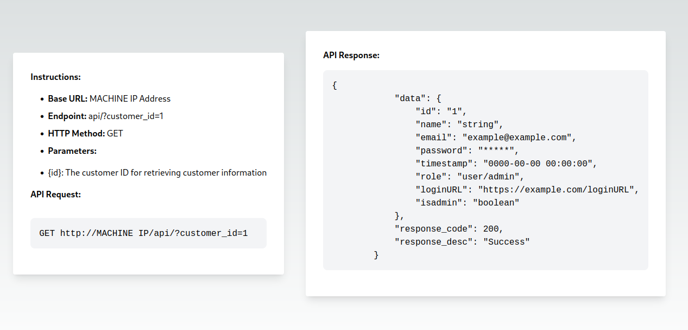
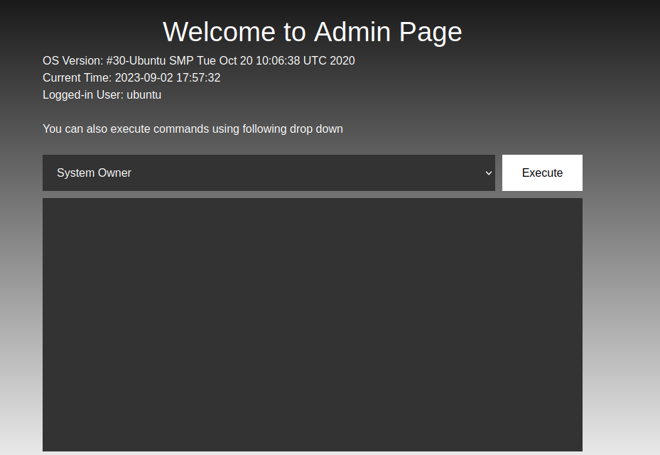
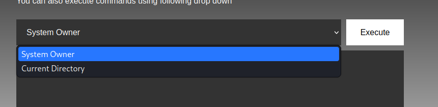
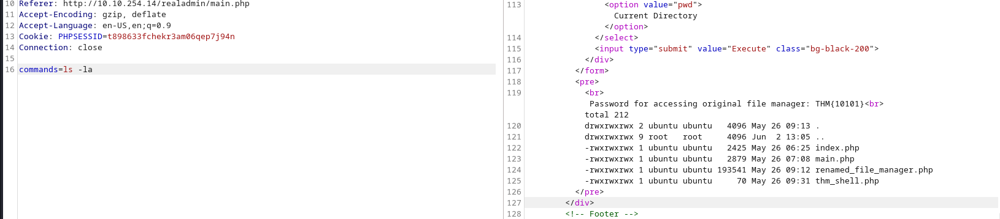
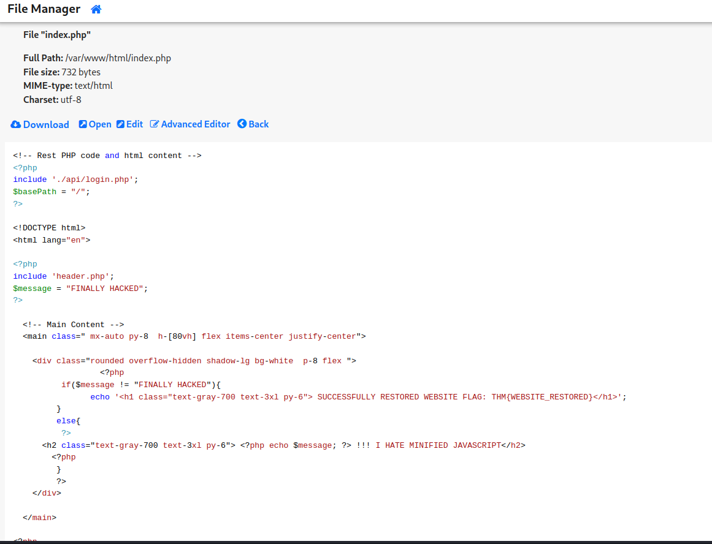

# __Traverse__

Room at https://tryhackme.com/room/traverse

---

??? question "List of the questions solved"

    Question: What type of encoding is used by the hackers to obfuscate the JavaScript file?
    > Ans: Hex

    Question: What is the flag value after deobfuscating the file?
    > Ans: DIRECTORY LISTING IS THE ONLY WAY

    Question: Logging is an important aspect. What is the name of the file containing email dumps?
    > Ans: email_dump.txt

    Question: The logs folder contains email logs and has a message for the software team lead. What is the name of the directory that Bob has created?
    > Ans: planning

    Question: What is the key file for opening the directory that Bob has created for Mark?
    > Ans: THM{100100111}

    Question: What is the email address for ID 5 using the leaked API endpoint?
    > Ans: john@traverse.com

    Question: What is the ID for the user with admin privileges?
    > Ans: 3

    Question: What is the endpoint for logging in as the __admin__? Mention the last endpoint instead of the URL. For example, if the answer is URL is tryhackme.com/admin - Just write __/admin__.
    > Ans: /realadmin

    Question: The attacker uploaded a web shell and renamed a file used for managing the server. Can you find the name of the web shell that the attacker has uploaded?
    > Ans: thm_shell.php

    Question: What is the name of the file renamed by the attacker for managing the web server?
    > Ans: renamed_file_manager.php

    Question: Can you use the file manager to restore the original website by removing the "__FINALLY HACKED__" message? What is the flag value after restoring the main website?
    > Ans: THM{WEBSITE_RESTORED}

## __Pentest scenario__

Host: 10.10. 254.14

Bài này tương đối cơ bản, chỉ cần traverse, traverse, traverse,... là trả lời được hết các câu hỏi :3

Do đó, writeup này tôi viết theo hướng các target chính cần đạt được.

### __Reconnaissance__

Ta chú ý vào kết quả scan của gobuster và đi lần lượt theo các dir, ta sẽ lấy được đáp án của các câu hỏi

```terminal title="Terminal"
/img                  (Status: 301) [Size: 310] [--> http://10.10.254.14/img/]
/client               (Status: 301) [Size: 313] [--> http://10.10.254.14/client/]
/api                  (Status: 301) [Size: 310] [--> http://10.10.254.14/api/]
/javascript           (Status: 301) [Size: 317] [--> http://10.10.254.14/javascript/]
/logs                 (Status: 301) [Size: 311] [--> http://10.10.254.14/logs/]
/planning             (Status: 301) [Size: 315] [--> http://10.10.254.14/planning/]
/phpmyadmin           (Status: 301) [Size: 317] [--> http://10.10.254.14/phpmyadmin/]
```

Về phần API, 



Ta sẽ dùng curl để tìm ra được thông tin tài khoản có quyền admin

```ps1 title="Terminal"
curl http://10.10.254.14/api/?customer_id=3
{"data":{"id":"3","name":"admin","email":"realadmin@traverse.com","password":"admin_key!!!","timestamp":"2023-05-23 04:47:25","role":"admin","loginURL":"\/realadmin","isadmin":"1"},"response_code":200,"response_desc":"Success"}
```

Đi tiếp, ta thấy được trang admin...



Ta được trang `./main.php` như hình trên có tác dụng thực thi lệnh hệ thống nhưng đã bị cố định chỉ chọn được 2 lệnh (xem hình dưới)



Lúc này là lúc Burpsuite có tác dụng



Bước cuối thì xem file thôi :3



## __What we learned__

1. Reconnaissance
